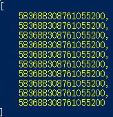
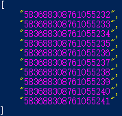
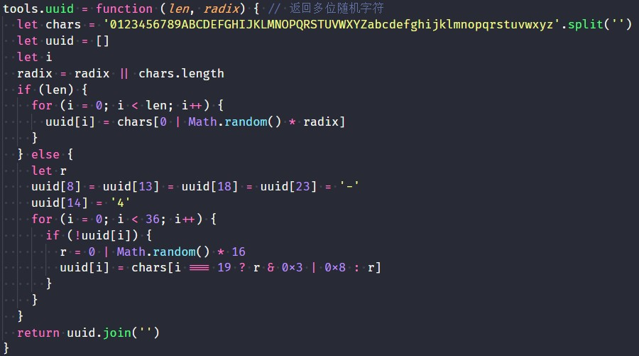
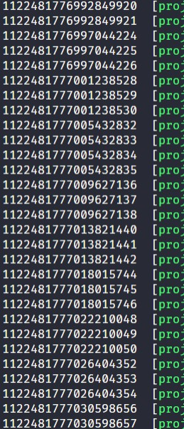

## JS64位整型解决方案，及加推JS长整型实战应用

### 从~~说起 (干货)
~在js中是位操作取反，很多同学，get到两次取反可以作为取整函数使用，例如：

``` js
~~1.1  //1
~~-1.1 //-1

```
### But
``` js
+new Date() // 返回自1970年1月1日 00:00:00 UTC到当前时间的毫秒数
+new Date('1970-01-01T00:00:00.000Z') // 0
// 以上没毛病
~~(+new Date()) // 说好的正毫秒数呢？
```
> js 在位操作的时候 会将整数截断为 32 位有符号整型，所以上面溢出了
> 所有位操作都会这样 [-2^31 , 2^31-1]

#### 除了上面这些，对于JS的数字，告诉我到底怎么回事？且听Sky道来...

>JS 中Number类型，通过 8 字节 double 浮点型 表示。
>再专业点是根据 IEEE 754 规定。
>浮点数并不能精确表示范围内的所有数的，[2.23x10^(-308)  ,  1.79x10^308] 可以表示的最大整，但精确是不够的！

#### So
``` js
0.1 + 0.2 // 0.30000000000000004 万恶的js精度问题
// 创口贴补一下 [2^53 , 2^53] 安全值如下
Number.MAX_SAFE_INTEGER //9007199254740991
Number.MIN_SAFE_INTEGER //-9007199254740991 

```
#### But Why？


* 1 位符号位
* 11 位指数位
* 52 位尾数位

* 那应该是2^52-1 为啥是 2^53?
> 浮点数在保存数字的时候做了规格化处理
> IEEE 754 规定，有效数字第一位默认总是1，不保存在64位浮点数之中。
> 也就是说，(-1)^符号位 * 1.xx...xx * 2^指数位
> 对于二进制来说， 小数点前保留一位， 规格化后始终是 1.xxx, 省了 1 bit。
> 因此，JavaScript 提供的有效数字最长为53个二进制位.
> What？！好吧

#### 其他偷偷笑的语言 我可以2^64-1 
>Mysql的笑
>BIGINT       8位  [ -9223372036854775808  ,  18446744073709551615]
>虽然 真不会这么大，但程序员需要完美

``` js
 BigInt(2 ** 64) - 1n   // 18446744073709551615n
 // Nodejs v11.10.0 提供了BigInt稳定版本,后面有个n，扩展了Number类型
```
> 完美

### 应用实战
> 在实际的应用场景中，一旦使用BigInt 之后所有的操作都必须是BigInt，会有代码兼容问题，全新业务当然没有问题：）
> 我们可以在Chrome 的命令行打印


#### 实战方案1
```js
let txt = '[583688308761055232,583688308761055233,583688308761055234,583688308761055235,583688308761055236,583688308761055237,583688308761055238,583688308761055239,583688308761055240,583688308761055241]'

let re = /\d+/ig
// 如果直接 JSON.parse(txt)输出如下
```


```js
// 使用正则格式化
$.dir((txt).match(re))
// 字符串还是很好对付的,但别忘记对需要JSON.parse的相关字段做一些约束
```


#### 实战方案2：引入Json-bigint
```js
let JSONbig = require('json-bigint');
let JSONbigString = require('json-bigint')({"storeAsString": true});
let key = '{ "key": 1234567890123456789 }';
console.log('\n\nStoring the BigInt as a string, instead of a BigNumber');
```


#### 实战应用之分布式系统产生唯一ID

##### 背景
> 为了满足每秒上万条消息的请求，每条消息都必须分配唯一的ID，这些ID还需要一些大致的顺序，并且在分布式系统中不同机器产生的ID必须不同

##### 分布式系统产生唯一ID的方案
* 数据库自增序列
> 最常用的方式
* UUID
>Sky在其底层Meeko框架中 实现的 rfc4122, sec. 4.1.5 UUID ,当然还可以有各类变种实现
>
>
* Redis生成ID
> 生成ID有性能上的需求时，可以使用Redis来生成ID。Redis是单线程的，可以用其原子操作 INCR和INCRBY来实现。
* Twitter snowflake算法
> 下面详细解说
* MongoDB ObjectId
> 不同的机器都能用全局唯一的方法生成ObjectId。MongoDB 从一开始就设计用来作为分布式数据库。实现的源码可以到MongoDB官方网站下载。


实战中 我们选择了Twitter snowflake
** 有了JS对64位的支持，我们用JS来实现雪花算法！**

##### 先看原理


> **原来如此，同时使用 服务器+工作进程+时间戳 来折腾**

##### 上代码，用BigInt搞定
``` js
class Snowflake { // 构建snowflake类
  constructor(_workerId, _dataCenterId, _sequence) {
    this.twepoch = 1559271041661n //bigint某个时间戳作为种子，当然也可以 用0n
    this.workerIdBits = 5n
    this.dataCenterIdBits = 5n
    this.maxWrokerId = -1n ^ (-1n << this.workerIdBits) // 值为：31
    this.maxDataCenterId = -1n ^ (-1n << this.dataCenterIdBits) // 值为：31
    this.sequenceBits = 12n
    this.workerIdShift = this.sequenceBits // 值为：12
    this.dataCenterIdShift = this.sequenceBits + this.workerIdBits // 值为：17
    this.timestampLeftShift = this.sequenceBits + this.workerIdBits + this.dataCenterIdBits // 值为：22
    this.sequenceMask = -1n ^ (-1n << this.sequenceBits) // 值为：4095
    this.lastTimestamp = -1n
    //设置默认值,从环境变量取
    this.workerId = BigInt(_workerId) || 1n
    this.dataCenterId = BigInt(_dataCenterId) || 1n
    this.sequence = BigInt(_sequence) || 0n

    if (this.workerId > this.maxWrokerId || this.workerId < 0) {
        throw new Error('0 < _workerId < maxWrokerId-[' + this.maxWrokerId + ']')
    }
    if (this.dataCenterId > this.maxDataCenterId || this.dataCenterId < 0) {
        throw new Error('0 < _dataCenterId < maxDataCenterId-[' + this.maxDataCenterId + ']')
    }
  }
  tilNextMillis (lastTimestamp) {
    let timestamp = this.timeGen()
    while (timestamp <= lastTimestamp) {
        timestamp = this.timeGen()
    }
    return BigInt(timestamp)
  }
  timeGen () {
      return BigInt(Date.now()) //运行时，时间戳
  }
  nextId () {
      let timestamp = this.timeGen()
      if (timestamp < this.lastTimestamp) {
        console.error('时钟倒退了，无法产生id ' + (this.lastTimestamp - timestamp))
        return -1// NOTICE: 因为非常依赖时钟，所以服务器时钟是不可以出错的，调用端要判断是否为-1
      }
      if (this.lastTimestamp === timestamp) {
          this.sequence = (this.sequence + 1n) & this.sequenceMask
          if (this.sequence === 0n) {
              timestamp = this.tilNextMillis(this.lastTimestamp)
          }
      } else {
          this.sequence = 0n
      }
      this.lastTimestamp = timestamp
      return ((timestamp - this.twepoch) << this.timestampLeftShift) |
          (this.dataCenterId << this.dataCenterIdShift) |
          (this.workerId << this.workerIdShift) |
          this.sequence
  }
}

 let tempSnowflake = new $.Snowflake(1, 1, 0)
// 1号进程进程 , 1号服务器, 序列从0开始
```

##### 进行单元测试，输出（压测100万条无重复）


欢迎各位交流！