## 加推全栈之性能提升及WebAssembly畅想

> 工程师文化之一在于细节的关注💥

### 函数的性能测试的一般方法

> 全栈A同学：
* 2020年要学习好多新东西，大家都在说优化，提高性能，如何入手？😶
* 有多个方法可以实现一个函数，到底用那种更好？
* 是否可以总结一些性能改变上的技巧？
* 2020年我们如何关注性能优化？😶

> Sky：我们从构建一个通用的benchmark（性能基准测试）方法开始，切入点要小💥
> 此方法我们希望做到以下几点

* 自动运行某函数多次
* 确定它每毫秒的执行次数 ops/ms，超过1000/ms是较优质的函数
* 确定它每次执行需要多少毫秒timeSpend/ms
* 确定它的执行稳定性，多次运行后消耗时间的范围百分比(极差/每次耗时)
* 每毫秒小于50次😶的函数，要被重点关注，有提升空间
### 直接上干货:fire:
在[meeko](https://github.com/kongnet/meeko)核心库中
``` javascript
const benchmark = function benchmark (
  fn = function () { /* do nothing */ }, // 传入的函数
  msg = '',                              // 需要打印的信息
  n = 1000000                            // 默认执行 100万次
) {
  const t = performance.now()            // 取更精确的时间
  let everyTime = 0
  let timeSpend = 0                      // 总执行时间
  let dt = 0                             // 每次执行时间差
  let minDt = Infinity                   // 最大执行时间差
  let maxDt = -Infinity                  // 最小执行时间差
  for (let i = 0; i < n; i++) {
    everyTime = performance.now()
    fn()                                 // 此处不执行传参，可以自行优化
    dt = performance.now() - everyTime
    timeSpend += dt
    minDt = dt < minDt ? dt : minDt      // 记录每次最小时间差
    maxDt = dt > minDt ? dt : maxDt      // 记录每次最大时间差
  }
  const diffTime = timeSpend
  const spendTime = diffTime.toFixed(0)  // 总时差取整
  const perSec = (((n / diffTime) * 10000) / 10000) | 0//每毫秒执行次数取整
  console.log(
    c.y((fn.name || '').fillStr(' ', 15)),       //彩色打印函数名，占15字符
    (spendTime + ' ms').fillStr(' ', 8, -1),     //打印总耗时，右对齐
    ((perSec + '').toMoney() + ' /ms').fillStr(' ', 10, -1),
    n.toExponential() + ' 次',            //打印每毫秒次数并千分位隔开，右对齐
    (
      '±' +
      (((maxDt - minDt) / 2 / (spendTime / n)) * 100).round(2) +
      '%'
    ).fillStr(' ', 9, -1),               //打印执行时间的稳定性百分比，右对齐
    msg                                  //打印信息
  )
}
```
> 上效果图
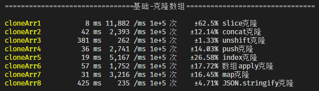
* 10万次下，运行速度最快的是cloneArr1，但执行抖动较大
* 大家常用的JSON克隆方式，性能相对较低
* 一些高级程序猿会采用map来克隆数组，中规中矩还容易扩展:smiley:

### Sky整理的一些全栈基础函数性能比较

#### * 判断某属性存在，100万次
  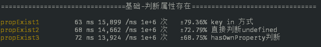
> 大家会常用 obj[prop] 模式，可尝试 key in 方式

#### * 字符串存在判断，100万次
  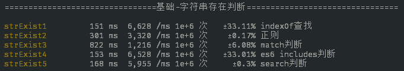
> 推荐使用includes，但indexOf依旧强大

#### * 数组中查找对象，100万次
  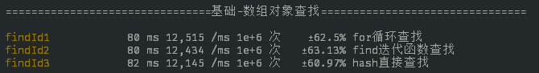
> 推荐使用find模式
#### * 删除元素
  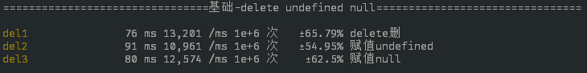
> 推荐使用delete
#### * 字符串拼接
  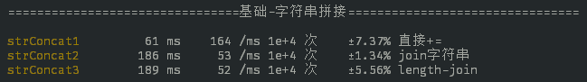
> 推荐直接使用+，除非对性能要求较高
#### * 递归与不递归（阶乘算法）
  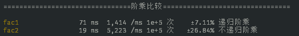
> 不递归解题对程序猿算法要求很高，递归可以降低逻辑复杂度
#### * 数组去重
  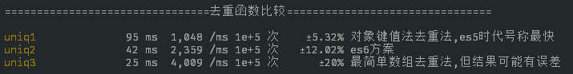
> 去重直接上ES6 模式，没问题！:ok:
#### * 求max
  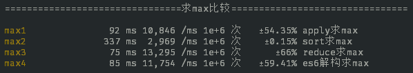
> 这里确实没有想到，reduce表现极其优秀:smile:

#### * 唯一UUID生成
  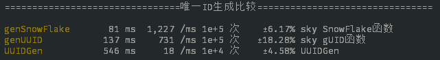
> 唯一ID，分布式的基础


> 这些也是我们每天都在打交道的代码
  更多基础测试代码[查看](https://github.com/kongnet/meeko/blob/master/benchmark.js)

### 2020年全栈能不能更快？:fire:
#### webassembly必须学习了
> WebAssembly成为W3C标准,应该无人不知了。
> WebAssembly大致就是用C/C++之类的语言编译成.wasm文件，直接被js调用执行😶
> 出bulit-in函数外，普遍性能的提升在50%以上😶

#### 安装条件
> 直接上[Emscripten](https://emscripten.org/docs/getting_started/Tutorial.html#running-emscripten)
* Git 
* CMake
* Linux下，安装 GCC。在OS X下，安装 Xcode。在Windows下，安装Visual Studio Community 2015 with Update 3 or newer
* Python 2.7.x😶，自己的python版本是3.8 要再安装2.7.x
```
git clone https://github.com/juj/emsdk.git
cd emsdk
emsdk install latest
emsdk activate latest

# on Linux or Mac OS X
source ./emsdk_env.sh

# on Windows
emsdk_env.bat
```
> 以上完成安装Emscripten安装:smile:
#### 我们来测试一下可以提升多少？😶
> 先上一个js的 斐波那契数列,使用我们的benchmark函数

``` javascript
const $ = require('meeko')
function fib (n) {
  if (n < 2) {
    return 1
  }
  return fib(n - 2) + fib(n - 1) // 最暴力写法，可以极大的优化
}
const fibJs = () => {
  fib(20)
}
$.benchmark(fibJs, 'fibJs', 100000) // 运行10万次
// fibJs 7536 ms 13 /ms 1e+5 次   ±15.79% fibJs  有点慢，每毫秒只有13次，但js同学表示无能为力了
```
> 上C语言的斐波那契数列实现

``` C
#include <stdlib.h>
#include <stdio.h>
#ifdef __EMSCRIPTEN__
#include <emscripten.h>
#endif
int fibonacci(int n, int a, int b)
{
    if (n <= 2)
    {
        return b;
    }
    return fibonacci(n - 1, b, a + b);
}
long EMSCRIPTEN_KEEPALIVE fib(int n)
{
    return fibonacci(n, 1, 1);
}
```
> emcc -s WASM=1 fib.c -o fib.js 将c编译成wasm，加入胶水层引入js
> 上图

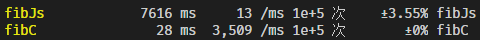

What? 同样是递归每毫秒webassembly 3.5k次

>  emcc -s WASM=1 -O3 fib.c -o fib.js  加入编译优化
> 上图

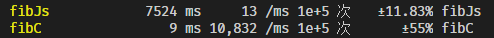

> What? 没看错又提高了3倍，比JS提高833倍😶


* JS版本的斐波那契函数可以进行**尾递归**优化。最终webassembly是JS的3倍左右，非833倍:smile:
* 总体上webassembly 可以对JS带来质的飞跃

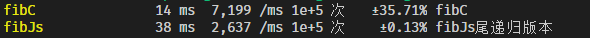
* 最后看一下JS与webassembly性能比较代码作为2020年程序员们工作的开始:fire:

``` javascript
/*
斐波那契数列js和webassembly c 比较
*/
const $ = require('meeko')// 引入meeko核心库
let cModule = require('./fib.js') // 引入wasm胶水层js代码

function fib (n) {
  if (n < 2) {
    return 1
  }
  return fib(n - 2) + fib(n - 1) // 最暴力写法，可以极大的优化
}
const fibJs = () => {
  fib(20)
}

cModule.onRuntimeInitialized = function () {
  const fibC = () => {
    cModule._fib(20) // 导出的c函数有个_下划线
  }
  $.benchmark(fibC, 'fibC', 100000)
}
$.benchmark(fibJs, 'fibJs', 100000)
```


## 小结

* 我们不要**过早**的进行性能优化，但要知道方法:smile:
* benchmark的含义是基准测试，有一个性能指标计划后，科学的提高
* 一些标准用法可以形成习惯，提高代码质量

新年的第1次分享，祝大家2020提升技术，开心，发财 :smile:

