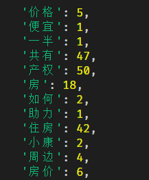
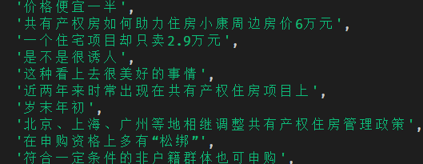
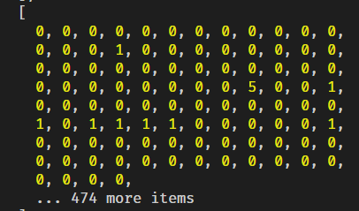
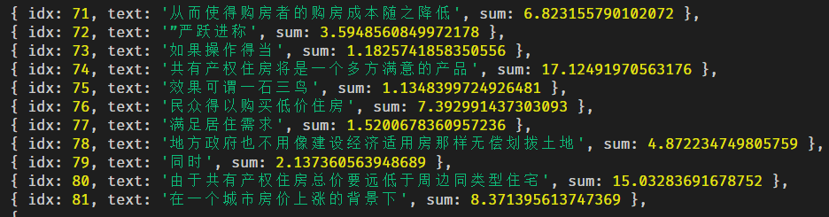

## 加推全栈之文章摘要

> 两个向量夹角越小说明他们越相似 💥

### 从一个小需求说起

> 产品的 1 个小需求：

- 我们需要有个文章的摘要，最好可以代表这个这篇文章的主要内容，可以延展另一个需求，文章打标签 😶

### 需求分析

- 有很多方法可以解决这个问题，我们选择使用余弦距离，也称为余弦相似度来解决这个问题 💥
- 网上有不少 python 解决方案，但我们用 JS 来造一次轮子，前端的同学笑了。

### 背景知识

- 在机器学习领域中，通常将特征表示为向量的形式，所以在分析两个特征向量之间的相似性时，常用余弦相似度表示 💥
- 如果是 n 个变量就是 n 维的余弦距离，没错，就是我们熟悉的 cos 函数

$$
\text { similarity }=\cos (\theta)=\frac{\mathbf{A} \cdot \mathbf{B}}{\|\mathbf{A}\| \mathbf{B} \|}=\frac{\sum_{i=1}^{n} A_{i} B_{i}}{\sqrt{\sum_{i=1}^{n} A_{i}^{2}} \sqrt{\sum_{i=1}^{n} B_{i}^{2}}}
$$

- 公式还是非常简单的，应该没有人写不出:smile:直接上加推代码

```javascript
function similarity (x = [], y = []) {
  let [xy, xSq, ySq, len] = [0, 0, 0, x.length]
  for (let i = 0; i < len; i++) {
    xy += x[i] * y[i]
    xSq += x[i] ** 2
    ySq += y[i] ** 2
  }
  return xy / (Math.sqrt(xSq) * Math.sqrt(ySq))
}
```

#### 核心函数有了，具体怎么做？😶

- Step1.对整篇文章进行分词，然后统计词频
- Step2.对整篇文章，按逗号，句号，问号，感叹号，省略号等分割
- Step3.对分割后的每段，与整篇的词频进行比较，形成分割后的每段的，词频数组
- Step4.对每段的词频数组和其他段，也包括自己的词频数组形成一个，相似度矩阵
- Step5.使用余弦相似度将相似度矩阵转成一个，相似度排名，每个句子对应一个排名值
- Step6.取出排名最前面的 n 句，默认 3 句，形成一个文章摘要。

> 看上去还是有些复杂，我们直接上代码 🔥

#### 先看最终的函数如何使用，再回过来一步一步分解

```javascript
/**
 *
 * @param {String} text
 * @param {Integer} sentenceNum
 * @param {Array} split
 */
function abstract (
  text = '', //输入的文章
  sentenceNum = 3, //取分值最高的，累计相似度最高的3句
  split = ['，', '。', '；', '？', '：', '！', '…'] // 分割句子的符号，这里是全角，你可以加入半角
) {
  //....
}

let r = abstract(text)
console.log(r.join(',')) //返回一个数组，按逗号join起来
```

- 函数的参数一般不要超过 5 个，保持功能单一比较好
- 我们随便选取新浪财经的一篇文章：
- https://finance.sina.com.cn/roll/2020-01-15/doc-iihnzahk4156789.shtml
- 标题是：《北上广等调整共有产权住房管理政策 申购资格松绑》

#### Step1 统计全文词频

```javascript
const $ = require('meeko') // 自有无依赖meeko核心库
let Segment = require('segment') //分词模块
let segment = new Segment()
let objText = segment
  .doSegment(text, {
    simple: true
  })
  .filter(x => !splitArr.includes(x))
  .count()
```



- 这里大家已经发现，产权这个词频较高，也就是说 有可能最终的句子里会包含**产权**这个词:smile:

#### Step2 对整篇文章，按逗号，句号，问号，感叹号，省略号等分割

```javascript
text = text
  .replaceAll('\n', '') // 去除换行
  .replaceAll('　', '') // 去除\t
  .replaceAll(' ', '') // 去除空格
let sentenceText = text
for (let i = 0; i < splitArr.length; i++) {
  sentenceText = sentenceText.replaceAll(splitArr[i], '$#$')
}

let sentenceArr = sentenceText.split('$#$').filter(Boolean) //使用$#$分割并去除空元素
console.log(sentenceArr)
```



- 注意默认的分割符号，类似顿号扩折号，不要错分割

#### Step3 对分割后的每句，与整篇的词频进行比较，形成分割后的每段的，词频数组

```javascript
const sentenceValArr = []
let n = 0
sentenceArr.forEach(item => {
  let r = segment
    .doSegment(item, {
      simple: true
    })
    .count()
  sentenceValArr.push([])
  for (let i in objText) {
    sentenceValArr[n].push(r[i] ? +r[i] : 0)
  }
  n++
})

console.log(sentenceValArr, n)
```



- 分割后本篇文章一共有 158 句，这里并未优化，暴力分解
- step3 图 表示，每一句对应 step1 图的单词，顺序所对应的，形成一个 158\*574 的词频矩阵

#### Step4-step5 对每段的词频数组和其他段，也包括自己的词频数组形成一个，相似度矩阵，并累计成一个 Rank 排名

```javascript
const sentenceSimArr = []
const sentenceSimVal = []
for (let i = 0; i < n; i++) {
  sentenceSimArr[i] = []
  for (let d = 0; d < n; d++) {
    let r = similarity(sentenceValArr[i], sentenceValArr[d]) //调用余弦距离函数
    sentenceSimArr[i].push(r)
  }
  const simSum = $.math.sum(sentenceSimArr[i]) //调用余弦求和函数
  sentenceSimVal.push({ idx: i, text: sentenceArr[i], sum: simSum })
}
console.log(sentenceSimVal)
```

- 这里算法依旧很暴力，完全可以优化
- step4-step5 同时完成
  

#### Step6.取出排名最前面的 n 句，默认 3 句，形成一个文章摘要。

```javascript
const resultArr = []
sentenceSimVal
  .orderBy(['sum'], ['desc']) // 按余弦累计值降序
  .slice(0, sentenceNum) // 拿出n句，默认3句
  .orderBy(['idx'], ['asc']) // 再根据原来的id 升序，保持文中的前后顺序
  .forEach(x => {
    resultArr.push(x.text)
  })
return resultArr //函数返回
```

- 这一步就是排序切割再排序，非常简洁

输入：
https://finance.sina.com.cn/roll/2020-01-15/doc-iihnzahk4156789.shtml

返回：
**什么是共有产权住房,共有产权住房的转让是有一定的限制的,北京的 25 万套目标推进共有产权住房**

3 句对文章的概括句子

[本分享代码点这里](https://github.com/kongnet/meeko/blob/master/sample/%E6%96%87%E7%AB%A0%E6%91%98%E8%A6%81.js)

## 小结

- 虽然造了轮子但，学会了一个经典机器学习算法 🔥
- 除了我们熟知的，欧氏距离，和今天分享的余弦距离。还有曼哈顿距离,切比雪夫距离,闵可夫斯基距离等
- 以上函数并未进行优化，所以多次循环，大家有兴趣可以把分割句子和全文词频，变成一个循环:smile:
- 余弦距离在表示两个特征向量之间关系还是很用处的，例如人脸识别，推荐算法等:smile:
- 碰到问题，先网上搜索，90%以上问题前人都已经经历过，我们只需要理解就好
- 一些基础的算法，平时积累起来，用时可展示你的洪荒之力。🔥

新年的第 2 次分享，祝大家 2020 提升技术，开心，发财 :smile:
