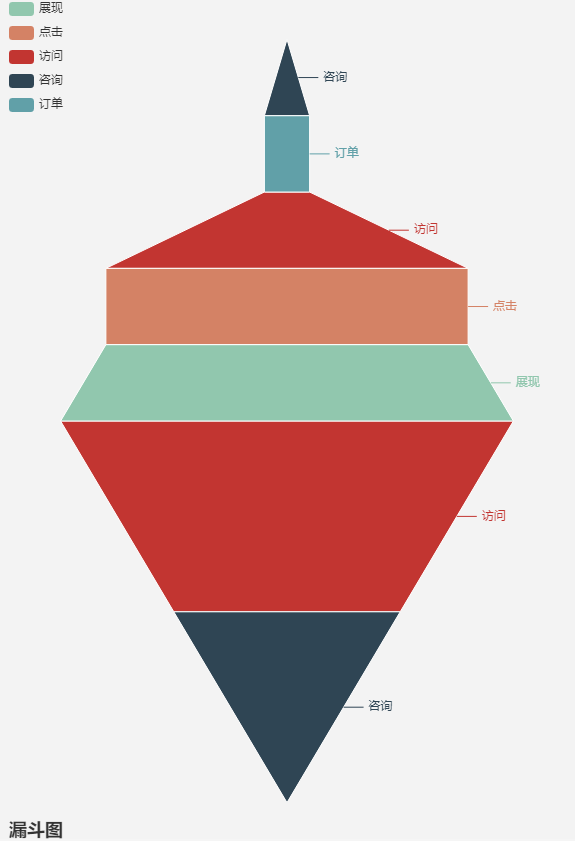
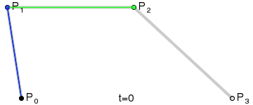
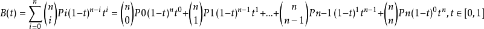
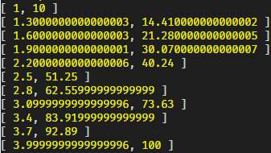
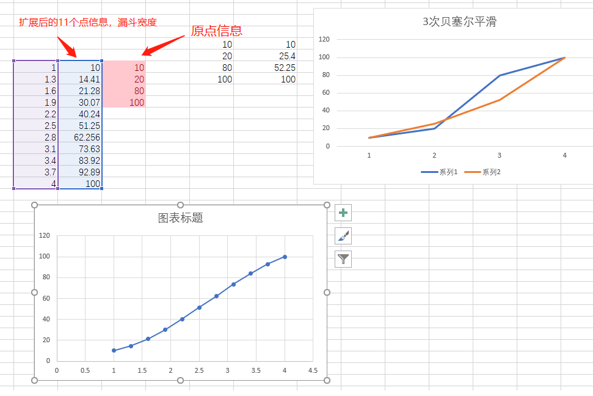
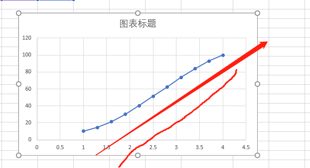

## 加推前端优化之贝塞尔函数及柯里化

> 工程师文化，本质是一种专研，搞清事物本质的精神 💥

### 从一次技术群的聊天说起

> 前端 A：

- 请问有没有 把一组数变平滑的 JS 算法？😔

- 比如说 [100, 80, 20, 10] 这里 80 -> 20 断崖式下跌，把他转换成类似 [100, 75, 50, 25 ]这种平滑下跌的
- 我希望能传参调整这个平滑度（项目组产品）😶

> Sky：有很多方法 💥

- 插值，移动平均线，贝塞尔，多项式拟合线条

> 前端 A

- 其实是想把漏斗图弄平滑点
  

> Sky: 如果需要有控制参数的话，建议使用贝塞尔
>
> Talk is cheap, show me the code🔥

### 本需求的分析

- 销售漏斗图比较锐，希望有一个柔和的宽度变化 😶
- 增加更多的点来柔和 这些[100, 80, 20, 10]
- 需要一个非常快捷的方式实现，前端要考虑性能
- 类似的解决问题的方法是否有一定的**延展性**🔥

> 通过插值方式将[100, 80, 20, 10]扩展成多个点集，我们选择贝塞尔 3 次曲线

### 贝塞尔曲线

- 1912 年伯恩斯坦多项式=>在[ a, b ] 区间上所有的连续函数都可以用多项式来逼近，并且收敛性很强，也就是一致收敛。😶

- 1959 年。当时就职于雪铁龙的法国数学家 Paul de Casteljau 开始对伯恩斯坦多项式进行了图形化的尝试。

- 通过很少的控制点，去生成复杂的平滑曲线，也就是贝塞尔曲线。

- 1962 年就职于雷诺的法国工程师皮埃尔·贝塞尔（Pierre Bézier），他使用这种方法来辅助汽车的车体工业设计。原来是研究汽车的线:smile:
- wiki 上有更详细的 E 文解释 💥

- ##### 贝赛尔曲线 N 阶,前端技术中常用的是 3 阶，如下图



### 实现（干货）🔥



> 以上公式取 3 阶即可,直接上加推 3 次贝塞尔代码，当然函数可以进一步**柯里化**

```javascript
const cubicBezier = (t, x = [], y = []) => {
  // t~[0,1]
  return [
    x[0] * (1 - t) ** 3 +
      3 * x[1] * t * (1 - t) ** 2 +
      3 * x[2] * t ** 2 * (1 - t) +
      x[3] * t ** 3,
    y[0] * (1 - t) ** 3 +
      3 * y[1] * t * (1 - t) ** 2 +
      3 * y[2] * t ** 2 * (1 - t) +
      y[3] * t ** 3
  ]
}
let x = [1, 2, 3, 4]
let y = [10, 20, 80, 100]
for (let i = 0; i <= 1; i += 0.1) {
  console.log(cubicBezier(i, x, y))
}
```

- 我们将原始 4 个信息点扩展成了 11 个点
  
- x,y 表示 4 个点的 x，y 坐标，从这里看，一个 3 次贝塞尔至少需要 4 个点支持，多余的点可以使用其他线条
- 用 excel 检验一下计算的结果
  

* 代码不难，11 个点也有了，但前端有同学好像还是没搞懂 😶

* 再上一个图
  

* 这个图垂直后，就是销售漏斗图平滑方案 🔥

> 我们在高级安卓和 iOS 面试中 会问到缓动函数和平滑曲线等知识点。

### 柯里化

- 细心的同学已经发现 cubicBezier 的参数 x,y 是初始化的时候确定的，之后主要参数是 t ~ [0,1]
- 在不改变原函数的情况下函数分段执行
- 将上面的 t 参数放到后面，并达成 cubicBezier(x,y,t) => cubicBezier(x,y)(t) 的变换效果

```javascript
function curry (fn, ...arg1) {
  // 柯里化核心函数
  return function (...arg2) {
    return fn.apply(null, arg1.concat(arg2))
  }
}
function curryExtend (fn, len = 1) {
  // 柯里化通用扩展
  const length = len
  return function (...arg) {
    return arg.length >= length
      ? fn.apply(this, arg)
      : curryExtend(curry.apply(this, [fn].concat(arg)), length - arg.length)
  }
}

const cubicBezier = (x = [], y = [], t) => {
  // 将参数t放置最后
  return [
    x[0] * (1 - t) ** 3 +
      3 * x[1] * t * (1 - t) ** 2 +
      3 * x[2] * t ** 2 * (1 - t) +
      x[3] * t ** 3,
    y[0] * (1 - t) ** 3 +
      3 * y[1] * t * (1 - t) ** 2 +
      3 * y[2] * t ** 2 * (1 - t) +
      y[3] * t ** 3
  ]
}
let x = [1, 2, 3, 4]
let y = [10, 20, 80, 100]

let bezierT = curryExtend(cubicBezier, 3)(x, y)
for (let i = 0; i <= 1; i += 0.1) {
  console.log(bezierT(i), cubicBezier(x, y, i))
}
```


- bezierT(t)，同原函数效果完全一致:smile:

### 本问题的延展

- 我们使用 Photoshop 中的 钢笔，就是 cubicBezier 曲线:smile:
- 在 CorelDraw 中翻译成“贝赛尔工具”；而在 Fireworks 中叫“画笔”
- 前端在使用 canvas 绘制曲线的时候，也用到了 cubicBezier,说道这边前端同学笑了:smile:

```
let c=document.getElementById("myCanvas");
let ctx=c.getContext("2d");
ctx.beginPath();
ctx.moveTo(20,20);
ctx.bezierCurveTo(20,100,200,100,200,20);
ctx.stroke();
```


- 前端在 css 中使用 ease-in ease-out ,cubicBezier 可以 作为 缓动函数 的发生器

- 或者说以上这些，和 cubicBezier 函数一模一样

## 小结

- 从贝塞尔函数，到通用柯里化
- 研发同学使用的各种计算机技术，都是前人潜心研究出来的知识积累，我们站在巨人的肩膀上，敬畏这他们并努力的前进。

我们的代码之路是星辰大海。🔥
