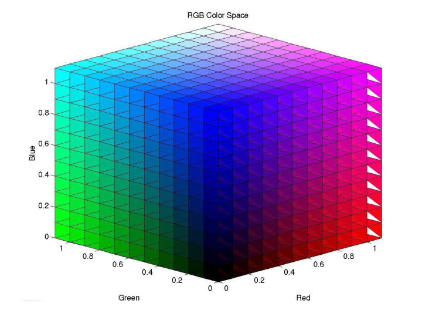

## 加推实战之颜色图像处理

> 深度掌握图像-颜色处理，将使你不平凡💥

### 1.从Sky遇到过的一个需求说起

* 在PDF合同中找到一个印章的区域
* 将印章抠出，背景非印章色处变为透明
* 美化抠出的图像
* 希望可以在**100ms**内完成所有操作😶

#### 1.1 需求分析

> PDF转图像有很多在线工具，但高级全栈程序员表示不服:slightly_smiling_face:

* pdf.js可以将pdf文件转为jpg
> 通过一个算法找到图片中带有章区域的子图像，图像像素过多的话，会极大耗时。

* 通过缩放图像到等比64-128个像素，将扫描规模控制在1万像素左右。

>  将子图像进行去背景操作，原以为此过程实现简单，但实际蕴含多个知识点😶

* 实际的颜色会因为扫描或者拍摄的光线而造成不同的色相（偏红偏黄），需要通过灰色梯度来解决。😶

### 2.基础知识

#### 2.1基础之距离

> 距离在计算机中是非常重要的概念，主要有以下几种，随便用JS实现一下

* 1、Euclidean Distance(欧式距离),

> 没错 a平方+b平方 开根号,我们直接推广到n维度。也是我们这次比较颜色相似度要用到的距离

```javascript
function euclidean (x, y) {
  if (x.length !== y.length) {
    throw '元素长度不一致'
  }
  let sum = 0
  for (let i = 0; i < x.length; i++) {
    sum += (x[i] - y[i]) ** 2
  }
  const dis = Math.sqrt(sum)
  return dis
}
```


* 2、ManhattanDistance(曼哈顿距离) 街区离你多远的意思

```javascript
function manhattan (x, y) {
  if (x.length !== y.length) {
    throw '元素长度不一致'
  }
  let sum = 0
  for (let i = 0; i < x.length; i++) {
    sum += Math.abs(x[i] - y[i])
  }
  return sum
}
```


* 3、Chebyshev Distance(切比雪夫距离)

> 又叫棋盘距离，王后走到某处需要的步数,一层一层的:smile:
>
> (x1,y1)和(x2,y2)二点为例，其切比雪夫距离为max(|x2-x1|,|y2-y1|)


* 4、MinkowskiDistance(闵可夫斯基距离):smile:

>  $$D(x, y)=\left(\sum_{u=1}^{n}\left|x_{u}-y_{u}\right|^{p}\right)^{\frac{1}{p}}$$ 大全集
>
> p=1 就是曼哈顿距离
>
> p=2 就是 欧几里得距离
>
> p->∞ 切比雪夫距离

* 5、Cos(Cosine 余弦距离)

>Sky的上一篇文章 《加推全栈之文章摘要 》有说明。人脸识别也会用到此算法

* 6、HammingDistance/Edit Distance(汉明距离/编辑距离)

> 二进制1011101 与 1001001 之间的汉明距离是 2
>
> 字符串"toned" 与 "roses" 之间的汉明距离是 3
>
> 两个比较对象相似单位的计数


#### 2.2 基础之颜色空间

* RGB颜色空间

> RGB比较颜色之间的相似度时,存在很大的问题,不建议直接使用,因为往往一个通道的一点改变,会导致最后融合在一起的颜色发生巨大变化。当然这是最常用的空间。



* CMY/CMYK颜色空间

> 而CMY是依据反射光得到的,对应于RGB

* HSV/HSB颜色空间

>  H是色调/色相，S是饱和度，I是强度,通过旋转角色就能改变色相:smile:，这也是我们经常用到的空间操作。


* HSI/HSL颜色空间

> 同属于 HSX 范畴

* Lab颜色空间

> [Lab颜色模型](https://link.zhihu.com/?target=http%3A//baike.baidu.com/item/Lab%E9%A2%9C%E8%89%B2%E6%A8%A1%E5%9E%8B)是由CIE（[国际照明委员会](https://link.zhihu.com/?target=http%3A//baike.baidu.com/item/%E5%9B%BD%E9%99%85%E7%85%A7%E6%98%8E%E5%A7%94%E5%91%98%E4%BC%9A)）制定的一种色彩模式,本次不深究

* YUV/YCbCr颜色空间

> YUV是通过亮度-色差来描述颜色的颜色空间,本次不深究

#### 2.3基础之扫描线法

> 计算机图像学中的经典算法，多用于多边形填充

* 我们在缩放后的图像中，依次x=>y y=>x 扫描点，一旦发现目标颜色（HSV空间）的距离在范围内，就停止:smile:
* 最后我们划出一块矩形区域，也就是章的区域
* 到此步骤结束 大约耗时30ms，还在可控范围内。

#### 2.4基础之图像卷积Convolution

> 卷积也出现在机器学习中，卷积神经网络，我们今天要说的是图像卷积操作
>
> 它是线性的，而且具有平移不变性shift-invariant。😶

* 比如原始图像像素阵列（注意每个像素有RGBA4个点）


* 先进行填充，然后叉乘卷积核，注意9个像素的卷积操作，最后还是9个像素！

  


* 通过一个卷积核一般3x3,5x5,7x7...奇数x奇数
* 其实这是一个信号处理的概念，卷积核也可以认为是一个滤波器，将原图X滤波器(卷积核操作)=新图:cry:
* 其实我们平时所说的，锐化，模糊，浮雕等等 都是 图像卷积操作😶

* 比如图像锐化我们会使用，如下2个矩阵，整个矩阵和为1，保持图像亮度不变:smile:


* 来一个立体的图解，可能更好理解


* Old x core = New

* 我们用JS随便写一个卷积核

```javascript
//像素卷积运算
// weights 奇数矩阵 3*3 5*5 ..
function pixelConvolute (
  pixelObj,
  weights = [0, 0, 0, 0, 1, 0, 0, 0, 0], //默认不变的权重
  isAlpha = 0
) {
  let side = Math.round(Math.sqrt(weights.length))
  let halfSide = Math.floor(side / 2)
  let src = pixelObj.data
  let w = pixelObj.width
  let h = pixelObj.height

  let dst = Buffer.alloc(w * h * 4)
  let alpha = isAlpha ? 1 : 0
  for (let y = 0; y < h; y++) {
    for (let x = 0; x < w; x++) {
      let sy = y
      let sx = x
      let dstOff = (y * w + x) * 4
      let [r, g, b, a] = [0, 0, 0, 0]
      for (let cy = 0; cy < side; cy++) {
        for (let cx = 0; cx < side; cx++) {
          let scy = sy + cy - halfSide
          let scx = sx + cx - halfSide
          if (scy >= 0 && scy < h && scx >= 0 && scx < w) {
            let srcOff = (scy * w + scx) * 4
            let wt = weights[cy * side + cx]
            r += src[srcOff] * wt
            g += src[srcOff + 1] * wt
            b += src[srcOff + 2] * wt
            a += src[srcOff + 3] * wt
          }
        }
      }
      dst[dstOff] = r
      dst[dstOff + 1] = g
      dst[dstOff + 2] = b
      dst[dstOff + 3] = a + alpha * (255 - a)
    }
  }
  return dst
}
```

* 有了卷积操作，我们可以在初期对图像先进行一次锐化，这样可能会得到更清晰的效果。
* 本算法复杂度较高，耗时需要控制,我们只要设置好相应的滤波器Filter（前端也叫滤镜）就行了
* 时域上的卷积等于频域上的乘积，这就是傅里叶变换:fire:

#### 2.5基础之灰度直方图

* 像素转灰阶有很多公式，我们用如下

```javascript
function pixelGray (r, g, b) {
  return 0.2126 * r + 0.7152 * g + 0.0722 * b //最后是一个 [0,255] 的值
}
```

> 为了充分使用位移的效率，我们也可以这样  Gray = (R\*19595 + G\*38469 + B\*7472) >> 16

* 像素灰度变换


* 累计图像RGB通道上各个点的个数，画条状图，网上找张图


* 我们实际的章灰度直方图数据如下：


#### 2.6照片的灰度分布

* 玩过摄影的同学都知道，一张照片会曝光过度，也会欠曝光
* 简单的说一张照片会分为4个区域，黑部，阴影部，亮部，白部
* 对应到我们的需求中，黑部，我们可以认为是，黑色文字
* 阴影部，是因为光线原因导致偏暗的红色章色，偏黑了
* 亮部，是因为光线太足，导致红色章泛白了，偏白了
* 白部，可以认为是背景
* 对不同部分的处理是本次需求中核心部分:fire:

#### 2.7伪彩色

* 变为灰度的图片要还原成彩色（不可能？），通常的方法是颜色索引:smile:


* 大家理解了，就是红外线成像嘛。他其实是把温度，或者深度等值，对照成颜色索引，然后显示出来:smile:
* 后面我们要用到这个技巧:fire:

### 3.实战

>有了上面这些图像的基础，线性代数的基础后，我们可以开始实际完成，文章开头的需求了:fire:

* 扫描线法，找到章矩形区域30ms
* 形成灰色直方图EASY，Array.count() 搞定
* 去除黑部和白部我们设定黑部阀值在5，白部阀值150
* 使用梯度上升法，二次求导直方图变化，最终黑部被动态确定在 5+dx ,白部 150+dy
* 留下中间部分，也就是章的正体+阴影:smile:

* 此时我们引入sigmoid函数，这是一个单调的非线性函数:fire:

#     $$S(x)=\frac{1}{1+e^{-x}}$$


* 注意红色框线部分，将正体+阴影的像素点，映射到这个函数上，也就是灰度转伪彩:smile:
* 它的用意是：中间部分大部分是红色章色，然后依次颜色变深。转换率如下

```javascript
      let ratio =
        1 /
        (1 +
          Math.exp((-(gray - blackThresholdBegin) / colorRange) * 10 + shade))
      arr[i] = 210 + ratio * 45 // 红色 按Sigmoid 从210 - 45
      arr[i + 1] = 0 + ratio * 190 // 绿色 按Sigmoid 从0 - 190
      arr[i + 2] = 0 + ratio * 200 // 蓝色 按Sigmoid 从0 - 200
    }
    // gray 像素灰度值 0-255
    // blackThresholdBegin 暗部起始阀值
    // colorRange 整体灰度值的极差
    // shade 在Sigmoid函数的偏移，你可以认为是 深浅值 越大越深 
```

* 看一下最后的效果


* 原图扫描导致纸面偏蓝，并较淡，阀值处理，抠图按Sigmoid变换后，加深背景并透明。
* 最重要的是80ms内，前端完成所有操作:fire:

### 4.其他有趣的图像效果

* 随便抓取最近几年的bing美图，然后将主色抽取出来，形成mainColor - jpg 映射表

  

* 给出一张图，用bing缩略图组成像素图像:smile:，当然你也可以设置每张图只用1次，需要至少1万张以上的图。

  

### 总结

**前端除了框架还有不少基础知识可以深挖**

学习多个颜色基础知识，初步了解颜色操作的原理，祝大家2020提升技术，开心，发财 :smile: