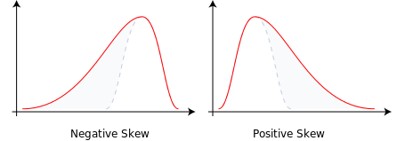

## 加推数据科学之统计基础

> 疫情让全国人民都关注数据，2020年学习数据科学，扎实的基础是跃升高级程序猿的必要条件💥

### 为何要学习？如何学习
* 数据科学内容过于广泛，太深入，大家无法理解，太浅又食之无味

* 程序猿精进的3把基础刀：计算机算法，线性代数，概率统计

* 2020年初的疫情，每个程序猿都应该有分析数据的能力，认识趋势理解变化！

* 很多国家已经在高中期间将概率统计作为必修课程

* 现代社会离不开统计和概率，我们从统计基础说起😶

  

### 全局观

* 2019年和业务部门分享了大数据和数据科学，作为研发的我们需要掌握更多:fire:

> 我们先简单展开几张图：

 

* 左上是数学领域全图
* 数据科学是一门交叉科学，上图右侧的韦恩图，表明了关系
* 从博大精深的数学=>应用数学=>统计学=>数据的分布描述😶
* 而数据是未来石油，是资本:fire:，我们要做的就是如何精炼石油:smile:

> 理解了统计基础，向数据分析和机器学习=>深度学习,两个方向发展成为可能，最终服务商业和人民群众

### 来2个引子

#### 平均数

* 算术平均数小学生都知道，但也带来了一个无法体现偏差问题：

* A组零件偏差（单位mm）[1,-1],B组[0.5,0.5] ，平均的话A:0,B:0.5。

* 实际B组的产出稳定性更优秀，于是引入方差，1918年第一次出现，variance：

$$
\sigma^{2}=\frac{\sum(X-\mu)^{2}}{N}
$$
$$
\sigma^{2} 总体方差 X为变量，\mu 为总体的均值， N为总体个数
$$
很明显，我们希望总体没有误差也就是 0，所以A组方差1，B组方差0.25
$$
标准差\sigma=\sqrt{方差} ，它与X有相同的量纲mm💥
$$
A组标准差1mm，B组0.5mm，很明显B组的稳定性更优秀，所以平均值有时候很不准:smile:

#### 生日悖论

> 随意的23 个人中至少有两人生日相同的[概率](https://baike.baidu.com/item/概率/828845)大于 50%

* 一年365，只有23人，但相同的概率竟然大于50%,这是非常有趣的

$$
1-P=\frac{365}{365} \times \frac{364}{365} \times \cdots \times \frac{365-n+1}{365}=\frac{365 !}{365^{n}(365-n) !}
$$

* 很多事情需要用科学合理的方式来解释，想当然就交了智商税😶

  |  n   |  23   |  30   |  40   |  50  |  60  |
  | :--: | :---: | :---: | :---: | :--: | :--: |
  |  p   | 50.7% | 70.6% | 89.1% | 97%  | 99.4 |


* 有兴趣的同学也可以自行用代码验证

> 先了解描述数据整体的各个函数和方法

### 数据的展示
* 前端同学在选择图表的时候，或许可以考虑更加匹配类型


* 尝试使用D3，highChart，Echart之类的更丰富的表现形式
> 以下是判断图形优劣的准则:fire:
* **应该精心设计，有助于洞察问题的实质**
* **应当使复杂的观点得到简明、确切、高效的阐述**
* **应该在短时间内，给到读者大量的信息**
* **应当是多维的**
* **应该表述数据的真实情况**

* 互联物联网下更复杂的图表


### 对比着Excel来？！

* Excel关于概率统计的函数有近百个，在疫情期间Sky将这些函数全部用JS实现了一遍💥，应该还没这样的库

* Excel是人人都会用的工具，我们以Excel函数对比学习

* 我们挑选一些实际工作经常用到的函数展开说

> 1、Excel带A结尾的函数是不忽略文本并把文本TRUE，FALSE处理成1,0，JS和EXCEL同样处理方式
> 2、JS会把数字形式的文本，转换为数字，EXCEL会当做0处理，注意此处不同
> 3、带有:ok_hand:说明和Excel的结果完全一致


#### （1）频数分布处理

#####  频数分布处理：FREQUENCY :ok_hand:

* [Excel FREQUENCY 中文帮助地址](https://support.office.com/zh-cn/article/FREQUENCY-%E5%87%BD%E6%95%B0-44e3be2b-eca0-42cd-a3f7-fd9ea898fdb9?ui=zh-CN&rs=zh-CN&ad=CN)

  > 按数据出现的频率分组，实战中经常使用
  
* 直接上代码


#### （2）描述统计量计算

#####  集中趋势计算

##### 调和平均数(HARMEAN :ok_hand:)≤几何平均数(GEOMEAN :ok_hand:)≤算术平均数(AVERAGE :ok_hand:)≤平方平均数（Excel没此函数）
$$
调和平均数 H_{n}=\frac{1}{\frac{1}{n} \sum_{i=1}^{n} \frac{1}{x_{i}}}=\frac{n}{\sum_{i=1}^{n} \frac{1}{x_{i}}}
$$
$$
几何平均数 G_{n}=\sqrt[n]{\prod_{i=1}^{n} x_{i}}=\sqrt[n]{x_{1} x_{2} x_{3} \cdots x_{n}}
$$
$$
平方平均数 Q_{n}=\sqrt{\frac{\sum_{i=1}^{n} x_{i}^{2}}{n}}=\sqrt{\frac{x_{1}^{2}+x_{2}^{2}+\cdots+x_{n}^{2}}{n}}
$$
> 注意各平均算法的适用范围

* 调和[Excel HARMEAN  中文帮助地址 ](https://support.office.com/zh-cn/article/harmean-%E5%87%BD%E6%95%B0-5efd9184-fab5-42f9-b1d3-57883a1d3bc6)，电路，距离量定速度不定
* 几何[Excel GEOMEAN 中文帮助地址](https://support.office.com/zh-cn/article/geomean-%E5%87%BD%E6%95%B0-db1ac48d-25a5-40a0-ab83-0b38980e40d5)，数据分段百分比，求平均百分比
* 平方，数值分布呈现正态分布时适用
* 代码实现起来相对较简单，不再罗列

##### 中位数：MEDIAN :ok_hand:

$$
Q_{\frac{1}{2}}(x)=\left\{\begin{array}{l}
{\frac{x^{\prime}}{2}} (n为奇数)\\
{\frac{1}{2}\left(x_{\frac{n}{2}}^{\prime}+x_{\frac{n}{2}+1}^{\prime}\right)}(n为偶数)
\end{array}\right.
$$

> 离散的，简单的说数据个数n为奇数，排序后取中间那个，为偶数排序后取，中间2个的平均数
> 连续变量满足条件P(X≤m)=F(m)=1/2的数称为X或此分布的中位数

##### 众数：MODE:ok_hand:

> 众数是指一组数据中出现次数最多的那个数据，一组数据可以有多个众数，也可以没有众数

* Excel在多个众数情况下，只返回1个
* 我们的函数返回多个，如果有的话
```javascript
const mode = a => {
  const arr = []
  const o = count(a) // 统计a中值出现的频率
  let max = 0
  for (const i in o) {
    if (o[i] > max) {
      max = o[i]
      arr.length = 0
      arr.push(+i)
    }
  }
  return arr
}
```

##### 四分位数：QUARTILE

* [Excel QUARTILE 中文帮助地址](https://jingyan.baidu.com/article/0320e2c1c33a001b86507b51.html) 

> Excel的四分位有2个方法 QUARTILE.INC 和 QUARTILE.EXC，并不是标准模式

$$
Q_{L}=\frac{(N+3)}{4} \\
Q_{L}=\frac{(3N+1)}{4}
$$
* quartile.exc 参数**1**-0.25,**2**中位数,**3**-0.75
* quartile.inc 参数**0**-最小,**1**根据余数0-0.75,**2**-中位数,**3**根据余数0-0.75,**4**-最大
* 上代码


* 四分位被表述成箱线图（1977年）时，对数据清洗和品质管理有重要作用:smile:
* ΔQ=Q3-Q1,一般在区间 Q3+1.5ΔQ, Q1-1.5ΔQ 之外的值被视为应忽略


##### 内部平均值：TRIMMEAN :ok_hand:
* [Excel TRIMMEAN 中文帮助地址](https://support.office.com/zh-cn/article/trimmean-%E5%87%BD%E6%95%B0-d90c9878-a119-4746-88fa-63d988f511d3)
> 有点类似平时我们说的，去掉一个最高分去掉一个最低分。这里是去掉多少个百分比后，再求平均数

* 直接上代码


##### 离散程度计算

##### 样本方差：VAR、VARA:ok_hand:
$$
\bar{y}=\frac{1}{n} \sum_{i=1}^{n} y_{i}
$$
$$
s^{2}=\frac{n}{n-1} \sigma_{y}^{2}=\frac{1}{n-1} \sum_{i=1}^{n}\left(y_{i}-\bar{y}\right)^{2}
$$
* n-1可以理解为无偏估计的修正，解不等式得出的,所以不是n-2或者n-3，就是n-1
* 所以样本方差又可以叫做无偏估计
*  [Excel VAR 中文帮助地址](https://support.office.com/zh-cn/article/VAR-%E5%87%BD%E6%95%B0-1f2b7ab2-954d-4e17-ba2c-9e58b15a7da2)

```javascript
const varianceCorrect = a => { // 样本方差
  const m = mean(a) //算术平均数
  const len = a.length - 1
  return (
    a.reduce(function (x, y) {
      return x + (y - m) * (y - m)
    }, 0) / len
  )
}
```
##### 总体方差：VARP、VARPA:ok_hand:
$$
\sigma^{2}=\frac{\sum_{i=1}^{n}\left(x_{i}-\mu\right)}{n}\\
\mu 总体的均值， n总体的个数
$$
*  [Excel VARP 中文帮助地址](https://www.baidu.com/link?url=JetJFpe5D631-N_1gR0PgrqyhyYEsAlviL_jVo1r3iza2N1kJMDv6vjgxbglWyQjCS49qrsmdkqKJ6sR0GQdPLuZw3K6PEPve8cNLEd-6--Yw2gdbbF0GjaV5ppJJvkyykcbWNNruLfatbvuhSBM0q&wd=&eqid=c0b08e5100001d13000000065e2569e6)
* 代码同上，n-1=>n

##### 平均差：AVEDEV:ok_hand:
* 平均差又叫平均偏差
$$
\frac{\sum|x-\bar{x}|}{n}
$$
*  [Excel AVEDEV 中文帮助地址](https://support.office.com/zh-cn/article/avedev-%E5%87%BD%E6%95%B0-58fe8d65-2a84-4dc7-8052-f3f87b5c6639)
##### 样本标准差：STDEVA、STDEV:ok_hand:
$$
S=\sqrt{\frac{\sum\left(X_{i}-\bar{X}\right)^{2}}{n-1}}
$$
* 就是样本方差开根号，非常简单，这是统计中的一个核心函数
##### 总体的标准偏差：STDEVP、STDEVPA:ok_hand:
* 总体方差开根号
#####  样本偏差平方和：DEVSQ:ok_hand:
$$
S_{T}=\sum_{i=1}^{r} \sum_{j=1}^{n_{i}}\left(X_{i j}-\bar{X}\right)^{2}
$$
* [Excel DEVSQ 中文帮助地址](https://jingyan.baidu.com/article/11c17a2c114a0cf446e39dc4.html)
#####  数据分布形状测度计算
##### 偏斜度：SKEW:ok_hand:

* [Excel SKEW 中文帮助地址](https://support.office.com/zh-cn/article/SKEW-函数-bdf49d86-b1ef-4804-a046-28eaea69c9fa)

$$
Skew=\frac{\frac{1}{n} \sum_{i=1}^{n}\left(x_{i}-\bar{x}\right)^{3}}{\left(\frac{1}{n} \sum_{i=1}^{n}\left(x_{i}-\bar{x}\right)^{2}\right)^{3 / 2}}
$$
* 负偏态或左偏态：左侧的尾部更长，分布的主体集中在右侧。
* 正偏态或右偏态：右侧的尾部更长，分布的主体集中在左侧。
* 如果分布对称，那么平均值=中位数，偏度为零（此外，如果分布为单峰分布，那么平均值=中位数=众数）。

 
* 上代码
```javascript
const skew = a => {
  const len = a.length
  const m = mean(a)
  const v1 =
    a.reduce(function (x, y) {
      return x + (y - m) * (y - m) * (y - m)
    }, 0) / len
  const v2 = Math.pow(
    a.reduce(function (x, y) {
      return x + (y - m) * (y - m)
    }, 0) / len,
    1.5
  )
  return ((v1 / v2) * Math.sqrt(len * (len - 1))) / (len - 2)
}
```
##### 峰度：KURT:ok_hand:

* [Excel KURT 中文帮助地址](https://support.office.com/zh-cn/article/KURT-函数-bc3a265c-5da4-4dcb-b7fd-c237789095ab)
$$
\text { Kurtosis }=\frac{n(n+1)}{(n-1)(n-2)(n-3)} \sum_{i=1}^{n}\left(\frac{x_{i}-\bar{x}}{\text { StDev }}\right)^{4}-\frac{3(n-1)^{2}}{(n-2)(n-3)}
$$
* 公式看上去比较复杂，但编码起来是很简单的，WiKi上还有其他形式的公式
> 峰度高就意味着方差增大是由低频度的大于或小于平均值的极端差值引起的。

##### 标准化值z-STANDARDIZE:ok_hand:

> 数据标准化常用的有：

* 1.离差标准化，简单的说就是将a,b等比转换到（0,1]区间,这也是我们的随机函数发生器的数值范围
$$
y_{i}=\frac{x_{i}-m \operatorname{in}\left\{x_{j}\right\}}{\max _{1 \leq j \leq n}\left\{x_{j}\right\}-m \operatorname{in}_{1 \leq j \leq n}\left\{x_{j}\right\}}
$$
* 2.z-score 标准化(zero-meannormalization)

>  也是Excel的Standatdize函数[STANDARDIZE 中文帮助地址](https://support.office.com/zh-tw/article/standardize-%E5%87%BD%E6%95%B8-81d66554-2d54-40ec-ba83-6437108ee775)公式如下

```javascript
xls.standardize = (x, mean, stddev) => {

 return (x - mean) / stddev

}
```

非常简单

* 3.归一化
$$
  y_{i}=\frac{x_{i}}{\sum_{i=1}^{n} x_{i}}
$$

$$
y_{1}, y_{2}, \dots, y_{n} \in[0,1] 无量纲，并且有 \sum_{i=1}^{n} y_{i}=1
$$
### 对数据描述性统计的对比
* 最后我们用Excel对数据统计量的对比来小结一下以上函数
 
* 可以看出JS函数运行结果与Excel完全一致:smile:
* 如果使用箱线图进行数据清洗，52这个值，将被排除:smile:
* 迅速对数据集，进行形态识别，为进一步做数据分析做好了准备:fire:
* 置信度会用到T分布（学生分布）的反函数，又会用到Gamma和Beta函数，这里不具体展开，详见[Github](https://github.com/kongnet/meeko)


### 结合我们知识，来点和疫情有关的数据:fire:
> **我们不做任何预测和计算，我们只看专家如何运用统计学来分析问题的**
> **我们也不去对医学术语去深入考究**
医学预印本杂志 https://www.medrxiv.org/
钟南山团队的预印稿论文，对截至1月29日为止的1099名确诊患者的统计分析
预印论文地址：https://www.medrxiv.org/content/10.1101/2020.02.06.20020974v1.full.pdf
#### 分段函数的使用
> 论文一开始就采用了频度分段函数，对样本进行了整体的描述
* 年龄按0-14岁、15-49岁、 50-64岁、 >=65岁分段
* 我们的FREQUENCY函数可以搞定:smile:
* 每个年龄段又分类，非重症，和重症
#### 重要结论

> 我简单翻译一下


1.平均年龄47岁，41.8%为女性
2.早期43.1%发热，住院后87.9%发热（很多潜伏者是不发热的，但你发热了，就要十分注意！）
3.潜伏期中位数MEDIAN，3天，最短0天，最长24天（24天只有一例）
4.其他我们不做解读，有兴趣的同学可以自行查看

### 下一步学习

* 其他Excel函数，**概率计算**，**参数估计**，**假设检验**，**相关性** , **回归分析**，**时序分析**
* 
* 涉及反函数，导数，高斯定积分等，代码篇幅较长，可关注Sky的github
* 公式网上都有，看懂公式编码难度不大，有兴趣的同学可以尝试自行实现一遍
* 这些公式中最重要的是正态分布函数（高斯分布）。对，就是那个1加到100的高斯同学:smile:，是各类统计函数的基础
$$
f(x)=\frac{1}{\sqrt{2 \pi} \sigma} \exp \left(-\frac{(x-\mu)^{2}}{2 \sigma^{2}}\right)，概率密度函数
$$
``` javascript
const normal = {}
normal.pdf = function (x, mean, std) {
  return Math.exp(
    -0.5 * Math.log(2 * Math.PI) -
      Math.log(std) -
      (x - mean) ** 2 / (2 * std * std)
  )
}
```
* 金融，生物，医药，管理6西格玛等 很多公式都由它推导而得:fire:
* 使用正态分布也可以模拟疫情发展。。。网上很多
* 互联网中的，用户画像，自动化营销，趋势判断。。。
* 再下一步，进入数据分析与挖掘领域


## 小结

* 有了这些基础函数，解决实际问题更加得心应手

* 概率统计是数据科学的基础，也是程序猿必须掌握的能力

* 了解数据形态的基本度量又是统计的基础:smile:

* 再进一步，学会数据挖掘与分析，机器学习，深度学习:fire:

  

2020战胜疫情，提升技术:fire:

