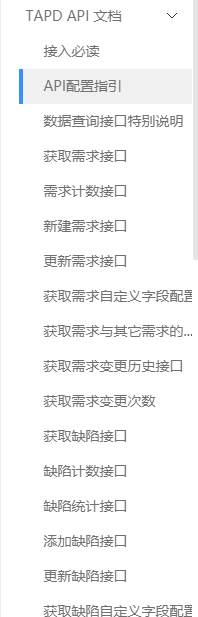

## 加推实战2例

> 1.通过IM机器人解决，自动报表汇总和事件提醒💥
>
> 2.前端验证方式升级

### 1.从任务痛点说起

* 加推和很多公司一样，企业运行的核心是任务，当leader发布任务后，汇总需要主动查看后台系统😶
* 产品线的bug会被记录到TAPD，但客服在于客户沟通中的一些bug往往会被遗忘，我们希望将其收集起来😶

### 需求分析

* 1.对于全员营销任务，我们希望在任务完成后，进行统计和提醒。💥
* 2.我们希望更方便的记录汇总bug
* 基于以上2个需求，我们决定开发钉钉机器人，在钉钉群中进行汇总和提醒，并可以让客服直接与机器人交互完成bug汇总。:smile:

#### 解决方案文档学习
> 学习能力非常重要，面对各类第三方接入，需要快速了解与学习相应文档:fire:

#### 钉钉文档

* 钉钉开放平台=>企业内部应用=>服务端API=>机器人开发
* 注意，在这个栏目下，钉钉有**2**种机器人，一种是**推送机器人**，一种是**问答机器人**（交互后，再推送）

##### 推送机器人（钉钉叫，自定义机器人）

* 此栏目文档，10分钟内阅读完成。对于中级以上程序猿，没有任何难度:smile:
* 安全机制，可以选择关键字，也可以选择加签（又叫验签），有php和python的代码，依葫芦画瓢。

> 我这里选择加签（看上去更安全些），将钉钉的加签方式 抽成一个函数。


* 默认时间戳为当前

* 推送机器人支持text、link、markdown、ActionCard、FeedCard消息类型，我们只用到text和markdown
* 为了更好扩展，我们创建一个模板静态对象,发送时，相应的值改变即可，so easy

```javascript
const sendObj = {
  markdownTemp: {
    msgtype: 'markdown',
    markdown: {
      title: '',
      text: ``
    },
    at: {
      //atMobiles: [],
      isAtAll: false
    }
  },
  textTemp: {
    msgtype: 'text',
    text: {
      content: ''
    },
    at: {
      atDingtalkIds: ['XXXXXXXXXXX'],
      isAtAll: false
    }
  }
}
```

* 钉钉文档会再次说明，推送机器人是不支持应答的，所以推送机器人主要用来解决推送问题。
* **注意** 这里有个发送频率，钉钉文档说是，每分钟20次。

* 封装一下推送接口，默认POST，JSON格式提交，这里使用axios组件发起请求


* 然后就是定时，将TAPD的信息汇总到这推送机器人，TAPD文档在后面说。

* 看一下最后的效果

  

  > 为了美观，采用钉钉的markdown，然后自动抓取bing当日壁纸，让大家有一个愉快的心情:smile:

##### 问答机器人（钉钉叫，企业内部机器人）


* 验签代码，复用推送机器人代码。

* 开通流程不同，看文档可简单完成配置。

* 当@机器人后，钉钉推送到你的API接口，你用钉钉验证算法进行sign值的验证，sign放在http Header中。

* 读取每个属性值，尤其是content值，然后根据每个企业的规则进行回复。

* **注意**此处钉钉会产生一个临时的sessionID，你需要在短时间内，回复，否则这个问答推送链接会失效。

* 样式和推送机器人一致，再一次复用代码，效果如下

  

  > 初步的样子有了之后，我们开始完成，企业内部的推送和问答逻辑。

  > 上面连入一个实时翻译接口，将中文或者英文互相翻译


  * 企业发布的任务完成后，自动推送到钉钉群
  
    

#### TAPD文档
* 腾讯TAPD API https://www.tapd.cn/help/view#1120003271001002318
* 腾讯的验签规则,在http 的Header中放入，简单http验证模式

```javascript
Authorization:
      'Basic ' + Buffer.from(account + ':' + pwd).toString('base64')

```
* 类似钉钉接口简单封装后，就可以获取相应项目下的缺陷（Bug）情况了。

* TAPD考虑的比较周到

  

> 当然还可以连接云雀知识库，最新的知识变更第一时间推给大家

#### 小结

* 企业IM系统已经成为日常必需的工具:smile:
* 将研发自动化，或者工作流自动化反馈，并通知相关人员，是一个很好的思路
* 我们除了链接TAPD，还可以链接语雀这样的文档系统，将知识文档的变化，实时推动到群:smile:
* 相信大家可以做出更好的机器人为企业服务（想象空间很大）:fire:


### 2.验证方式升级

> 大部分的表单验证是通过一个动态的验证码图片，我们希望改成滑动验证(用户有时会分辨不清图形验证的值)

* 有很多第三方提供了这个能力，验证方式也多种多样，先分析一下技术点

#### 技术点分析
* 完成后台图片和局部的抠图。💥
* 前端记录用户的拖拽行为，并将，点位数组+拖拽时间+移动到抠图的位置​提交​后端:smile:
* 我们希望有个算法，可以过滤出一般人的操作行为。
#### 干货
> 一般人拖动的行为总结如下
* 在y轴方向，不可能完全水平无变化

* 在x轴方向，有一个总体上的趋势（结束处来回拖动是正常），先加速后减速的过程

* 为了防止一些简单的模拟攻击，增加二次曲线的拟合度不能>90%

* 我们把这些条件转化成代码，并做测试，来验证一下


> 简单的说，你移动 不可能 完全水平，也不可能 最后还强加速，这是方法核心

#### 人的真实拖动数据检测


#### 小结
* 研发遇到问题，可以先思考一下，立刻找开源库，可能最终实现成本更高。
* 本例核心是一个高中的抛物线应用，将位移转化为加速度，然后进行开口判别:fire:

以上2例抛砖引玉，祝大家2020提升技术，开心，发财 :smile:

