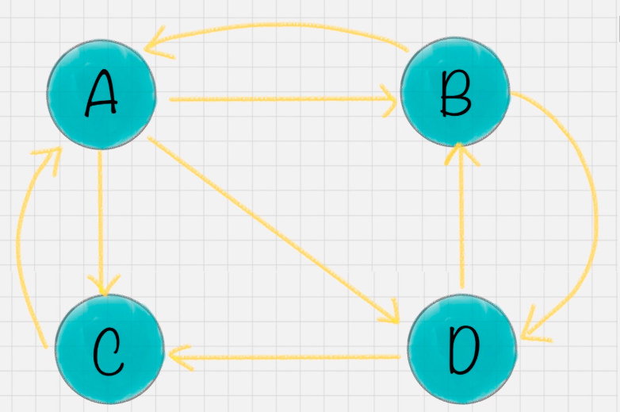
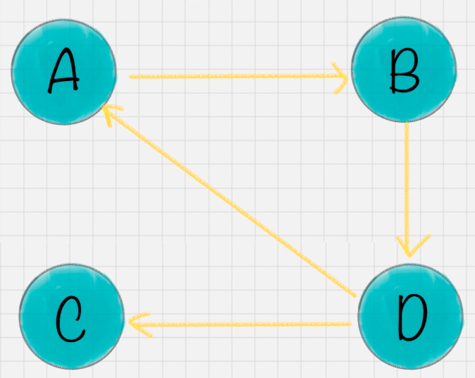
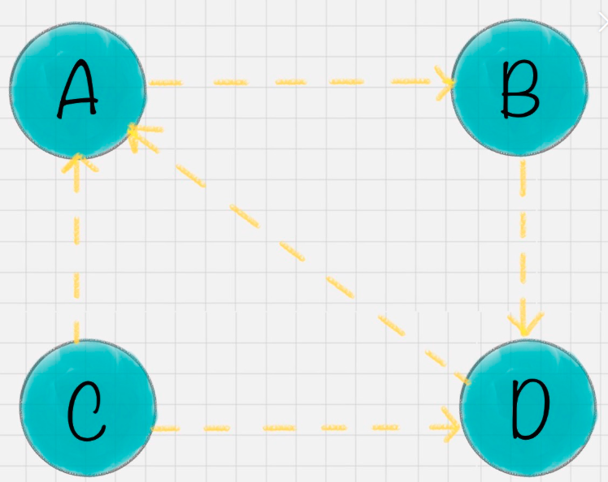
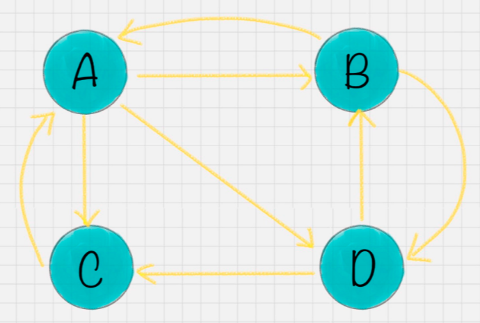
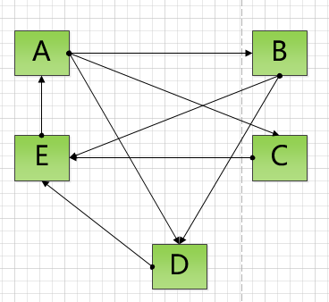
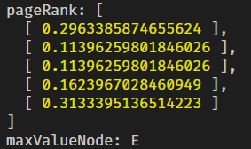

## 加推实战之pageRank

> PageRank是通过计算页面链接的数量和质量来确定网站重要性的粗略估计

### 方法背景及应用概述

> PageRank算法在1998年4月举行的第七届国际万维网大会上由Sergey Brin和Larry Page提出。所以叫pageRank😄
>
> 算法创立之初的目的是应用在Google的搜索引擎中，对网站进行排名。
>
> 作为典型的技术驱动型的公司，Google确实改变了世界💥

* 为了提高搜索质量，开始使用人工进行目录分类，网页越来越多，人工分类已经不现实了。搜索引擎进入了 **文本检索** 的时代。
* 谷歌的两位创始人，借鉴了学术界评判学术论文重要性方法， 论文被引用次数。由此想到网页的重要性也可以根据这种方法来评价。
* 作为现代搜索引擎的核心算法，大家应该都了解一下。常用的大数据算法库一般都包含此方法
* 在社交网络中，我们也可以类似的找出价值共享最大的人（节点）😄
* 在一段时间内，pageRank作为网页营销的一个衡量标准，当然现在人们改变了想法
* 延展的方法有 [TrustRank](https://baike.baidu.com/item/TrustRank)，[Hilltop](https://baike.baidu.com/item/Hilltop) 算法等

### 算法核心思想

* **如果一个网页被很多其他网页链接到的话说明这个网页比较重要，也就是PageRank值会相对较高**
* **如果一个PageRank值很高的网页链接到一个其他的网页，那么被链接到的网页的PageRank值会相应地因此而提高**😄
* 所谓环环相扣

### 数学概念准备

##### 先实现马尔科夫矩阵的判断（随机矩阵、概率矩阵）

> 马尔科夫矩阵判断标准：所有元素都>=0，并且每一列的元素和都为1

```javascript
function isMarkov (mat) {
  let esp = 1e-10 // 和1的误差
  let isPositive = !1
  let colSum = [] // 每1列求和
  let len = mat.length
  for (let i = 0; i < len; i++) {
    for (let k = 0; k < len; k++) {
      const item = mat[i][k]
      isPositive = item >= 0 ? !0 : !1
      if (!isPositive) return !1
      colSum[k] = colSum[k] || 0
      colSum[k] += item
    }
  }
  return colSum.every(x => Math.abs(1 - x) <= esp) && isPositive
}
```

* 当然还需要2个条件
* 随机矩阵必须是不可约矩阵（自行学习）
* 随机矩阵必须是非周期的（自行学习）
* 包括收敛性，高斯-赛德尔迭代
* 最终，证明了PageRank算法的正确性。😄

##### 了解高斯-塞德尔迭代法

* 高斯-赛德尔迭代法是解**线性方程组**的常用迭代法之一，设线性方程组为
  $$
  \begin{array}{c}
  a_{i 1} x_{1}+a_{i 2} x_{2}+\cdots+a_{i n} x_{n}=b_{i} \\
  (i=1,2, \cdots, n)
  \end{array}
  $$
  
* 高斯-赛德尔迭代法的迭代公式为:

$$
\begin{aligned}
x_{i}^{(k+1)}=(&\left.b_{i}-\sum_{j=1}^{i-1} a_{i j} x_{j}^{(k+1)}-\sum_{j=i+1}^{n} a_{i j} x_{j}^{(k)}\right.) / a_{i i} \\
&(i=1,2, \cdots, n ; k=0,1,2, \cdots,)
\end{aligned}
$$

* 通过不断迭代，最终解出特征向量，也就是网页的价值向量PR

### 先来看一个具体例子



* A 有 2 个入链，3 个出链，B ,C , D依次类推

* 将这个网络写成概率矩阵，也就是**马尔科夫矩阵**

* $$
  M=\left[\begin{array}{cccc}
  0 & 1 / 2 & 1 & 0 \\
  1 / 3 & 0 & 0 & 1 / 2 \\
  1 / 3 & 0 & 0 & 1 / 2 \\
  1 / 3 & 1 / 2 & 0 & 0
  \end{array}\right]
  $$

* 我来解释一下上面的矩阵：

* 一列一列看，A列向量，B列向量，C列向量，D列向量

* A 有三个出链分别链接到了 B、C、D 上。那么当用户访问 A 的时候，就有跳转到 B、C 或者 D 的可能性，跳转概率各为 1/3。

* B 有两个出链，链接到了 A 和 D 上，跳转概率各为 1/2。

* C=>A ,D=>B,D=>C 很简单吧😄

* 因为4个页面的初始价值是相等的，全部设置为1/4

* 然后开始进行状态转移，不断的乘以转移的结果，也就是乘以一个列向量。如下

* $$
  w_{1}=M w_{0}=\left[\begin{array}{cccc}
  0 & 1 / 2 & 1 & 0 \\
  1 / 3 & 0 & 0 & 1 / 2 \\
  1 / 3 & 0 & 0 & 1 / 2 \\
  1 / 3 & 1 / 2 & 0 & 0
  \end{array}\right]\left[\begin{array}{c}
  1 / 4 \\
  1 / 4 \\
  1 / 4 \\
  1 / 4
  \end{array}\right]=\left[\begin{array}{c}
  9 / 24 \\
  5 / 24 \\
  5 / 24 \\
  5 / 24
  \end{array}\right]
  $$

* 不断用M成 Wk,一直到误差小于某个值，也就是收敛了即可停止。

* 代码也就是一个循环就搞定了🔥

##### 实际会碰到的2个问题

* 1.等级泄露（Rank Leak）只有入链没有出链最终每个网页的PR=0

* 

* 2.等级沉没（Rank Sink）如果网页只有出链，没有入链，也会让所有PR=0

* 

* 解决方案是，增加一个阻尼因子，也就是用户有一定的概率直接跳到这个页面，而不是通过其他页面过来。公式如下：

* $$
  PR(u)=\frac{1-d}{N}+d \sum_{i \in B_{u}} \frac{P R(v)}{L(v)}
  $$

* d一般取0.85，pageRank在吴军的《数学之美3》有介绍，但里面没有提及具体的阻尼数值。

* 这样代码就变成，不断循环乘矩阵并增加阻尼系数d

### 工程实现上的技巧

* 如果只是实现这个算法，SO EASY，但每次都要人工去编写这个概率矩阵未免有些麻烦

* 对于上图，我们其实希望输入边的数组，然后自动生成矩阵

* 

* ```
  [["A", "B"], ["A", "C"], ["A", "D"], ["B", "A"], ["B", "D"], ["C", "A"], ["D", "B"], ["D", "C"]] => 自动得出概率矩阵
  ```
  
* 节点A-Z用完了，就AA AB，大家发现其实这就是 excel的 字母编码，我们来实现一下这个算法的双向过程

```javascript
const $  = require('meeko')

// 类excel，的列坐标转数值
function strIndex2num (str) {
  str = str.toUp()
  let a = str.split('')
  let len = a.length
  let s = 0
  for (let i = 0; i < len; i++) {
    s += (a[len - 1 - i].charCodeAt() - 64) * 26 ** i
  }
  return s
}
// AP =>  42

// 类excel，的列数值坐标转字符串坐标
function num2IndexStr (num) {
  return num
    .toString(26)
    .split('')
    .map(x => String.fromCharCode(+x ? +x + 64 : x.charCodeAt() - 23))
    .join('')
}

// 42 => AP
```

* 有了这些工具我们就可以愉快的实现PageRank了😄

### JS手撕PageRank

* 
* 以上有5个节点，上pageRank完整代码

```javascript
function pageRank (transMat, initVector, damping = 0.85, iter = 100) {//输入的概率矩阵，初始向量，阻尼系数，高斯-赛德尔迭代次数
  const esp = 1e-9
  const len = transMat.length
  if (!isMarkov(transMat)) return { iter: 0, r: transMat, isMarkov: false } // 马尔科夫矩阵判断，元素非负，列和为1
  if (!initVector)
    // 初始化向量
    initVector = $.math.mat.transpose([
      Array.from({ length: len }, x => 1 / len) // 初始化N个，值为1/N 的向量
    ])
  let r = $.math.mat.mul(transMat, initVector)// 第一次迁移计算
  // 高斯-塞德尔迭代法
  for (let i = 0; i < iter; i++) {
    let weightNew = $.math.mat
      .mul(transMat, r) // 点乘上一次结果
      .map(x => [(1 - damping) / len + damping * x[0]]) // 加入阻尼系数计算PR
    // 迭代，收敛到阀值停止
    if (Math.abs(weightNew[0][0] - r[0][0]) < esp) {
      return { iter: i, r: r, isMarkov: true }
    }
    r = weightNew
  }
  return { iter: iter, r: r, isMarkov: true }
}

function createNetwork (edges) {
  /*
    edges: [从哪里=> 跳转到哪里 ]
  */
  let colCount = edges.map(x => x[0]).count() //计算列的总计数
  let len = 0
  for (let i in colCount) {
    len++
  }
  let mat = $.math.mat.zero(len, len) // len * len的全零矩阵
  // 边字符串形式转 数值矩阵形式
  for (let i = 0; i < edges.length; i++) {
    let [colNum, rowNum] = [
      strIndex2num(edges[i][0]) - 1, // 类excel 列坐标 转换 AP =>  42
      strIndex2num(edges[i][1]) - 1
    ]
    mat[rowNum][colNum] = 1 / colCount[edges[i][0]] //1/列计数 作为初始值 概率值填入
  }
  return mat
}
// 上图的例子，小写字符会自动转成大写
let edges = [
  ['a', 'b'],
  ['a', 'c'],
  ['a', 'd'],
  ['b', 'd'],
  ['c', 'e'],
  ['d', 'e'],
  ['b', 'e'],
  ['e', 'a']
]
// 用边形式 创建 马尔科夫概率矩阵，计算pageRank向量
let pageRankArr = pageRank(createNetwork(edges)).r

console.log('pageRank:', pageRankArr)
console.log(
  'maxValueNode:',
  num2IndexStr(+$.math.findMax(pageRankArr.flatten()).tag + 1)
)
```

* 运行结果如下
* 
* 现实中，网页的节点的比较是上亿的，而不是只有5个
* 所以我们会使用MapReduce将矩阵进行分解，分而治之法

### PageRank算法的缺点

> pageRank算法，原理简单但效果惊人。然而，PageRank算法还是有一些弊端。

* 1，**没有区分站内导航链接**。很多网站的首页都有很多对站内其他页面的链接，称为站内导航链接。这些链接与不同网站之间的链接相比，肯定是后者更能体现PageRank值的传递关系。

* 2，**没有过滤广告链接和功能链接**（例如常见的“分享到微博”）。这些链接通常没有什么实际价值，前者链接到广告页面，后者常常链接到某个社交网站首页。

* 3，**对新网页不友好**。一个新网页的一般入链相对较少，即使它的内容的质量很高，要成为一个高PR值的页面仍需要很长时间的推广。

> pageRank代码地址 https://github.com/kongnet/meeko/blob/master/sample/pageRank%E4%BE%8B%E5%AD%90.js


### 总结

* 了解PageRank，应用到实际业务场景

* 通过JS实现之，解决更多类似的网络价值问题🔥


祝大家2020提升技术，开心，提升自己 😄