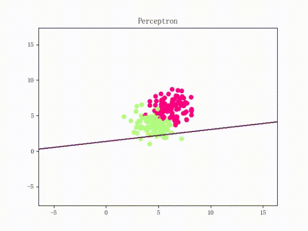
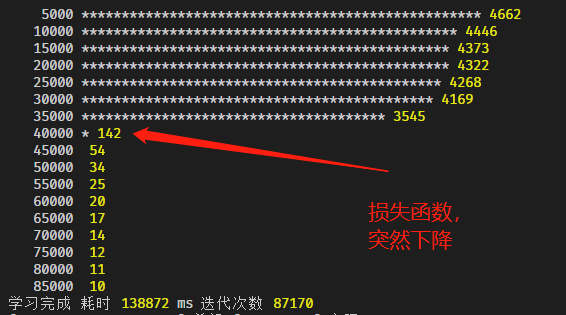

## 加推实战之全栈JS神经网络

> 脑机接口时代已经到来？作为万能分类器，各类神经网络在近年有了长足的发展
>
> 比如卷积神经网络，也在如今的图片识别领域取得最好的成绩
>
> 今天的目标是JS手撕通用神经网络🔥，无任何库依赖

### 神经网络概述
* 人工神经网络（ Artificial Neural Networks， 简写为ANNs）也简称为神经网络（NNs）或称作连接模型（Connectionist Model） ，是对人脑或自然神经网络（Natural Neural Network）**若干**基本特性的抽象和模拟。
* 
* 俺们的神经元看上去很厉害
* 目前在神经网络研究方法上已形成多个流派，最富有成果的研究工作包括：[多层网络BP算法]()，[Hopfield网络模型]()，[自适应共振理论]()，[自组织特征映射理论]()等。人工神经网络是在现代神经科学的基础上提出来的。它虽然反映了人脑功能的基本特征，但远不是自然神经网络的逼真描写，而只是它的某种简化抽象和模拟。
* 今天大致的学习流程，日常问题=>感知机=>向前传播=>向后传播=>多层BP神经网络->案例=>小结
* 为啥要学习？机器一直在学习，作为人类请保持学习😄

### 日常数据分类问题

#### 简单感受一下

* 先看个动图
* 
* 上图的过程，就是通过机器学习，最终确定一组参数，最后将2组数据尽可能分开😄
* 通过一条直线进行分类，就是线性分类器

####  再来看一个经典分类例子

* 逻辑电路中我们都学过与门，或门，与非门，或非门，异或门
* **题外话**：门电路形成组合逻辑，触发器组合形成时序逻辑，2者共同实现数字逻辑，最终形成俺们的CPU💥。。。
* 输入=>输出 的真值表，如下图
* 
* 除了XOR，其他逻辑操作真值表 都可以被一条直线划分，如下图
* 
* 
* 1条直线基本闯天下，但XOR呢，无法用一条直线搞定，那应该如何？😶一朵小乌云？
* 
* 看一下 无法线性分类的动图，机器不断学习，但陷入震荡😶
* 

#### 类似XOR分类的解决方案

* 我们可以用各种机器学习完成，类XOR数据集分类，如下图

* 
* 今天要用的是上图中， 左下模式-神经网络，实现非线性分类器🔥
### 人工神经网络

#### 感知机

* 感知机（perceptron）是由美国学者 Frank Rosenblatt 在 1957 年提出来的，感知机是神经网络（深度学习）的起源算法

* 可以简单的认为一个感知机就是一个神经元，接受输入，处理后输出，也可以输入到下一个感知机😄

* 

* 一个感知机，由多个输入，其中，参数w叫做权值向量(weight)，b称为偏置(bias)，activation function是激活函数，最终得出Oj

* 注意b 在上图没有明确标注出,可以认为是一个截距,每个感知机对应1个b

  $$X=\left\{x_{1}, x_{2}, x_{i}, \ldots, x_{N}\right\}$$

  $$O=\{0,1\}$$

  $$O=f(x)=\operatorname{sign}\left(w^{T} x+b\right)$$

* 整个感知机，理解起来是很简单的，他模拟了生物神经元的特定功能😄

* 上面的f（x） ，你可以简单认为就是一条直线，所以对于除了XOR的逻辑门，我们可以通过1个感知机进行分类

* 下面我们会用JS建立一个感知单元类。

* 神经网络主要有三个基本要素：**权重、偏置和激活函数**，我们的目标就是调整这3个参数
#### 激活函数
* 起非线性映射的作用，其可将神经元的输出幅度限制在一定范围内，一般限制在（－1～1）或（0～1）之间。最常用的激活函数是Sigmoid函数。
* Sigmoid函数在之前文章中有提及
* 
* 下面代码中我们会实现，3种激活函数，及其导数
#### 多层感知机-神经网络
* 先看动图
* 
* 上图有1层输入层，2层隐藏层，1层输出层
* 输入层有2个维度输入，输出层有2个维度输出
* 大部分的分类工作，用2层隐藏层网络足矣


#### 正向传播
* 多层神经网络的正向传播大约是这样的:
* 
* 输入的手写数字，通过2层，隐藏层后，获得了 0-9，10个分类
* 为啥会得到0-9，那是由里面的w 参数，b参数， 激活函数，确定的 。你要做的只是乘起来求和
* 784是什么鬼？28x28，每张图片的像素个数 😄，这里使用了 one-hot独热编码
* 如何确定这些参数值呢？使用反向传播，也就是常说的学习（训练）
#### 反向传播
* 如果正向传播是小学生，那反向传播一下就跳到了大学预备班😶，可能这就是所谓前方高能吧
* 我们尽可能简单的叙述这个过程
##### 复合函数的偏导 链式法则
$$z(x, y)=f[u(x, y), v(x, y)]$$

$$\begin{array}{l}
\frac{\partial f}{\partial x}=\frac{\partial f}{\partial u} \frac{\partial u}{\partial x}+\frac{\partial f}{\partial v} \frac{\partial v}{\partial x} \\
\frac{\partial f}{\partial y}=\frac{\partial f}{\partial u} \frac{\partial u}{\partial y}+\frac{\partial f}{\partial v} \frac{\partial v}{\partial y}
\end{array}$$

* 为啥要这么复杂？
* 因为在w ，b 不确定的时候，我们先通过正向传播得出一个值，这个值和真实的值的差，形成一个损失函数Loss()
* 我们要做的就是 调整 这些 w 和 b 值，求Loss函数的最小值
* 我们通过几百上千次的微调 这些w 和 b 来让残差（实际和预测的差）变小
* 而这些微调，我们用数学语言就是求L函数的w偏导 b偏导
* 整个过程如下：
* 
* “正向传播”求损失，“反向传播”传误差。同时，神经网络每层的每个神经元都可以根据误差信号修正每层的w 和 b的值
* 上图的δ 就是梯度，别搞错是一个向量哦😄
* 理解这个过程，写出代码并不难😶
* 而这个不断微调的过程我们叫梯度下降法：
*  
*  上图对J函数求，θ0 和 θ1的偏导，每次对多个参数调一点点，摸索着，找到复合函数的最小值 💥
*  最后，根据这些梯度值，更新w，b参数调整后的新值，进入下一轮正向传播
*  多层神经网络好比丹炉，而我们得到的参数好比金丹。于是AI工程师，又被成为炼丹师

#### 干货，上代码

* 首先是辅助函数

```javascript
function activeFunc (x, type = 'relu') {
  let lamb = 1.0507009873554804934193349852946
  let alpha = 1.6732632423543772848170429916717
  let temp = 0
  switch (type) {
    case 'sign':
      return x >= 0 ? 1 : -1
    case 'sigmoid':
      return 1 / (1 + Math.exp(-x))
    case 'tanh':
      return (Math.exp(x) - Math.exp(-x)) / (Math.exp(x) + Math.exp(-x))
    case 'relu':
      return x > 0 ? lamb * x : lamb * alpha * (Math.exp(x) - 1)
    case 'diffsigmoid':
      x = 1 / (1 + Math.exp(-x))
      return x * (1 - x)

    case 'difftanh':
      x = Math.tanh(x)
      return 1 - x ** 2
    case 'diffrelu':
      return x > 0 ? 1 : alpha * Math.exp(x)
  }
}
function mse (realArr = [], predArr = []) {
  return (
    realArr.reduce((a, b, idx) => a + (b - predArr[idx] || 0) ** 2, 0) /
    realArr.length
  )
}
//交叉熵损失函数备选
function crossEntropy (a, y) {
  return -y * Math.log(a) - (1 - y) * Math.log(1 - a)
}
```

* 3个常用激活函数及其导数函数，做了一个6合1的函数，目的为了处处可微，并是输出非线性化。你也可以分开写
* 这点很重要否则，线性组合还是线性的，模型无法进行复杂拟合
* mse平方差求和，目的为了计算残差，更好的观察模型逐步收敛的过程
* 感知机类

```javascript
class Perceptron {
  constructor (inputObj = {}) {
    this.config = inputObj
  }
  set config (o) {
    this.type = o.type || 'hidden' // input hidden output 神经元的类型 cov pool
    this.inputDimNum = o.inputDimNum || 2 //输入维度
    this.outputDimNum = o.outputDimNum || 2 //输出维度
    this.inputArr = []
    this.beforeOutput = 0
    this.output = 0
    this.activeFunc = o.activeFunc || 'sigmoid'
    this.wb =
      o.wb ||
      $.math.genRange(1, this.inputDimNum, 0).map(x =>
        randMinMax(
          -Math.sqrt(1 / this.inputDimNum), //传统的初始化种子
          Math.sqrt(1 / this.inputDimNum)
        )
      ) //w 向量 0.5
    if (!o.wb) this.wb.push(1) //b 设置成 1
    this.wbT = $.math.mat.transpose([this.wb]) // w+b转置矩阵
    this.derivative = 0 //导数值
  }
  setWb (a) {
    this.wb = a
    this.wbT = $.math.mat.transpose([this.wb]) // w+b转置矩阵
  }
  predict (inputArr) {
    if (inputArr.length < this.inputDimNum) throw new Error('输入维度太少')
    this.inputArr = inputArr
    this.beforeOutput = $.math.mat.mul([[...inputArr, 1]], this.wbT)[0][0]
    this.output = activeFunc(this.beforeOutput, this.activeFunc)
    return this.output
  }
}
```

* 感知机类，主要实现 向前传播，就是属性多，其他很简单😄
* 这里使用 predict 来实现 向前传播
* 向后传播，需要乘以误差矩阵，与偏导的乘积，作为上一层的误差矩阵，从尾部想神经网的头部传输

```javascript
  function backPropagation (realArr) {
    if (typeof realArr === 'number') {
      realArr = [realArr]
    }
    //第L行
    let L = networkArr.length - 1
    let deltaArr = []
    // 计算偏导
    for (let i = L; i > 0; i--) {
      deltaArr[i] = []
      if (i === L) {
        for (let d = 0; d < networkArr[i]; d++) {
          deltaArr[i].push(
            (networkObj[i][d].output - realArr[d]) *
              activeFunc(networkObj[i][d].beforeOutput, 'diffsigmoid') //最后一层的误差
          )
        }
      } else {
        let weightArr = []
        for (let k = 0; k < networkArr[i + 1]; k++) {
          weightArr.push(networkObj[i + 1][k].wb)
        }
        let weightArrT = $.math.mat.transpose(weightArr)
        for (let d = 0; d < weightArrT.length - 1; d++) {
          deltaArr[i][d] = 0
          weightArrT[d].map((x, idx) => {
            deltaArr[i][d] +=
              deltaArr[i + 1][idx] *
              x *
              activeFunc(networkObj[i][d].beforeOutput, 'diffsigmoid') // 矩阵点乘
          })
        }
      }
    }

    //更新每一层的每个wb值
    for (let i = L; i > 0; i--) {
      for (let k = 0; k < networkArr[i]; k++) {
        let wbArr = networkObj[i][k].inputArr.map((x, idx) => {
          return x * deltaArr[i][k]
        })
        wbArr.push(deltaArr[i][k])
        networkObj[i][k].wb.map((x, idx) => {
          wbArr[idx] = x - learnRate * wbArr[idx]
        })
        networkObj[i][k].setWb(wbArr)
      }
    }
  }
```

* 学习Train的过程，非常简单暴力

```javascript
 let epoch = 1e5 //世代 你也可以认为是迭代次数
 for (i = 0; i < epoch; i++) {
    let mseArr = []
    for (let k = 0; k < data.length; k++) { //数据行数
      forwardPropagation(data[k]) // 每个数据的维度
      backPropagation(dataTag[k]) // 每个数据的分类标记
    }
  }
```

* 其次你需要一个createNetwork函数循环产生多个，感知机实例。代码太简单就罗列了
* 对，这就完了，你的丹炉已经搞定，可以开始炼丹了。🔥
* 以上矩阵基本操作，封装在meeko的代数核心库中。

#### 实例执行

##### XOR分类

* xor无法通过普通回归进行分割，我们看看自己的丹炉效果
* 2,2,2 1个隐层网络


* 在15000次迭代后，误差突然减小，这也是大部分神经网络学习的，特征，要耐心炼丹

* 最后输出的 就是金丹了，直接，拿这些w 和 b 的参数，就可以直接断言XOR操作了
* 有了丹药，输出是瞬间的。这也是大部分同学在网上下载别人训练好的模型的用法😄

##### 鸢尾花分类
* 我们使用之前的150个 鸢尾花数据集，对花的品种进行分类
* 我们把3类花，进行one-hot编码 [1,0,0] [0,1,0] [0,0,1] 代表3类，输入4维
* 在之前的《特征工程文章中》，我们使用PCA将鸢尾花的维度从4维降低到了2维
* 本次，我们先不降维，直接暴力使用神经网络分类🔥
* 我们创建一个 10个神经元的隐藏层 
```javascript
let networkArr = [4, 10, 3]
networkObj = createNetwork(networkArr)// 循环产生多层多个感知机
```
* 139秒后，我们在87170次迭代后，得到了满足阀值eps的丹药
* 
* 我们调整参数创建新的神经网络，2个隐藏层， 1个有10个神经元的，1个有3个神经元  
```javascript
let networkArr = [4, 10, 3, 3] // 这个结构是看到matlab 鸢尾花例子用了这个参数
networkObj = createNetwork(networkArr)
```
* 因为随机参数造成的差异，普遍来说 4,10,3,3结构会比 4,10,3 好一些，训练时间随网络变大而迅速增加。
* 但同样的epoch，多层可以用更多的 参数可调，当然对于不同的数据集 情况有所不同。


* 几次运行下来，会发现经常有1个点 [ 6, 2.7, 5.1, 1.6 ]  没有被正确识别


* 我们作图看一下


* 这个点是在2个花品种之间，人工筛选也会出现错误。太高的网络层数 一样会造成过拟合，这个丹药（参数），最终是非常满意的。
* 用784,100,10 这样的网络模型，可以训练手写minst数据集 到97%+ 的精准率，这是非常好玩的事情。
* 至此自建的多层神经网络，还是有一定的精准性的🔥
> 浏览器中运行也是妥妥的💥

#### 进一步学习

* 主流神经网络加入了更多不同功能的节点，但万变不离其宗

* 比如常用的卷积神经网，就加入了，卷积层和池化层😄

* 参数的优化，主要有动态学习率，参数初始化方法，归一，动量，改变下降方式等

* 对于神经网络我们已经现龙在田了

* 其他类型的神经网络

* 

  

### 总结

* 了解通用人工神经网络的正反向传播
* 了解多层神经网络，神经网络就是丹炉，获得的参数就是金丹
* 通过JS实现之，将算法用到实际业务场景，自动化一切，减少人工
* 逐步掌握多层神经分类的技巧
* 了解其他主流神经网络


祝大家2020提升技术，开心，获得金丹，发财 😄