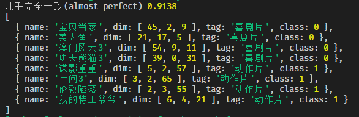

## 加推实战之全栈JS经典机器学习

> 各行各业的研发、产品都需要理解一些机器学习的知识

### 机器学习概述
* 20世纪50、60年代被提出，随着硬件算力的增加，走向民用
* 通过数据+算法得出模型，模型的本质是对世界规律的数字化抽象🔥
* 大致关系是：大数据=>人工智能=>机器学习=>深度学习
* 大致模型的流程:确定参数=>判别
* 经典的机器学习算法包括：
  * 决策树 ：基于规则的一种分类算法《本文介绍》
  * 朴素贝叶斯 ：基于概率的一种分类算法，主要用于文本的分类《往期有介绍》
  * SVM ：主要用于非线性可分的分类算法
  * K-Means：对数据进行初步聚类，是数据挖掘中非常重要算法之一《本文介绍》
  * KNN ：基于距离的一种分类算法《本文介绍》
  * 线性回归：主要用于预测目标结果为连续值的问题《往期有介绍》
  * 逻辑回归：主要用于预测目标结果为离散值的问题
  * 神经网络 ：主要用于深度学习
* 朴素贝叶斯已经在加推实战系列之前的文章分享了
* 今天的目标是JS手撕，**K-Means，KNN，决策树DecisionTree**🔥

### 为什么是这3个

* 编写简单，初级程序员都可以完成
* 非常经典，非常重要😄
* 效果中规中矩，性能可以接受，有此3个及其延伸思想，可以实战
* 分类和回归都可以搞定
* 放在一起可以进行比较和理解，2个K开头算法（knn，k-means）那是完全不同的


> 浏览器中运行也是妥妥的💥，废话少说如下：

### K-means

#### 历史

* 1957有算法思想，1967年确定术语，1982年才被贝尔实验室公开，一个经典不衰的算法

* K-Means算法是无监督的聚类算法
* 简单的说，当你不知道数据怎么分的时候，用它一分便可初步了解。
* 广泛应用于，市场划分、机器视觉、 地质统计学、天文学和农业等
* K-Means有不少变体，包括K-means++,k-means|| ,mini Batch K-means

#### 算法思想

* 将样本划分为K个簇，让簇内的点尽量紧密的连在一起，而让簇间的距离尽量的大

#### 算法步骤

* (1)从数据中选择K个对象作为初始聚类中心

* (2)计算每个聚类对象到聚类中心的距离来划分

* (3)再次计算每个聚类中心

* (4)中心的变化小于阀值，则停止，否则，继续操作。

  

* 上图初始化了3个中心点，一开始中心点是数据中元素位置的数值，之后逐步移动

* 注意，所有的数据点都不会动，动的只是中心点，上图的C1-C3

* 上图3，C1旧=>C1新，其他中心点类似

* 最终数据将被聚类到C1-C3

#### 思考

* K怎么定？
* 聚类效果如何评估？

#### JS手撕,类结构如下

```javascript
class Kmeans {
  constructor (inputObj = {}) {
  }
  // 设置算法入参
  set config (o) {
  }
  // 计算2点之间距离
  distTwo (algorithm, x = [], y = []) {
  }
  // 聚类效果指标SSE （簇内误方差）
  sse (o) {
  }
  // 重置数据
  reset () {
  }
  // 随机选择聚类中心点
  selectRand (obj, k) {
  }
  // kmeans++ 方式选择聚类中心点
  selectFarAway (obj, k) {
  }
  // 计算数据和各个中心点的距离
  computerDist (algorithm) {
  }
  // 移动中心点，达到阀值停止
  moveCenter (esp = 1) {
  }
  // 聚合
  clustering (k = 3, selectMethod = 'Rand') {
  // 寻找最佳K值
  findK (maxK = 10, selectMethod = 'Rand') {
}
```


#### 使用的数据如下

```js
//维度解释                搞笑，拥抱，打斗
let movieObjArr = [
  { name: '宝贝当家', dim: [45, 2, 9], tag: '喜剧片' },
  { name: '美人鱼', dim: [21, 17, 5], tag: '喜剧片' },
  { name: '澳门风云3', dim: [54, 9, 11], tag: '喜剧片' },
  { name: '功夫熊猫3', dim: [39, 0, 31], tag: '喜剧片' },
  { name: '谍影重重', dim: [5, 2, 57], tag: '动作片' },
  { name: '叶问3', dim: [3, 2, 65], tag: '动作片' },
  { name: '伦敦陷落', dim: [2, 3, 55], tag: '动作片' },
  { name: '我的特工爷爷', dim: [6, 4, 21], tag: '动作片' },
  { name: '奔爱', dim: [7, 46, 4], tag: '爱情片' },
  { name: '夜孔雀', dim: [9, 39, 8], tag: '爱情片' },
  { name: '代理情人', dim: [9, 38, 2], tag: '爱情片' },
  { name: '新步步惊心', dim: [8, 34, 17], tag: '爱情片' }
]
 
  let k1 = new Kmeans({ dataObj: movieObjArr }) //实例Kmeans
  
  k1.findK()// 寻找最佳K
```

#### 构造函数config(o) 参数说明

```javascript
  set config (o) {
    this.k = o.k || 3 // 默认K=3
    this.dataObj = o.dataObj.copy() || []
    this.oriDataObj = o.dataObj.copy() || [] //复制一份原始的数据
    this.initFunc = o.initFunc || 'rand' // 默认选择初始化中心的算法为rand，可选FarAway 即K-Means++算法
    // 距离可选项 'euclidean', 'euclideans', 'manhattan', 'chebyshevn', 'hamming'
    // 距离函数在之前加推实战中有详细说明
    this.algorithm = o.algorithm || 'euclidean' // 默认欧几里得距离
  }
```


#### findK()函数解释

* 取K 【1-10】，循环计算SSE

* SSE公式如下：

* $$S S E=\sum_{i=1}^{n} \sum_{j=1}^{m} w^{(i, j)}=|| x^{(i)}-\mu^{(j)}||_{2}^{2} \quad \mu^{(j)} \text { 表示j族的中心 }$$

* SSE函数如下

  

  ```javascript
  sse (o) {
      if (o.length === 0) return 0
      let r = o.map(x => {
        if (x.item.length === 0) return 0
       // 计算中心点和维度之间欧几里得距离 ，平方求和
        return $.math.sum(
          x.item.map(it => this.distTwo('euclidean', x.center, it.dim) ** 2) 
        )
      })
      return $.math.sum(r)// 簇之间再求和
    }
  ```


#### k=[2-10]运行SSE结果，并作图如下


* K=3是肘部，也就是方差之后变得相对平缓的，转折点，曲率也较大
* 我们也可以使用 3个点，求曲率的方式来确定K，人眼看效果更好一些
* 曲率公式：$$\rho=\frac{1}{K}=\frac{\left(1+y^{\prime 2}\right)^{\frac{3}{2}}}{\left|y^{\prime \prime}\right|}$$，以下是实现

```javascript
function findMaxCurvature (kArr = [], y = []) {
  let f = $.math.polyFitting(kArr, y).formula //拟合
  let [a1, a2] = [2 * +f[0].split('*')[0], +f[1].split('*')[0]] //求导
  let [max, maxIdx] = [0, -1]
  if (a1 <= 0) return { max: 0, idx: -1 }
  for (let i = 0; i < kArr.length; i++) {
    let r = a1 / (1 + (a1 * kArr[i] + a2) ** 2) ** (3 / 2) //计算曲率
    if (r > max) {// 找到最大曲率的索引
      max = r
      maxIdx = i
    }
  }
  return { max, idx: kArr[maxIdx] }
}
```

#### 以上数据确定K=3为较佳的簇分类数，继续运行,

```javascript
let r = k1.clustering(3)
console.log(k1.dataObj.orderBy(['class'], ['asc']))

//打印如下=>
[
  { name: '奔爱', dim: [ 7, 46, 4 ], tag: '爱情片', class: 0 },
  { name: '夜孔雀', dim: [ 9, 39, 8 ], tag: '爱情片', class: 0 },
  { name: '代理情人', dim: [ 9, 38, 2 ], tag: '爱情片', class: 0 },
  { name: '新步步惊心', dim: [ 8, 34, 17 ], tag: '爱情片', class: 0 },
  { name: '宝贝当家', dim: [ 45, 2, 9 ], tag: '喜剧片', class: 1 },
  { name: '美人鱼', dim: [ 21, 17, 5 ], tag: '喜剧片', class: 1 },
  { name: '澳门风云3', dim: [ 54, 9, 11 ], tag: '喜剧片', class: 1 },
  { name: '功夫熊猫3', dim: [ 39, 0, 31 ], tag: '喜剧片', class: 1 },
  { name: '谍影重重', dim: [ 5, 2, 57 ], tag: '动作片', class: 2 },
  { name: '叶问3', dim: [ 3, 2, 65 ], tag: '动作片', class: 2 },
  { name: '伦敦陷落', dim: [ 2, 3, 55 ], tag: '动作片', class: 2 },
  { name: '我的特工爷爷', dim: [ 6, 4, 21 ], tag: '动作片', class: 2 }
]
```

* 原数据被分成3个簇，class 0-2，0-2和tag本身没有关系
* 注意，本次分配是1次完美分配，class=0 只包含 爱情片，class=1 只包含 喜剧片 class=2 只包含 动作片
* 这说明，按照 **搞笑，拥抱，打斗** 3个维度值来分 电影到这3个 标签，是有说服力的
* 因为初始化中心点每次是随机，虽然会移动，但每次都会不一样，比如某一次如下

```javascript
[
  { name: '奔爱', dim: [ 7, 46, 4 ], tag: '爱情片', class: 0 },
  { name: '夜孔雀', dim: [ 9, 39, 8 ], tag: '爱情片', class: 0 },
  { name: '代理情人', dim: [ 9, 38, 2 ], tag: '爱情片', class: 0 },
  { name: '新步步惊心', dim: [ 8, 34, 17 ], tag: '爱情片', class: 0 },
  { name: '谍影重重', dim: [ 5, 2, 57 ], tag: '动作片', class: 1 },
  { name: '叶问3', dim: [ 3, 2, 65 ], tag: '动作片', class: 1 },
  { name: '伦敦陷落', dim: [ 2, 3, 55 ], tag: '动作片', class: 1 },
  { name: '宝贝当家', dim: [ 45, 2, 9 ], tag: '喜剧片', class: 2 },
  { name: '美人鱼', dim: [ 21, 17, 5 ], tag: '喜剧片', class: 2 },
  { name: '澳门风云3', dim: [ 54, 9, 11 ], tag: '喜剧片', class: 2 },
  { name: '功夫熊猫3', dim: [ 39, 0, 31 ], tag: '喜剧片', class: 2 },
  { name: '我的特工爷爷', dim: [ 6, 4, 21 ], tag: '动作片', class: 2 }
]
```

* 注意，最后一个class=2 混入了 动作片
* tag是我们预先知道的值，但K-means算法目标是对未知数据进行聚类，有tag我们也可以进一步来解释聚类的效果
* 一定要注意，K-means 是聚类，并不是分类，所以，聚类的目的并不是得到精准的分类！😶

#### 引入混淆矩阵概念

* 混淆矩阵是ROC曲线绘制的基础，它也是衡量分类型模型准确度中最基本，最直观，计算最简单的方法
* 我们对上面的聚类效果进行判别，是因为我们事先知道了原数据的tag值。
* 
* n个分类，形成n*n的矩阵，纵向是预测值，横向是实际值，然后将所有结果填入矩阵😶
* 先随便写一个混淆矩阵的通用类，全代码非常简单

```javascript
class ConfusionMatrix {
  constructor (tagArr) {
    //如果是数组count()成对象，否则，直接使用
    this.tagCount = Array.isArray(tagArr) ? tagArr.count() : tagArr
    let n = 0
    //this.tagTotal = tagArr.length
    this.keyMap = {}
    for (let i in this.tagCount) {
      this.keyMap[i] = n
      n++
    }
    this.dimNum = n
    this.mat = this.fillTag(this.dimNum + 1) //列为实际，行为测试
  }
  //填入标签，形成混淆矩阵
  fillTag (m) {
    let a = $M.mat.zero(m + 1, m + 1)// m+1 * m+1 全0矩阵
    let keyArr = Object.keys(this.keyMap)
    let sum = 0
    for (let i = 1; i < m + 1; i++) {
      let itemCount = this.tagCount[keyArr[i - 1]]
      sum += itemCount || 0
      a[0][i] = keyArr[i - 1] || '小计'
      a[i][0] = keyArr[i - 1] || '小计'
      a[m][i] = itemCount || sum
    }
    return a
  }
  getMatrix () {
    return this
  }
  //一致性检测值
  getKappa () {
    let diagonalSum = 0
    let itemsquareSum = 0
    for (let i = 1; i < this.dimNum + 1; i++) {
      diagonalSum += this.mat[i][i]
      itemsquareSum +=
        this.mat[this.dimNum + 1][i] * this.mat[i][this.dimNum + 1]
    }
    let po = diagonalSum / this.mat[this.dimNum + 1][this.dimNum + 1]
    let pe = itemsquareSum / this.mat[this.dimNum + 1][this.dimNum + 1] ** 2

    return { po, pe, k: (po - pe) / (1 - pe) } // kappa系数计算公式
  }
  /**
   * @description 测试
   * @param {string} tag1 预测成为的标签
   * @param {string} tag2 实际标签
   * @param {number} num 数量
   */
  addCountByKey (tag1, tag2, num = 1) {
    if (this.keyMap[tag1] === void 0 || this.keyMap[tag2] === void 0)
      throw new Error('标签未定义')
    this.mat[this.keyMap[tag1] + 1][this.keyMap[tag2] + 1] += num
    this.mat[this.keyMap[tag1] + 1][this.dimNum + 1] += num
  }
}
```

* 使用混淆距离计算上面数据的结果

```javascript
  let cm = new $.ml.util.ConfusionMatrix(tagCount) //实例化混淆矩阵
  let tagClassMap = Object.keys(cm.keyMap) // 将电影本身的tag 和 class 0-2 形成对照表
  for (let i = 0; i < obj.kMeanObj.length; i++) {
    obj.kMeanObj[i].item.forEach(x => {
      cm.addCountByKey(tagClassMap[x.class], x.tag) //循环计算并加入矩阵
    })
  }
  console.log(cm)
// =>
mat: [
      [ 0,     '喜剧片', '动作片', '爱情片', '小计' ],
      [ '喜剧片',    3,       1,      0,      4 ],
      [ '动作片',    0,       3,      0,      3 ],
      [ '爱情片',    1,       0,      4,      5 ],
      [ '小计',      4,       4,      4,     12 ]
  ]
```

* 有了这个矩阵后，我们可以进行Kappa值的计算
* Kappa公式：$$k=\frac{p_{o}-p_{e}}{1-p_{e}}$$
* 简单的说，po是对角线的概率，即预测和实际tag一致，pe是非对角线值💥
* Kappa系数的评判标准如下

```javascript
function kappaMap (v) {
  if (v <= 0.2) return '极低的一致性(slight)'
  if (v > 0.2 && v <= 0.4) return '一般的一致性(fair)'
  if (v > 0.4 && v <= 0.6) return '中等的一致性(moderate)'
  if (v > 0.6 && v <= 0.8) return '高度的一致性(substantial)'
  if (v > 0.8 && v <= 1) return '几乎完全一致(almost perfect)'
}
```

* 最终，我们循环1w次看，聚类的平均kappa系数效果，基于有tag标签

```javascript
  let kappaArr = []
  for (let i = 0; i < 10000; i++) {
    let r = k1.clustering(3) //, 'FarAway'
    kappaArr.push(kmeansKappa(k1))  }
  console.log(kappaMap($.math.mean(kappaArr)), $.math.mean(kappaArr)) //1w次平均值

// => 中等的一致性(moderate) 0.4405125
```

* 对于随机初始化中心点的K-means大致就这样了😄

### K-means++

#### 算法思路

* 随机初始化虽好，但如果一开始就取相对较远的点作为中心点那岂不是更好？簇之间更分散?

##### 算法步骤

* 随机取1个点
* 计算剩余点，和这个点的，距离，随机选正比距离的概率的点作为下一个点
* 计算剩余点，和已选最近中心点的，距离，随机选正比距离的概率的点作为下一个点
* 直到K个点选完
* 这里所谓正比距离的概率的点，需要引入轮盘赌算法

##### 轮盘赌算法

* 随机产生，指定概率值的数值
* 遗传算法中选择和复制比较好的个体
* 观察如下数据
* [1, 2, 2, 3, 3, 3, 4, 4, 4, 4, 5, 5, 5, 5, 5]
* 我希望之后，随机产生的值5的概率是1的5倍，4的概率是1的4倍，以此类推


* 这就是轮盘赌的精髓，累计概率法，上代码

```javascript
let a1 = [1, 2, 2, 3, 3, 3, 4, 4, 4, 4, 5, 5, 5, 5, 5]
let a1Count = a1.countAdv() //对上面数据计数，{1:xx,2:xx,3:xx}

/**
 * @description 轮盘赌概率输出
 * @param {Array} arr countAdv输出形式的数组
 */
function roulette (arr) {
  let rand = Math.random()
  let sum = arr[0].w //w是每个值在总数据中的权重
  let i = 0
  for (i = 1; i < arr.length; i++) {
    if (sum > rand) return arr[i - 1].k
    sum += arr[i].w
  }

  return arr[i - 1].k
}

let rCount = [] 
for (let i = 0; i < 10000; i++) {// 运行1w次，输出每个数字的 计数
  rCount.push(roulette(a1Count))
}
console.log(rCount.count())

// => { '1': 646, '2': 1364, '3': 1927, '4': 2743, '5': 3320 
```

* 2大致是1的2倍，3大致是3倍。。。5大致是5倍，算法完成😄
* 有了轮盘赌算法，就是完成K-means++的初选中心点算法
* 上K-means++代码

```javascript
  // kmeans++
  selectFarAway (obj, k) {
    k = k < 1 ? 1 : k
    let outputObj = []
    obj = obj || this.dataObj.copy() //复制一份
    let first = obj.shuffle().pop() // 随机拿一个中心点
    outputObj.push({ center: first.dim, item: [] })
    let n = 1
    while (n < k) { // 直到K个中心点全选完
      let distFromNearCenter = []
      for (let i = 0; i < obj.length; i++) {
        let itemFromCenter = []

        for (let d = 0; d < outputObj.length; d++) {
          itemFromCenter.push(
            this.distTwo('euclidean', obj[i].dim, outputObj[d].center)
          )
        }
        distFromNearCenter.push($.math.min(itemFromCenter))// 计算每个点离开自己最近的 ，簇中心点
      }
      let total = $.math.sum(distFromNearCenter) //计算所有点的距离总和
      let maxDist = -1
      let maxDistIdx = -1

      let weigthArr = distFromNearCenter.map((x, idx) => {
        let w = x / total //算出每个点权重值
        if (w > maxDist) {
          maxDist = w
          maxDistIdx = idx
        }
        return { k: idx, w: x / total }
      })

      let farIdx = roulette(weigthArr) //丢给轮盘赌算法，随机给出1个，正比概率距离的点！
      outputObj.push({ center: obj[farIdx].dim, item: [] }) // 新的中心点压入数组
      obj.remove(farIdx)// 在原来的点中，删除此中心点
      n++
    }
    return outputObj
  }
```

* 看上去比随机取K个点，复杂了不少，但原理上还是很清晰
* 一些知名学习库中，聚类算法的默认选K算法是 k-mean++😄

#### 进一步思考

* 我们发现在K=3的时候，有些簇可以完全命中全部tag分类

  

* 是否可以将这1簇，排出后，再进行聚类？

* 去掉class：2 也就是tag=爱情片的数据，再聚类看效果

* 

* 效果显著，Kappa系数提高到了0.9+😄,并且剩下的标签也得到了很好的聚类

* 这种技巧就是，**层次聚类法**

### K-means小结

* 了解了最基本的机器聚类算法，简单但实用，脑图如下

* 

### KNN

#### 历史

* KNN（K- Nearest Neighbor）即K最邻近法，最初由 Cover和Hart于1968年提出，是一个理论上比较成熟的方法。

#### 算法思想

* 即每个样本都可以用和它**最接近的k个邻近位置的样本**来代替，所谓近墨者黑近朱者赤😄
* 也可以粗陋的理解为，你啥角色是由离你最近的几个人说了算的。

#### KNN算法三要素

* K的选择，这里有点类似k、K-means的K ，但这里的K指附近的K个邻居
* 距离：
  * 《往期有介绍》，除常规的距离外，还会用到马氏距离，在meeko核心库中有实现
  * 常用的有欧氏距离，曼哈顿距离。。。，距离和最终效果关系较大
* 预测规则
  * 分类：多数边表决，加权表决
  * 回归：平均值法，加权平均值法

#### 废话少说，先看例子

```javascript
// 维度说明 浓度、颜色深度
let xRaw = [
  [14.23, 5.64],
  [13.2, 4.38],
  [13.16, 5.68],
  [14.37, 4.8],
  [13.24, 4.32],
  [12.07, 2.76],
  [12.43, 3.94],
  [11.79, 3],
  [12.37, 2.12],
  [12.04, 2.6]
]
let yRaw = [
  '黑皮诺',
  '黑皮诺',
  '黑皮诺',
  '黑皮诺',
  '黑皮诺',
  '赤霞珠',
  '赤霞珠',
  '赤霞珠',
  '赤霞珠',
  '赤霞珠'
]
let xTest = [12.8, 4.1]
```

* 我们想判断，酒精浓度值12.8，颜色深度4.1的，属于黑皮诺还是赤霞珠，葡萄酒
* 

* 肉眼观察，预测点（红色三角形），和黑皮诺，赤霞珠距离差不多。不喝上一口很难判断😄

* 按KNN K=3的判断，此点更匹配黑皮诺

  ```javascript
  未知酒分类 {
    result: { tag: '黑皮诺', maxValue: 2 },
    whole: { '赤霞珠': 1, '黑皮诺': 2 },
    algorithm: 'euclidean'
  }
  ```

* 欧式距离下，K=3 ，更可能是 黑皮诺（占2个点）

#### JS手撕，类如下

```javascript
// K-邻近机器学习
class Knn {
  constructor (xRaw, yRaw, k = 3, algorithm = 'euclidean') {
  }
  // config参数
  set (xRaw, yRaw, k = 3, algorithm = 'euclidean') {
  }
  // 计算距离
  calcDis (dimArr) {
  }
  // 预测
  predict (dimArr) {
  }
  // 参数调优
  optimize (chunkSize) {
}
```

* 代码比K-means更简单
* xRaw 相当于，K-means例子中的dim属性，多个维度
* yRaw相当于tag，标签
* KNN就是根据已有标签，对未知标签进行分类预测

#### 测试优化模型

* KNN中，我们除了要确定K的取值，还需要确定那个距离算法更好
* 我们引入**K折交叉验证法**，就是将样本拆成K分1分为学习样本，1份为测试样本

#### optimize函数实现K折交叉验证法

```javascript
  optimize (chunkSize) {
    // 将训练集分为 训练80%和测试20% 2个集合，自动计算最佳K取值
    let testSetLen = Math.round(this.xRaw.length * 0.2)
    let incArr = Array.from(
      { length: this.xRaw.length },
      (item, index) => index
    )
    let testSet = incArr.chunk(chunkSize || testSetLen) // 直接分包
    let trainSet = testSet.map(item => incArr.except(item)) // 差集
    let trainSetDim = trainSet.map(item => item.map(it => this.xRaw[it]))
    let trainSetTag = trainSet.map(item => item.map(it => this.yRaw[it]))
    let testPredictSet = testSet.map(item => item.map(it => this.xRaw[it]))
    let testTagSet = testSet.map(item => item.map(it => this.yRaw[it]))
    let maxRatio = 0
    let optimizeK = 3
    for (let k = optimizeK; k < 9; k += 2) {// 取奇数，避免平局
      let n = 0
      let nRight = 0
      for (let i = 0; i < trainSetDim.length; i++) {
        this.set(trainSetDim[i], trainSetTag[i], k, this.algorithm)
        for (let d = 0; d < testPredictSet[i].length; d++) {
          if (
            this.predict(testPredictSet[i][d]).result.tag === testTagSet[i][d]
          ) {
            nRight++
          }
          n++
        }
      }

      if (nRight / n > maxRatio) {
        maxRatio = nRight / n
        optimizeK = k
      }
    }
    this.set(this.xRaw, this.yRaw, optimizeK, this.algorithm)
    return { k: optimizeK, accuracy: maxRatio, algorithm: this.algorithm }
  }
```

* 我们从K=3 开始取 到K=9 ，分组为80%为训练集，20%为测试集

* 测试，测试集合，并对实际标签进行精确度检测，

* 注意，这里也可以使用混淆矩阵的Kappa值进行检测，代码会更复杂些

* 我们目的是 快速调优到一个可信的K值 以及距离算法

* 运行optimize函数后，结果如下

* 

* 可以看到，欧氏距离，曼哈顿距离都有很好的表现，K取5较好

* 于是我们取K=5 欧氏距离进行最后的预测

  ```javascript
  未知酒分类 {
    result: { tag: '赤霞珠', maxValue: 3 },
    whole: { '赤霞珠': 3, '黑皮诺': 2 },
    algorithm: 'euclidean'
  }
  ```

* 结果是 赤霞珠

* 我们再在预测之前将数据进行特征工程归一化《往期有介绍》

  ```javascript
  function zScoreNorm (a) {
    let arr = $.math.mat.transpose(a).map(x => {
      let mean = $.math.mean(x)
      let std = $.math.stddev(x)
      x = x.map(it => (it - mean) / std)
      return x
    })
    return $.math.mat.transpose(arr)
  }
  ```

  

* knn.set(zScoreNorm(xRaw), yRaw, 3, item) //z标准化后，再学习

* 

* 我们发现，对前3距离的结果，总的精准度提高了,1代表对于20%的预测数据，完全预测正确，归一化威力很大

* 我们分别有 K=5-欧氏距离，K=3-标准欧氏距离，K=5-曼哈顿距离，3次预测

* 

* 结果，2次 黑皮诺 1次赤珠霞，最终 我更相信这个预测值是 黑皮诺🔥

#### 继续用KNN做影片数据的预测

* 我们要预测 唐人街探案1  维度 [23, 3, 17] ，判断是什么标签，学习数据是K-means部分的12个带tag的影片数据
* 我们用不归一，归一min-max，归一zScore ，对常规距离（5种），进行测试6折交叉检验，round（12*0.2）= 2  
* 一共运行KNN算法 3x5x6 = 90次。来综合预测  唐人街探案1 属于什么类型的影片
* 结果如下


* 3种方式都得出 唐人街探案1 属于喜剧，但有动作片的成分。实际上baidu一下，就会发现，此片是动作喜剧片，很OK😄

### KNN小结

* KNN，非常简单，但行之有效，可以快速在线进行分类预测，精度在归一化后，还是很高的
* 当然给出的结果其实是一个概率值，这样我们可以结合混淆矩阵，画出KNN模型的ROC曲线，最终给到AUC，更专业的给出模型评估


### DecisionTree决策树

#### 历史

* 最早的决策树算法是由Hunt等人于1966年提出，之后有个ID3 C4.5 CART
* 1984年， Breiman 等人提出的 CART 算法

* 1986年，Ross Quinlan 发明ID3，用于生成决策树的算法。
* 1993年提出C4.5算法

#### 算法思想

* 其中ID3，算法建立在奥卡姆剃刀上。意为简约之法则，也就是假设越少越好，或者“用较少的东西，同样可以做好的事情”，即越是小型的决策树越优于大的决策树。

* 决策树是一种基本的**分类和回归**方法。

* **物理含义：**表示定义在特征空间上的条件概率分布，也就是把P(y) 转化为P(y|X)

  同时也可以理解为 if-then 规则的集合

* **几何意义：**分而治之”的思想，即把特征空间划分为一系列的矩形区域，然后再每一个区域拟合一个简单的模型。有点类似K-means中的分层聚类

#### 基础知识

##### 信息熵

* [信息论](https://baike.baidu.com/item/信息论)之父 C. E. Shannon 在 1948 年发表的论文“通信的数学理论（ A Mathematical Theory of Communication ）”中指出，任何信息都存在冗余，冗余大小与信息中每个符号（数字、字母或单词）的出现概率或者说不确定性有关。
* Shannon 借鉴了热力学的概念，把信息中排除了冗余后的平均信息量称为“信息熵”，并给出了计算信息熵的数学表达式。

* 简单的说熵增系统就越发无序，熵减，系统变得有序
* 公式$$H(U)=E\left[-\log p_{i}\right]=-\sum_{i=1}^{n} p_{i} \log p_{i}$$
* log一般以2为底，称为bit， 以e为底 称为nat 奈特😶，上代码

```javascript
// 计算信息熵/香农熵
function infoEntropy (a) {
  let arr = a.countAdv()
  return -arr.reduce((x, y) => x + y.w * Math.log2(y.w), 0)
}
```

* 非常简单😄

#### 决策树ID3原理及实现

* 1.使用上面的js代码，计算样本标签的总信息熵，baseEntropy

* 2.依次计算每个维度列对应标签列的，维度累计条件信息熵，后面有全代码

  ```javascript
  let prob = dimTagObj[k].count / this.rowNum
      dimEntropy += prob * util.infoEntropy(dimTagObj[k].tag)
  ```

* 3.熵的差额（**信息增益 = entroy(前) - entroy(后)**）最大的作为此迭代，的分裂属性，将剩余部分加入下一次迭代

* 4.如果剩余集合只有同种标签或没有维度可以再分了，停止算法

* 简单的说，决策树ID3就是把无序的数据，分得有序这个思路来的😄

* 公式如下

  $$\begin{array}{l}
  \operatorname{Info}(D)=-\sum_{i=1}^{m} p_{i} \log _{2}\left(p_{i}\right) \\
  \operatorname{Info}_{A}(D)=\sum_{j=1}^{v} \frac{\left|D_{j}\right|}{|D|} \times \operatorname{Info}\left(D_{j}\right) \\
  \operatorname{Gain}(A)=\operatorname{Info}(D)-\operatorname{Info}_{A}(D)
  \end{array}$$

#### 决策树C4.5原理及实现

* ID3 信息增益容易偏向取值较多的特征

* 针对这个问题，C4.5进行了优化，将信息增益/信息分裂值 ，形成信息增益比这样的概念

* 公式如下

  $$\begin{aligned}
  \operatorname{Gain}_{\text {ratio}}(D, A) &=\frac{\operatorname{Gain}(D, A)}{H_{A}(D)} \\
  H_{A}(D) &=-\sum_{i=1}^{n} \frac{\left|D_{i}\right|}{|D|} \log _{2} \frac{\left|D_{i}\right|}{|D|}
  \end{aligned}$$

* 看上去只是多了一个分母，但这两个算法，跨度有好几年，感谢前辈
* 下面将ID3 和 C4.5 两个方法融合写成一个JS类，如下

```javascript
class DecisionTree {
  constructor (a, tag = [], algorithm = 'ID3') {
    //NOTICE: a的最后一行总是 标签分类列
    if (a <= 1 || !(a[0] instanceof Array))
      throw new Error($.c.r('数据行数太少,或不是矩阵形式'))
    this.tag = tag
    this.algorithm = algorithm
    this.rowNum = a.length //数据多少行,行数都是一样的
    this.decisionObj = {}
    this.outTree = {} //输出的结构树
    this.baseEntropy = 0 //总的信息熵
    this.buildTree(a)
  }
  decisionSub (a, filterColumn = [], path = '开始决策') {
    if (!a) return
    if (filterColumn.length === a[0].length - 1) return //没有维度可以再分了
    let arr = a.copy()
    let r = $M.mat.transpose(arr)
    if (r[r.length - 1].countAdv()[0].v === a.length) return // 如果所有tag都是一样的，就不用再分裂了
    delete this.decisionObj[path] //父亲集合可以再分裂，所以删除父亲，已经浅复制
    let maxGain = -1 //最大增益
    let maxGainIdx = -1 //最大增益索引
    for (let i = 0; i < r.length - 1; i++) {
      if (filterColumn.includes(i)) continue
      let dimTagObj = {} // 每个维度对应tag的分类对象
      let dimEntropy = 0
      let splitInfo = this.algorithm === 'ID3' ? 1 : util.infoEntropy(r[i]) // 如果不是ID3 就是 C4.5

      for (let d = 0; d < this.rowNum; d++) {
        let item = r[i][d]
        if (dimTagObj[item]) {
          dimTagObj[item].count++
        } else {
          dimTagObj[item] = { count: 1, tag: [] }
        }
        dimTagObj[item].tag.push(r[r.length - 1][d])
      }
      for (let k in dimTagObj) {
        let prob = dimTagObj[k].count / this.rowNum
        dimEntropy += prob * util.infoEntropy(dimTagObj[k].tag) // 累计条件熵
      }
      if ((this.baseEntropy - dimEntropy) / splitInfo > maxGain) { //信息增益，或者信息增益率
        maxGain = (this.baseEntropy - dimEntropy) / splitInfo
        maxGainIdx = i
      }
    }

    let pathArr = []
	//上面核心算法已经结束，下面主要形成kv的树形对照结果，个人有各自的想法
    arr.forEach(x => {
      let pItem =
        path +
        '=>' +
        (this.tag[maxGainIdx] || maxGainIdx) +
        '(' +
        x[maxGainIdx] +
        ')'
      if (this.decisionObj[pItem]) {
      } else {
        pathArr.push(pItem)
        this.decisionObj[pItem] = []
      }
      this.decisionObj[pItem].push(x)
    })
    filterColumn.push(maxGainIdx)

    for (let i = 0; i < pathArr.length; i++) {
      this.decisionSub(
        this.decisionObj[pathArr[i]],
        [...filterColumn],
        pathArr[i]
      )
    }
  }
  // 构建树开始
  buildTree (a) {
    let dimArr = $M.mat.transpose([...a])
    this.baseEntropy = util.infoEntropy(dimArr[dimArr.length - 1]) //最后1列为分类tag列，由此列计算基础信息熵、香农熵
    this.decisionSub(a)
    return this.decisionObj
  }
  // 打印树
  printTree () {
    this.toTreeObj()
    for (let i in this.outTree) {
      console.log(this.outTree[i])
    }
  }
  // 树转成对象，进一步可视化
  toTreeObj () {
    let treeObjArr = {}
    let o = this.decisionObj
    for (let i in o) {
      let arr = i.split('=>')
      arr[arr.length - 1] +=
        '==>' + o[i][0][o[i][0].length - 1] + `[${o[i].length}]`
      arr.forEach((x, idx) => {
        if (treeObjArr[x]) {
        } else {
          treeObjArr[x] = []
          if (arr[idx - 1]) treeObjArr[arr[idx - 1]].push(x)
        }
      })
    }
    this.outTree = printTree(treeObjArr, {}, '开始决策')

    return this.outTree
  }
}
```

* 同时支持ID3 和 C4.5的 JS代码不过20行，只要理解算法原理，都可以写出来🔥

#### 看一个例子

```javascript
// 某人的相亲决策，第一行为维度说明，最后1列是，决策结果,一共8条数据

data = [
  ['白', '富', '美', '去不去'],
  ['是', '是', '是', '去'],
  ['是', '是', '否', '去'],
  ['是', '否', '是', '犹豫'],
  ['是', '否', '否', '犹豫'],
  ['否', '是', '是', '去'],
  ['否', '是', '否', '去'],
  ['否', '否', '是', '犹豫'],
  ['否', '否', '否', '不去']
]
const tree1 = new DecisionTree(data.slice(1), data[0])
tree1.printTree()
// =>

开始决策
 . 富(是)==>去[4]
 . 富(否)
 .  . 白(是)==>犹豫[2]
 .  . 白(否)
 .  .  . 美(是)==>犹豫[1]
 .  .  . 美(否)==>不去[1]
4+2+1+1 = 8
```

* 原来只要富就去，这个观点是不对的😶

#### [周志华《机器学习》西瓜数据集]，我们再看一下

```javascript
let data = [
  ['色泽', '根蒂', '敲声', '纹理', '脐部', '触感', '好坏'],
  ['青绿', '蜷缩', '浊响', '清晰', '凹陷', '硬滑', '好瓜'],
  ['乌黑', '蜷缩', '沉闷', '清晰', '凹陷', '硬滑', '好瓜'],
  ['乌黑', '蜷缩', '浊响', '清晰', '凹陷', '硬滑', '好瓜'],
  ['青绿', '蜷缩', '沉闷', '清晰', '凹陷', '硬滑', '好瓜'],
  ['浅白', '蜷缩', '浊响', '清晰', '凹陷', '硬滑', '好瓜'],
  ['青绿', '稍蜷', '浊响', '清晰', '稍凹', '软粘', '好瓜'],
  ['乌黑', '稍蜷', '浊响', '稍糊', '稍凹', '软粘', '好瓜'],
  ['乌黑', '稍蜷', '浊响', '清晰', '稍凹', '硬滑', '好瓜'],
  ['乌黑', '稍蜷', '沉闷', '稍糊', '稍凹', '硬滑', '坏瓜'],
  ['青绿', '硬挺', '清脆', '清晰', '平坦', '软粘', '坏瓜'],
  ['浅白', '硬挺', '清脆', '模糊', '平坦', '硬滑', '坏瓜'],
  ['浅白', '蜷缩', '浊响', '模糊', '平坦', '软粘', '坏瓜'],
  ['青绿', '稍蜷', '浊响', '稍糊', '凹陷', '硬滑', '坏瓜'],
  ['浅白', '稍蜷', '沉闷', '稍糊', '凹陷', '硬滑', '坏瓜'],
  ['乌黑', '稍蜷', '浊响', '清晰', '稍凹', '软粘', '坏瓜'],
  ['浅白', '蜷缩', '浊响', '模糊', '平坦', '硬滑', '坏瓜'],
  ['青绿', '蜷缩', '沉闷', '稍糊', '稍凹', '硬滑', '坏瓜']
]
const tree1 = new DecisionTree(data.slice(1), data[0])
tree1.printTree()

```

* 
* 比较一下《西瓜书》中的西瓜数据集可视化结果
* 
* 上图由python输出和俺们的JS运行结果一模一样🔥
* 当然你要JS可视化，输出tree2Obj即可
* 这里结果说明，只需要 **纹理，根缔，触感，色泽**，就可以评估西瓜了，敲声，脐部并不重要😄

#### 小结

* 决策树，比KNN或许难理解一些，但代码也是非常简单的
* 当然还有过拟合和剪枝的问题
* 

### 总结

* 理解3个机器学习算法K-means，KNN，DecisionTree
* 了解算法的历史与核心思想
* 通过JS实现之，将算法用到实际业务场景
* 逐步掌握其他机器学习算法
* 例子在 https://github.com/kongnet/meeko/tree/master/sample 

祝大家2020提升技术，开心，发财 😄