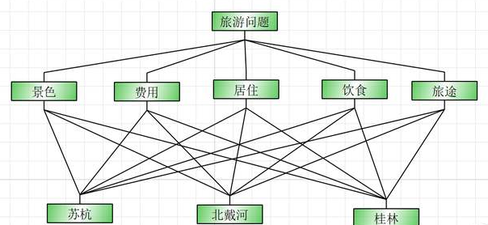
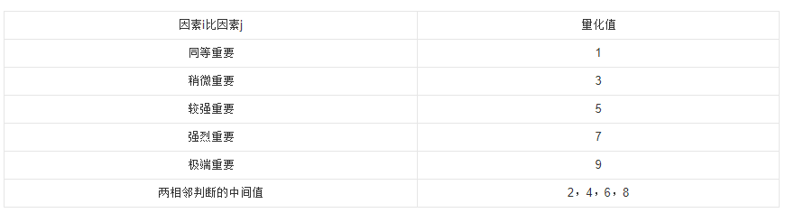
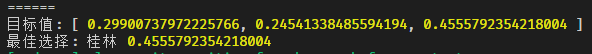
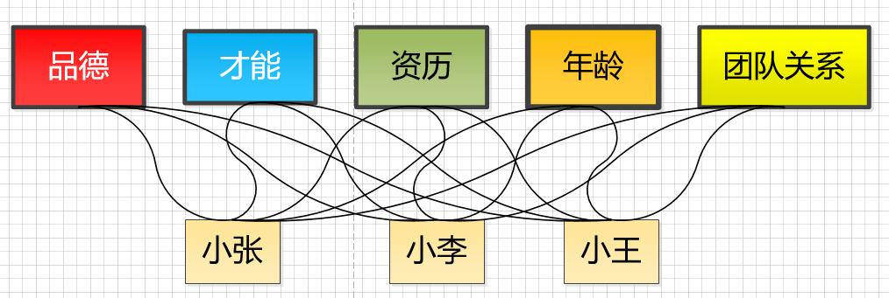
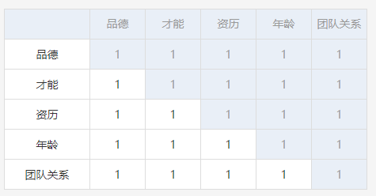

## 加推实战之层次分析法

> 层次分析法，简称AHP，是一个运筹学方法

### 方法背景及应用概述

> AHP方法是美国运筹学家匹茨堡大学教授[萨蒂](https://baike.baidu.com/item/萨蒂/5389356)于20世纪70年代初，在为[美国国防部](https://baike.baidu.com/item/美国国防部)研究"根据各个工业部门对国家福利的贡献大小而进行电力分配"课题时，应用网络系统理论和多目标综合评价方法，提出的一种层次权重决策分析方法。

* 公司要选拔人才，会考核多个维度，选谁是主观选，还是有客观的方法论?
* 要送父母一个按摩椅，多个品牌怎么选？
* 要做一次国庆节的旅游，多个目标地点怎么选？

* 我们用JS手撕一下这个方法，并将其通用化😄

  

### 先从一个实际的例子来了解这个方法的步骤

#### 


* 景色要好，但费用不能太贵

* 费用便宜的话，住的和吃的会不会太差？

* 对多个属性，可能无法一次性端平

##### 认识比例标度尺

* 
* 上图啥意思？
* 这是一个带有主观判断的表，例如
* 景色：费用，你认为是多少？我认为景色稍微重要 ，那就是 3:1，如果反过来 就是 1:3
* 于是 景色：费用 就是一个 数值😄
* 依次类推，每个决策维度两两比较，形成一个 **判断矩阵**
$$
\begin{pmatrix} &1 &1/2 &4 &3 &3\\ &2 &1 &7 &5 &5 \\ &1/4 &1/7 &1 &1/2 &1/3 \\ &1/3 &1/5 &2 &1 &1\\ &1/3 &1/5 &3 &1 &1\end{pmatrix}
$$
* 矩阵是对角是互为倒数，这就说明我们只需要对比一遍就可以获得**判断矩阵**
* 只需要完成矩阵中的，上三角 或 下三角，其他自动完成

##### 一致性判断

* 两两比较 的时候，可能会出现 A比B 好，B比C好，C比A好，这样的，前后不一致的比例判断，我们可以采用**层次单排序及一致性检验**
* 一致性指标：
* $$CI=\frac{\lambda - n }{n - 1},\lambda 是特征值 $$ ,n是特征个数
* CI = 0 ，有完全的一致性
* CI 接近 0 ，有满意的一致性
* CI 越大， 越不一致
* 求出CI后，再用CR = CI / RI < 0 .1 来判断是否一致
* 如果不满足一致性，请重新两两对比😄
* RI （随机一致性指标） 查表得出，要自己求RI，可以构造n个对比矩阵，然后求特征值的平均数
* RI如下
* n=1~12时，RI分别为 0，0，0.52，0.89，1.12，1.26，1.36，1.41，1.46，1.49，1.52，1.54
* 查表很简单，判断的维度不超过12，上例是5😄
* 上面的公式需要求，矩阵的特征值，计算略微复杂，我们使用和积法来近似求**特征值**以及**特征向量**

##### 上JS代码来求一个对比矩阵的CR

* 增加注解详细说明代码

```javascript
function getCr (matrix) {
   // RI查表法
  let riArr = [
    0,     0,    0, //这里是 0 一般1,2都是0 ，把0放进来，是为了后面计算方便
    0.5275,    0.8824,    1.1075,    1.2468,    1.3394,    1.4039,    1.4511,    1.4863,    1.5135,    1.5363,    1.5541,
    1.5712,    1.5838,    1.5962,    1.6051,    1.6135,    1.6218,    1.6287,    1.635,    1.6404,    1.6456
  ]
  let mat = matrix // matrix需要是 [[],[],..] 二维数组的形式
  let colSum = []
  let len = mat.length // 获得每列的和
  for (let i = 0; i < len; i++) {
    for (let k = 0; k < len; k++) {
      colSum[k] = colSum[k] || 0
      colSum[k] += mat[i][k]
    }
  }
  let w = $.math.mat
    .map(mat, (x, row, col) => x / colSum[col]) // 对矩阵的每个元素，归一化，即除以本列的列和
    .map(x => [$.math.mean(x)]) // 归一化后，对行求 平均数
  let r = { w: w, ri: riArr[len], n: len } // 返回RI查表对应的值
  r.lamda =
    $.math.sum($.math.mat.mul(mat, r.w).map((x, idx) => x[0] / r.w[idx][0])) /
    r.n  // 原矩阵点乘归一后的向量AW = λw ，求出λ 和 特征向量 W
  r.ciri = (r.lamda - r.n) / (r.n - 1) / r.ri
  r.ciribool = r.ciri < 0.1 // CR 一致性比较，是否<0.1
  return r
}
```

* 有了这个函数，我们就完成了此方法的核心🔥

##### 每个判断维度对应目标的对比矩阵

* 简单的说，选定景色，这个维度，两两比较，苏杭、北戴河、桂林的对比矩阵，然后确保一致性。
* 这样一共会出现5个 对比矩阵，都是3*3的
* 加上维度的对比矩阵，一共有6个矩阵
* 具体矩阵如下

```javascript
// 景色、费用、居住、饮食、旅途 矩阵
let a1 = [
  [  1,     1 / 2,  4, 3,         3],
  [  2,     1,      7, 5,         5],
  [  1 / 4, 1 / 7,  1, 1 / 2, 1 / 3],
  [  1 / 3, 1 / 5,  2, 1,         1],
  [  1 / 3, 1 / 5,  3, 1,         1]
]
// 苏杭，北戴河，桂林 对于 景色的矩阵
let b1 = [
  [1,     2,     5],
  [1 / 2, 1,     2],
  [1 / 5, 1 / 2, 1]
]
// 苏杭，北戴河，桂林 对于 费用的矩阵
let b2 = [
  [1, 1 / 3, 1 / 8],
  [3, 1,     1 / 3],
  [8, 3,         1]
]
// 苏杭，北戴河，桂林 对于 居住的矩阵
let b3 = [
  [1,         1, 3],
  [1,         1, 3],
  [1 / 3, 1 / 3, 1]
]
// 苏杭，北戴河，桂林 对于 饮食的矩阵
let b4 = [
  [1,     3, 4],
  [1 / 3, 1, 1],
  [1 / 4, 1, 1]
]
// 苏杭，北戴河，桂林 对于 旅途的矩阵
let b5 = [
  [1, 1, 1 / 4],
  [1, 1, 1 / 4],
  [4, 4,     1]
]
```

* 再一次观察，其实都是对角互为倒数的😄
* 下面的代码就SO EASY了,就这么短

```js
let objectWeight = [
  [...getCr(b1).w.map(x => x[0])],
  [...getCr(b2).w.map(x => x[0])],
  [...getCr(b3).w.map(x => x[0])],
  [...getCr(b4).w.map(x => x[0])],
  [...getCr(b5).w.map(x => x[0])]
]
let targetArr = ['苏杭', '北戴河', '桂林']
let result = $.math.findMax(
  new Matrix(getCr(a1).w) 
    .T() //维度矩阵转置
    .mul(objectWeight) //乘以3个目的地，对应5个维度的向量组成的新矩阵
    .get()[0] 
) // 用 findMax找到 数组中最大值的下标
console.log('最佳选择:', targetArr[+result.tag], result.maxValue)
```

* 结果如下
* 
* 有了这个小工具，我们可以做人才选拔
* 
* 当然AHP方法是带有主观性的，可以用多个人产生对比矩阵，形成决策树，这样评判更公平😄
* 我们可以将上面的过程，做成一个可视化的界面，例如这样：
* 
* 在《需求反馈系统》中，实战就用到了AHP算法😄

### 总结

* 了解AHP，使用到实际业务场景

* 通过JS实现之，通用化后，可以解决任何需要多层决策的问题🔥


祝大家2020提升技术，开心，发财 😄