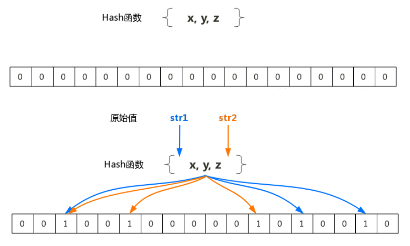
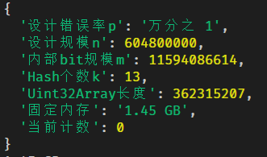

## 加推实战之布隆过滤器

> 隆过滤器可以用于检索一个元素是否在一个集合中。
>
> 用JS实现一下。

* 2020年国庆后的第一篇文章，配合《关于加快推进国有化企业数字化转型工作的通知》
* 数据化处理能力是每个企业的核心价值🔥

### 简介

> 布隆过滤器（英语：Bloom Filter）是1970年由布隆提出的。它实际上是一个很长的二进制向量和一系列随机映射函数。
>
> 布隆过滤器可以用于检索一个元素是否在一个集合中。优点是空间效率和查询时间都远远超过一般的算法，缺点是有一定的误识别率和删除困难。
>
> 类似的过滤器有布谷鸟过滤器 **Cuckoo Filter: Practically Better Than Bloom**

### 算法核心思想

* 当一个元素被加入集合时，通过K个散列函数将这个元素映射成一个位（bit）数组中的K个点，把它们置为1。
* 检索元素时，判断点是不是都是1就知道（可能误判断）集合中有没有它了：有任何一个0，则被检元素一定不在；如果都是1，则被检元素很可能在。



### 使用场景

>  在正确率要求不是100%,同时存在海量的数据集时我们可以使用布隆过滤器.

- 查一个英语单词是否拼写正确
- 一个嫌疑人的名字是否已经在嫌疑名单上
- 爬虫里，一个网址是否被访问过
- Medium 使用布隆过滤器避免推荐给用户已经读过的文章。
- Google Chrome 使用布隆过滤器识别恶意 URL。
- Google BigTable，Apache HBbase 和 Apache Cassandra 使用布隆过滤器减少对不存在的行和列的查找。
- Squid Web 代理使用布隆过滤器处理缓存摘要。
- 海量邮箱（100亿+）垃圾邮件过滤功能
- 高速短地址生成
- 高速LRU缓存

### 问题分类

#### 1.空间问题

* 每用户1w条数据,10w用户就是10亿条数据

* redis？mysql？ Hbase？

#### 2.时间问题

* 单进程每秒1k次的访问，判断是否存在的过滤函数性能，必须高于这个每毫秒100次，2个数量级以上。

* 每次10条数据,但每1条都需要和其他1w条做比对，这样的过程高频发生时。

### 数学概念准备

##### 实现算法不超过100行😄，但数学原理是深刻的

#### 误报率

$$
P_{f} p \approx\left(1-e^{-\frac{k n}{m}}\right)^{k}
$$

* 这里有几个参数，需要理解
* n是已经放入的key，我理解为设计量，就是你的这个系统可能的上限。这个很重要
* m为内部bit数组的长度
* k为几个函数

#### m的估算（内部bit个数）

$$
\mathrm{m}=-\frac{n \times \ln p}{(\ln 2)^{2}}
$$

* 这里注意，一般是先有一个固定的误判率，例如万分之1，然后再反过来推算m和k
* 网上很多先推到概率公式，会让人产生疑惑！😄

#### k的估算（需多少个hash函数）

$$
\mathrm{k}=\ln 2 \times \frac{m}{n}
$$

* 这里要注意的几点
* 1.需要多少个hash函数，这个靠上面公式得出
* 2.用什么hash函数，一般使用**非加密型**的hash函数，保持算法的高效

#### 数据量的估算

* 假设，一个活动维持7天，每秒有1000个不同的ip访问（挺厉害），那需要设计一个判断IP是否存在的函数空间使用量如何？

* 7 * 3600 * 24 * 16（ip长度） * 1000  大约 需要9.68G

* 换成布隆过滤器，在万分之一的误报率下，大约需要 1.45 GB，差距可见一斑。

* 最后我们还会压测一下，达到真正生产级别的性能🔥

* 当然还要注意服务器架构

  

### JS手撕BloomFilter

* 以下类的步骤说明
* 1.自动根据误报率p和设计规模n计算出，计算出内部bit数组长度m，和需要多少个hash函数k
* 2.根据murmurhash  v3 作为核心hash，因为他在32位下性价比最高🔥,封装在 meeko.math.murmurHash中
* 3.在计算的整个过程中使用TypeAray，让数组性能达到最佳🔥
* 核心函数小于10行，其他都是辅助打印函数

```javascript
//32位版本
class BloomFilter {
  constructor (inputObj = {}) {
    this.config = inputObj
    this.primeArr = [
      41,      317,      1913,      10477,      49531,      34157,      9739,      701,      179,      181,      191,
      193,      197,      199,      211,      3499,      3511,      3517,      3527,      3529,      3533,      3539,
      3541,      3547,      3557
    ]// 质数种子，当然也可以不用质数一共25个因为一般k不会超过25
  }
  set config (o) {
    this.p = o.p || 0.0001 //默认万分之一
    this.n = o.n || 100000 //默认有10万个数据要判断
    this.m = Math.ceil(this.findBits(this.n, this.p))
    this.k = this.findNumOfHash(this.n, this.m)
    this.bitArr = new Uint32Array(Math.ceil(this.m / 32) + 1) // 32 对应Uint32Array
    this.count = 0
  }
  // 设置key
  set (key) {
    const arr = []
    for (let i = 0; i < this.k; i++) { // 计算k的hash函数的值
      const posBit = $.math.murmurHash(key, this.primeArr[i]) % this.m // 取余到相应的值
      const pos = Math.floor(posBit / 32) //计算地址
      const offset = posBit % 32 // 地址偏移量
      if (
        this.bitArr[pos] === void 0 ||
        ((this.bitArr[pos] >> offset) & 1) === void 0
      ) {
        console.log('err:', pos, offset)
        console.log(this.bitArr.length)
        throw new Error('超出内部bit数组长度')
      }
      arr.push([pos, offset])
    }
    for (let i = 0; i < arr.length; i++) {
      this.bitArr[arr[i][0]] |= 1 << arr[i][1] // k个hash相对应的bit位设置1
    }
    this.count++ //内部做个计数
  }
  get (key) {
    const arr = []
    for (let i = 0; i < this.k; i++) {
      const posBit = $.math.murmurHash(key, this.primeArr[i]) % this.m
      const pos = Math.floor(posBit / 32)
      const offset = posBit % 32
      if (
        this.bitArr[pos] === void 0 ||
        ((this.bitArr[pos] >> offset) & 1) === void 0
      ) {
        throw new Error('超出内部bit数组长度')
      }
      arr.push((this.bitArr[pos] >> offset) & 1) //把k个hash的位读取出来
    }
    return arr.every(x => x === 1)// 全位1 才返回真
  }
  info () { //辅助函数，打印基本信息
    return {
      设计错误率p: '万分之 ' + this.p * 10000,
      设计规模n: this.n,
      内部bit规模m: this.m,
      Hash个数k: this.k,
      Uint32Array长度: this.bitArr.length,
      固定内存: (this.m / 8).prettyBytes(),
      当前计数: this.count
    }
  }
  findBits (n, p = 0.0001) {// 计算m
    return (-n * Math.log(p)) / (Math.log(2) * Math.log(2))
  }
  findNumOfHash (n, m) {// 计算k
    return Math.max(1, Math.round((m / n) * Math.log(2)))
  }
}
```


### 压测性能

* 我们根据上面的数据估算来压测7 * 3600 * 24 * 1 * 1000条 设计数量n
* 首先打印一下内部长度和Typearray数组长度



* 设计规模n = 7 * 3600 * 24 *  1000 7天每秒1k次ip访问
* 内部的bit长度为115亿bit位
* 无符号32位长度，3.6亿数组长度
* 占用内部预计使用1.45G

#### 开始压测

* 压测代码如下
* 场景：假设一个活动持续一周，每秒有1000张订单，总数6亿次业务访问
* 通过布隆过滤器快速判断订单编号是否存在

```javascript
let num = 7 * 3600 * 24 * 1 * 1000

//默认 误报率万分之一
let b = new BloomFilter({ num, p: 0.0001 }) 
console.log(b.info())


let t = $.now()
for (let i = num; i < num * 2; i++) {
  b.set(i + 'sky') //压入 6亿次 key
}
console.log($.now() - t, 'ms')

t = $.now()
let errCount = 0
//判断6亿次可以是否存在
for (let i = num * 137; i < num * 138; i++) {//这里有意产生误报区间 
  errCount = b.get(i + 'sky') ? errCount + 1 : errCount
}
console.log(
  '实际错误率',
  errCount / num,
  '每条处理耗时',
  ($.now() - t) / num,
  'ms',
  '每秒处理次数',
  (num / ($.now() - t)) * 1000
)
```

> 普通笔记本电脑运行结果
>
> 实际错误率 **0.00009623015873015873** < p: 0.0001
>
> 每条处理耗时 **0.0031106150793650793 ms** 
>
> 每秒处理次数 **321479.82777866366**

* 每秒单进程get性能在32万次，Redis的GET性能在15万次/每秒，当然这个没可比性，做成RPC服务的话，性能会下降很多
* 布隆过滤器的放置位置一般在高并发业务之前，快速进行存在性判断，减少IO操作🔥

###  布隆过滤器的优缺点

#### 优点

1. 效率高,插入和查询操作都是O(k)
2. 空间节省,每一个元素映射为一个二进制位
3. 安全,保存了数据的全集,但是没有保存数据本身

#### 缺点

1. 误算率,使用了Hash算法,必然会存在hash碰撞.会将不存在的数据认为是存在的（假阳性）.但是存在的数据一定存在.
2. 很难删除数据.

### 总结

* 了解布隆过滤器，应用到实际业务场景
* 通过JS实现之，并对其设计规模n，内部bit规模m，错误率p，hash函数个数k等，深入理解🔥
* 以固定错误率为参数，可以很好的控制布隆过滤器的实际模型效果


祝大家2020提升技术，开心，提升自己 😄