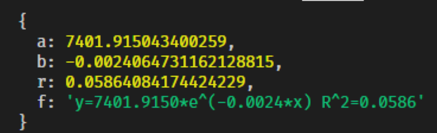

## 加推实战之数据预测

> 从数据中发现隐藏在背后的规律，形成知识:fire:

#### 从需求说起
* 对活动或成交数据进行未来一段周期的预测


#### 分析并寻求方案
* 关于预测马上可以想到的是回归
* 现有的几个拟合方法可以立刻用上:smiley:
* 对各个拟合算法进行集成学习，减少残差
* 发现周期性数据的周期，并对周期进行预测
* 方案是否具有通用性？😶
* 是否可以警告一些异常点？😶

### 直接上干货全JS实现:fire:
#### 普通数据预测/回归

* 本文分析数据样本采用，一个真实商场的入口去重人流量变化90天，90个数据点，图像如下

  


#### 直线拟合

```js
const $ = require(meeko')   // 引入meeko核心,前端使用rollup转换
// https://github.com/kongnet/meeko
// 拟合函数都在 math命名空间下
$.math.linearFitting(x,y)
```


* a * 90 + b 就是第91个点
* 预报10天趋势图像


#### 指数拟合

```js
console.log(
  $.math.exponentFitting(
    $.math.genRange(0, personArrivalArr.length - 1), //产生等差数列
    personArrivalArr
  )
)
```



#### 幂函数拟合

* 同上函数换成powerFitting

#### 对数拟合

* 同上函数换成lnFitting

#### 多项式拟合

* 同上函数换成 polyFitting ,下面产生4次多项式拟合

```js
console.log(
  $.math.polyFitting(
    $.math.genRange(0, personArrivalArr.length - 1), //产生等差数列
    personArrivalArr,
    4 // 这个参数是多项式的次数
  )
)
```


#### 集成学习的思想

* 将已有数据划分成 学习和测试2个集合，目的为了不要过拟合😶
* 对不同的拟合方法进行数据拟合，然后检测测试集合的残差
* 残差最小的就是比较好的拟合选择

##### 误差（Errors）
> 观测值与真实值的偏差。

##### 残差（Residuals）
> 估计值与观测值的偏差。

##### 算法步骤

* 例如以上90个观察值，28原则分为 72个 学习值，18个测试值
* 多项式（1-10次），指数 ， 幂函数
* 循环学习72个观察值后 得出，12个拟合方程
* 用剩下18个数据，计算12个方程的残差，ABS（测试值-拟合值），最小的，就是我们认为拟合较好的结果:smile:
* 学有余力的同学，可了解bagging，boosting和随机森林最为广泛的三类集成学习算法:fire:
### 周期函数的预测（本次重点）
> 函数可以由多个函数叠加组合而成
* 上图


* 很好理解，图3 = 图1 +  图2

#### 周期函数预测基本思路
> 在时间序列分析领域，常见的分析方法叫做时间序列的分解（Decomposition of Time Series），它把时间序列分成几个部分，分别是周期项s(t)  ，趋势项g(t) ，剩余项r(t)  t>=0 。


$$y(t)=g(t)+s(t)+r(t)$$
* 按上面叠加的原理就很好理解了

#### 趋势项 g(t)
* 可以用回归，也可以用分段插值，我们直接用前面说过的拟合，现成的函数:smiley:
* $$g(t) = a*t + b$$
#### 周期项 s(t)

* 首先我们先看一下excel对源数据的周期拟合情况

* 我们可以看出，excel采用暴力重复的方式 去解析趋势，虽然有上下置信区域，但也太粗糙，而且也没出函数，我们无法进一步预测:cry:
* 我们首先尝试用Excel的思路去解决问题
* 观察Excel的图像，会发现大约是按照7天这个周期来的，也就是1周，当然我们也会自然想到7天是1个周期
* 随便手写1个，上代码

```js

// 代码封装在meeko.ml名字空间下

console.log(
    // 周期7天 ，向前预测20天
    $.ml.peridForecast(personArrivalArr, 7, 20).forecast.join('\n')
)
```


* 到这里，给前端同学使用就已经够了
* 我们拥有了类似Excel数据预测的能力
* 但是，周期7天是我们定的，上图的数据真的是这样嘛？隐藏在数据中还有什么规律呢？
* 下面我们使用傅里叶级数来进行拟合:fire:

#### 傅里叶级数

* 内容浩如云海，可以写几本书。
* 简单的说就是，把任意的周期函数表示成三角正弦、余弦函数。当然还需满足狄利赫里条件
* 先由拉格朗日（拉格朗日方程和中值定理无人不知无人不晓），发现某些周期函数可以分解为三角函数和，然后由傅里叶**（让·巴普蒂斯·约瑟夫·傅里叶男爵（1768 －1830））**在研究热力学传导的时候，进行猜测，任意周期函数都可以写成三角函数之和

* 

* 

* $$f(x)=C+\sum_{n=1}^{\infty}\left(a_{n} \cos \left(\frac{2 \pi n}{T} x\right)+b_{n} \sin \left(\frac{2 \pi n}{T} x\right)\right), C \in \mathbb{R}$$

* 欧拉出来说，复数形式是：$$\sum_{n=-\infty}^{\infty} c_{n} e^{i \frac{n \pi x}{l}}$$

* C，An,Bn为待定系数，后面我们会通过变基用**JS** 来计算出来:fire:

* 注意到目前为止，公式和我们说的都是 离散傅里叶形式DFT

  

#### 傅里叶变换/分析
> 我们如今自由在互联网里遨游，要得益于数字信号处理技术的发展，而数字信号领域最重要的基础就是傅里叶变换，也就是时域向频域的变换。
>
> 当然傅里叶变换只是拉普拉斯变换的特例。都属于积分变换范畴:fire:

以下动图是由傅里叶级数=>傅里叶变换（时域=>频域）


* 举个例子，声音的wav波形就是时域，音符就是频域，波形是连续的，音符是单个独立的:smile:

#### 直接上核心代码

> JS实现网上基本无，我们随便ES6手撕一个，最终完成时域=>频域

```js
function fourierAnalysis (a) {
  const PI2 = Math.PI * 2
  let arr = a.copy()
  let mean = $.math.mean(arr)
  arr = arr.map(x => x - mean)
  let len = arr.length
  let fillNum = 2 ** (Math.log2(len) | 0) // 2^N
  arr = arr.concat($.math.genRange(0, fillNum - len - 1, 0)) // fill => 2^N
  let fourierArr = []
  for (let idx = 0; idx < fillNum; idx++) {
    fourierArr[idx] = [0, 0, 0] // 实部 虚部 共轭相乘
    // 时域=>频域
    for (let k = 0; k < fillNum; k++) {
      fourierArr[idx][0] += arr[k] * Math.cos((PI2 * k * idx) / fillNum)
      fourierArr[idx][1] += arr[k] * Math.sin((PI2 * k * idx) / fillNum)
    }
    fourierArr[idx][2] = fourierArr[idx][0] ** 2 + fourierArr[idx][1] ** 2
  }
  //console.log(fourierArr.map(x => x[2] / fillNum).join('\n'))
  fourierArr = fourierArr
    .map(x => x[2] / fillNum) //算出功率
    .slice(0, fillNum / 2) //取一半
  let maxFreq = $.math.max(fourierArr) // 取最大值，计算频率的倒数 即为 周期
  return { period: fillNum / fourierArr.findIndex(x => x === maxFreq) }
}
```

* 介绍一下函数实现步骤
* 1.取数据的平均值
* 2.复制1个新的副本，然后中心化数据（每项减去平局值）
* 3.取数据的log以2为底的长度，为了是2^N补全，这样的目的是为了进行快速傅里叶变换
* 4.不足的地方以0补全。
* 5.循环所有数据
* 6.算出实部和虚部，这里用第0位表示实部，第1位表示虚部
* 7.算出功率值，也就是模平方
* 8.取一半数据，因为他们一定是对称的！找到，频域中的最大值，取倒数即为周期，period

> 整个算法时间复杂度O(n^2)，这也是多项式乘法的一般复杂度，想更快，就用蝴蝶算法

#### 以上函数究竟是干啥的？

> 分析数据中的隐藏周期:fire:

* 我们用300年的太阳黑子的数据，来验证上面这个函数的正确性:fire:
* https://github.com/elf11/Matlab/blob/master/SolarCicles/sunspot.dat 太阳黑子数
* 1701年-2000年 一共300年，科学家们很厉害
* 我们先画出图像


* 略微有点上扬，太阳笑一下，地球抖三抖啊
* 按科学家的说法是黑子活动平均周期是11年，下面用我们的函数来计算一下:fire:


* 我们的计算是 11.13年，很OK，也验证了上面算法的正确性:smiley:

#### 回到我们要分析的数据
* 我们现在有工具,可以知道到底数据的周期是多少了
* 我们计算90个人流数据的周期
```js
console.log(fourierAnalysis(personArrivalArr))
// => { period: 32 }
```
* 原来我们的数据隐藏的周期是32，Sky猜测，1个月1次的大(fa)消(gong)费(zi)周期，至于为何多2天，那得还信用卡:smile:

* 知道了周期值，我们突破了1大步，但还需要知道s(t) 这个函数

* 我们需要将原数据向三角函数变基

* 然后我们就可以知道$$f(x)=C+\sum_{n=1}^{\infty}\left(a_{n} \cos \left(\frac{2 \pi n}{T} x\right)+b_{n} \sin \left(\frac{2 \pi n}{T} x\right)\right), C \in \mathbb{R}$$ 里面的An 和 Bn各是多少了 

* 基展开，上代码

```js
  function fourierItem (n) {
    return function (t) {
      if (n === 0) {
        return 1
      }
      return Math[n % 2 === 1 ? 'cos' : 'sin']((n & 1 ? (n + 1) / 2 : n / 2) * t)
    }
  }
```

* 然后，将原数据周期32的值与角速度逆矩阵相乘

* **let r = \$.math.mat.mul(\$.math.mat.inv(a), \$.math.mat.transpose(b))** 核心就一句话

* 得出用傅里叶分析和变换的原90个点的数据的预测，比较图像如下
  

* 与原方法比较后是不是觉得有点香？

* 如果我们进一步使用4分位的箱体图，并计算IQR我们还可以进一步发现这个原始数据的异常点，作图如下

*  

#### 扩展-FFT和蝴蝶算法

* 上面的变换算法复杂度为O(N^2)，在比较大的数据量下，需要优化，于是有了蝴蝶算法，可以将复杂度下降到O(N*log2(N))
* 
* 用时域方式来计算的话，首先进行bit翻转，形成 0,4,2,6,1,5,3,7的新下标，然后反过来推出原下标的值。
* 分解原数据为奇偶2组，不断分，然后再组合成要逼近的函数
* 这个算法还能降低多项式乘法和大规模矩阵乘法的算法复杂度。
* 当然近年还有很多此算法的升级版本，在不同的奇偶分解的时候，使用不同的基变换2和4 比如Cooley－Tukey算法
* 有兴趣的同学可以自行实现。

* 如果你真正掌握了这个，没人敢说你不懂技术:fire:


## 小结

* 由预测需求，引出了函数的拟合，通过JS完成。
* 由数据的周期性变化，引出了傅里叶分析与变换（信号，语音，图像），通过JS实现。
* 对，数据预测的概念有了一个简单的了解。
* 为将来，访问量预测，金融预测等等打好基础。

祝大家2020提升技术，开心，发财 :smile:

