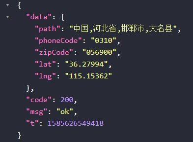

## 加推实战之GeoHash逆地址查询

> WebGIS应用非常广泛，掌握原理和编码方式是全栈必须的技能💥

### 1.从痛点说起

* 小程序和一些弱网情况下无法获得经纬度所对应的省区信息。😶
* 各大webMapAPI都需要AccessKey，本身管理不统一，普通key的调用会有频度限制。
* 用户希望迅速，定位到所在地区的服务门店😶

### 需求分析

* 1.离线或本地化，通过经纬度来查询得到中国省区信息。💥
* 2.希望有较高的性能，在后端直接完成经纬度到地区的转化

#### 解决方案学习
* 我们可能需要几个小工具，来完成这个任务:smile:
* 常规的做法是利用GIS中附近的概念来快速匹配位置
* Mysql和Redis中的关于地理操作的函数
* 理解GeoHash

> **最终实施方案：将市区的POI点位信息转化为GeoHash，查询时进行附近纠正，最后愉快得出结果**:smile:

##### JS计算2点经纬度之间的距离

```JavaScript
function getDistance (lat1, lng1, lat2, lng2) {
  let radLat1 = (lat1 * Math.PI) / 180.0
  let radLat2 = (lat2 * Math.PI) / 180.0
  let a = radLat1 - radLat2
  let b = (lng1 * Math.PI) / 180.0 - (lng2 * Math.PI) / 180.0
  let s =
    2 *
    Math.asin(
      Math.sqrt(
        Math.pow(Math.sin(a / 2), 2) +
          Math.cos(radLat1) * Math.cos(radLat2) * Math.pow(Math.sin(b / 2), 2)
      )
    )
  s = s * 6378.137 // 地球半径;
  s = Math.round(s * 10000) / 10000
  return s
}
```

> 当然咋们的地球是这样的：😶


> 上面经纬度到距离算法的核心是:

##### 在纬度相等的情况下：

* 经度每隔0.00001度，距离相差约1米；
* 每隔0.0001度，距离相差约10米；
* 每隔0.001度，距离相差约100米；
* 每隔0.01度，距离相差约1000米；
* 每隔0.1度，距离相差约10000米。

##### 在经度相等的情况下：

* 纬度每隔0.00001度，距离相差约1.1米；
* 每隔0.0001度，距离相差约11米；
* 每隔0.001度，距离相差约111米；
* 每隔0.01度，距离相差约1113米；
* 每隔0.1度，距离相差约11132米。

> 距离计算函数虽好，但当有很多点的时候计算量很大，大部分的C端产品都使用了附近这个概念，所以我们需要了解经纬度的另一种编码GeoHash

#### GeoHash

##### 1.普通经纬度的缺点

* 后端，需要同时对经度lng列、维度lat列做查询判断。

* 因为传入的lng、lat值总在变化，数据库中的查询很难进行缓存优化。

##### 2.GeoHash算法

> *墨卡托投影，是正轴等角圆柱投影。由荷兰地图学家墨卡托(G.Mercator)于1569年发明*


* 当然这种投影上下的区域面积会有很大的失真
* GeoHash引入z曲线，对每个小方格进行编码，下面会有一个手工计算的过程

 

* z曲线不断分割平面，原来越密集，精度也不断提高，类似分形


* 对某一数字通过二分法进行无限逼近。这里以经纬度区间 lng经度[-180,180]，lat维度[-90,90]

* 使用哈夫曼编码，假设维度值为31度，精确到1度，我们手算一下: :fire:

  
  
* 同理经度也做哈夫曼编码

* 编码后，将经纬度的bit值交叉组合形成类似 11100 11101 00100 01111 00000 01101 01011 00001

* 维经维经维，经维经维经。。。

* 这里是5个bit一组，也就是2^5 ,这样就可以用base32 来描述5bit串

##### 3.base32字符串化

| 十进制 | 0    | 1    | 2    | 3    | 4    | 5    | 6    | 7    | 8    | 9    | 10   | 11   | 12   | 13   | 14   | 15   |
| ------ | ---- | ---- | ---- | ---- | ---- | ---- | ---- | ---- | ---- | ---- | ---- | ---- | ---- | ---- | ---- | ---- |
| base32 | 0    | 1    | 2    | 3    | 4    | 5    | 6    | 7    | 8    | 9    | b    | c    | d    | e    | f    | g    |
| 十进制 | 16   | 17   | 18   | 19   | 20   | 21   | 22   | 23   | 24   | 25   | 26   | 27   | 28   | 29   | 30   | 31   |
| base32 | h    | j    | k    | m    | n    | p    | q    | r    | s    | t    | u    | v    | w    | x    | y    | z    |

> **注意**上面少了 **a i l o** 这几个比较容易混淆的字母

* 我们来举个例子
* 天安门经纬度**GeoHash**(39.90877336, 116.3974911) => **wx4g09nj6** ，精度9位
* 当然整个地球平面可以被1位的geohash表示如下图


* 然后经纬度不断二分，每次二分变成4个小方块，每次二分的时候，精度也在不断提高


* 至此，我们可以将我们的省市区经纬度数据，转换为GeoHash字符串，通过比较字符串来进行逆查询

##### 具体怎么做（干货）？

* 1.将省市区经纬度信息POI转为geohash，根据上面的算法编写**GeoHashEncode** 函数,结果如下：


> 这里我只做了6位geohash，误差在600米，对于区一级的定位是足够了，甚至可以考虑5位

* 2.将输入的经纬度坐标，转化为geohash，这里依旧选择转成6位
* 3.考虑地图坐标系的转换，相应的文章可以去搜索加深理解

| 坐标系     | **Google Earth（WGS84）** | 百度地图（BD09）     | **高德地图（火星坐标）** |
| ---------- | ------------------------- | -------------------- | ------------------------ |
| 坐标       | 116.386364 39.911985      | 116.398991,39.919753 | 116.392627,39.913428     |
| 转换为谷歌 | --                        | 116.386371,39.912032 | 116.386384,39.912025     |
| 转换为百度 | 116.398979,39.919702      | --                   | 116.399003,39.919747     |
| 转换为高德 | 116.392602,39.913383      | 116.392614,39.913434 | --                       |

于是我们主要进行高德转baidu的函数即可,非常简单:smile:

```javascript
function bd2gd (lat, lng) {
  let xPI = (Math.PI * 3000.0) / 180.0
  let x = lng - 0.0065
  let y = lat - 0.006
  let z = Math.sqrt(x * x + y * y) - 0.00002 * Math.sin(y * xPI)
  let theta = Math.atan2(y, x) - 0.000003 * Math.cos(x * xPI)
  let gg_lng = z * Math.cos(theta)
  let gg_lat = z * Math.sin(theta)
  return { lat: gg_lat, lng: gg_lng }
}
```

* 4.找到输入的geohash和数据中的geohash后，寻找周围8个邻居，这步比较重要，也是geohash的缺点


> 从上图可以看出，红点虽然在E区，但实际离开它最近的是在B区的黄点:smile:

* 假设GeoHash是6位，bit位数 6*5 = 30位，所以lat lng 都是15bit。我们只要计算连续除以15次2后的lat和lng的值就可以知道上下左右斜8个方向的偏移量
* 举个例子，还是天安门，周围8个点的6位GeoHash是


* 5.将上面9个点一起查询数据库，得出多条数据
* 6.然后使用文章开头的**getDistance**函数,找到多条数据中最近的位置
* 7.如果6位GeoHash找不到，那就降维5位-4位，继续2-6步骤，再找不到，输出不在中国境内，完成:fire:

> 来看一下这个类库结构80行代码，然后做一次验证


* 验证，地图上随便找个点，右边是我们输出的结果，妥妥的:smile:




##### 精度问题

* 9位geohash	lat 22bit 	lng 23bit	误差 ±0.00478km，5*9=45bit。可查wiki百科
* 9位geohash可以达到4.7m的误差，可以说普通使用足够了
* 实际我们得到的经纬度如果没有6位以上，也不需要进行9位geohash的转换
* 实际的算法中，使用了6位geohash，然后降维到5位geohash。

##### 性能

> 开发完成后需要进行单元测试和性能测试，可以使用之前说到的$.benchmark函数

* 本地逆地址查询的性能在5000次/秒，当然还有不少优化空间
* 10万个POI下，字符串查询附近比普通经纬度距离（直接**getDistance**）查询大约快3倍，和机器性能有关。

* 关于POI，当然可以离线导入自己的兴趣点，使用GeoHash，POI千万级内，性能不会下降:fire:

#### 总结


通过经纬度逆查询，分析学习编码提升自我，祝大家2020提升技术，开心，发财 :smile:

