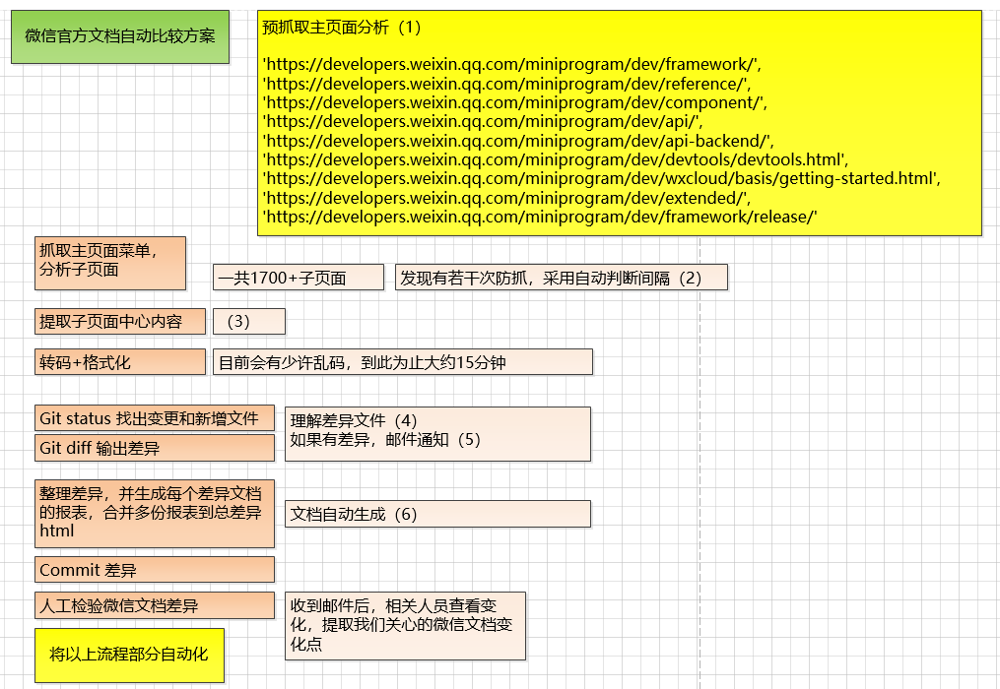
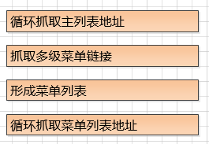
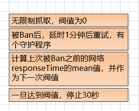
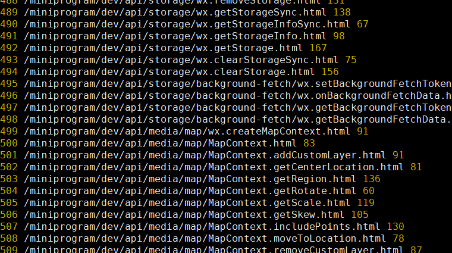
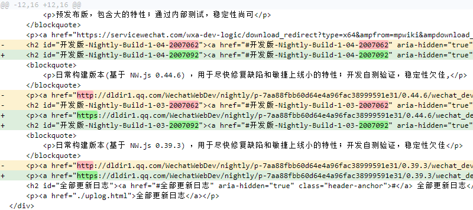
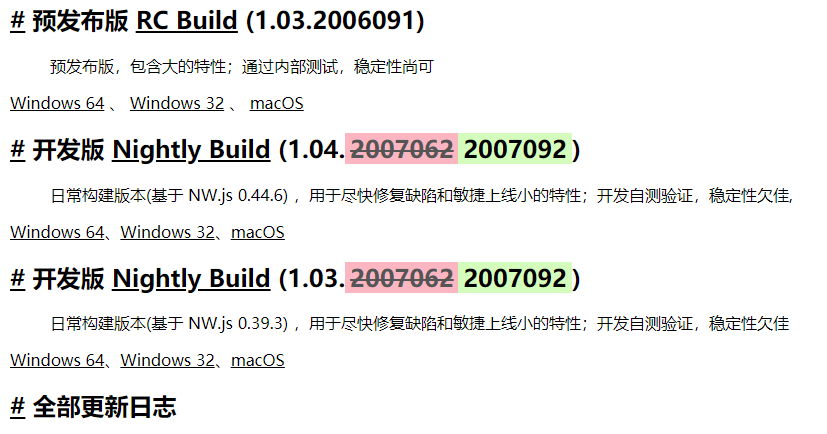
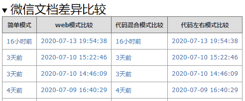
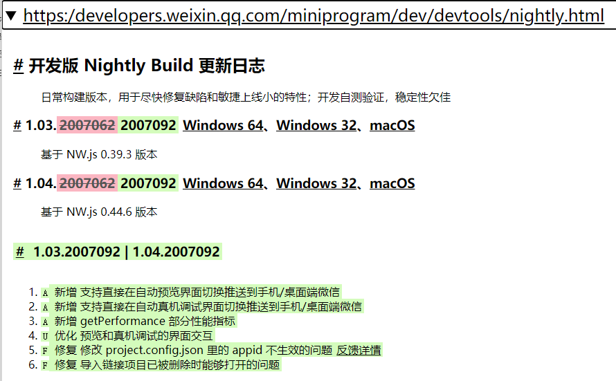
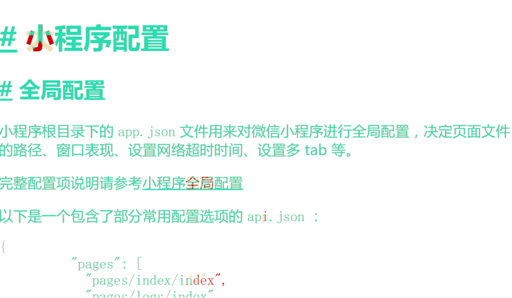

## 加推实战之微信文档爬虫及差异比对

> 网络爬虫是现代互联网基础应用

### 从需求说起
* 微信文档经常改变，对产品和研发同学都是一个梗😶
* 希望可以定时比对微信文档是否有新的更新，并通知产品同学
* 构建一个抓取比对的通用框架💥


### 分析并寻求方案
* 抓取并分析方式很多，也是初级程序员必备的技能，采用google的傀儡组件，或者用样式选择器进行选择，亦或使用xpath
* 需要注意的是反爬取等异常处理，这是难点
* 研发攻关没有任务时间，越快实现越好:joy:
* GIT天然有版本控制，直接利用GIT的功能，完成比对


> 熟练操作GIT是每个程序员的必修课💥

### 系统架构与步骤设计

> 技术leader和产品的2个额外小需求：

* 发现差异后第一时间先邮件通知😶
* 将此功能通用化，模块化😶



### 直接上干货，主要步骤描述:fire:

#### （1）预抓取页面分析

* 这里主要使用F12大法，查看主要跳转到那些页面，我们本次关心的是微信小程序技术类页面一共9个大类
* 这里需要发现域名前缀prefix，即 **https://developers.weixin.qq.com/**，后面就是拼接此prefix
* 微信文档结构呈现左右结构，左边是多级菜单，右边是内容。
* 此过程大约需要消耗中级程序猿10-20分钟
* 此分析是否可以用机器来代替？😶

#### （2）简单反爬取

* 具体的抓取代码流程如下：
* 
* 此代码不会超过50行，调试并编写代码，耗时1小时。
* 对于抓取过程中的反抓取，采用如下流程：
* 
* 在没有多个proxy的情况下，找到延迟阀值是实战较好的模式，本例自动通过守护程序找到阀值:fire:



#### （3）提取子页面内容

* 微信文档的内容，放在一个固定的区域内，在获取后，不要保留style，但要保留html语义结构，这是重要的一步
* 汉字微信采用**&#x** HTML转义编码，我们采用正则将其进行反转义 **str.replace(/&#x/g, '%u')** 

#### （4）理解Diff差异格式

* 抓取后，与上一个版本形成diff，使用 **git diff > temp.diff **

```javascript
diff --git a/.gitignore b/.gitignore
index ae35cba..4d8e76e 100644
--- a/.gitignore
+++ b/.gitignore
@@ -49,3 +49,6 @@ jtFrontEasyCheck.html
 /diff.txt
 /diff-gen.js
 /weixin-crawl.js
+/gen-file.js
+/diffhtml.js
+/temp/*
```

* 文档中2个版本中的所有差异文件列表

* 第一行代表 同一个文档的 a版本 和 b版本

* 第二行代表，本版本a 和 版本b的 **hash值 %h**，**100644**表示对象模式，**100**表示普通文件，**644**代表一个权限

* **--- a/.gitignore** 代表变化前的版本**+++ a/.gitignore**  变化后的版本

* **@@ -49,3 +49,6 @@**

* **-49,3** 减号表示变化前的文件，49表示第49行，3表示连续3行，也就是从第49行（包括）开始，连续3行。

* **+49,6** 加号表示变化后的文件，含义同上

* 接下去，**空格**开头标识行行内容无变化，减号（**-**）开头标识原来版本文件删除的行，加号（**+**）开头标识修改后版本文件添加的行。

* 有了对diff格式的理解，我们就可以很容易进行diff文件的解析和可视化渲染。:smile:

* 可视化效果如下：

  

* 这里采用的是 代码级别的比较，噪音较多，产品同学希望是web模式的比较😶

* 那就需要采用另一种word-by-word模式进行了，逐字比较，将不同的地方用 INS标签和DEL标签进行显示

* 可视化效果如下：



* 大家可以发现，web模式清晰很多，但href中的变化无法体现，当然这并不重要:smile:
* web模式前端渲染代码如下:

```javascript
 <script src="../htmldiff/assert/WT.js"></script>
  <script>
    let $ = WT.$ // 引入Sky前端框架
    let fileAddDelArr = {{d.addDel}} // 字符模板 引入增删文件列表数组
    let fileDiffArr = {{d.modify}} // 字符模板 引入修改文件列表数组
    let fg = $Fg() // 创建文档碎片
    for (let i = 0; i < fileDiffArr.length / 3; i++) { // [文件链接，旧版本此文件内容，最新版本此文件内容]
      let elm = fg.adElm('', 'DETAILS') // 创建DETAILS元素
      elm
        .adElm('', 'SUMMARY') // 创建SUMMARY元素 ，设置fileTitle类
        .cn('fileTitle')
        .h(`<a href="${fileDiffArr[i * 3]}" target="_blank" rel="noopener noreferrer">修改 ${fileDiffArr[i * 3]}</a>`) // 防止异源修改
      elm
        .adElm('', 'DIV')
        .h(htmlDiff(fileDiffArr[i * 3 + 1], fileDiffArr[i * 3 + 2])) // word-by-word 渲染新旧文档，并写入DIV标签内部
    }
    for (let i = 0; i < fileAddDelArr.length / 2; i++) {// [文件链接，A（增）D（删）类型]
      let elm = fg.adElm('', 'DETAILS')
      elm
        .adElm('', 'SUMMARY')
        .cn('fileTitle')
        .h(
          `<a href="${fileAddDelArr[i * 2]}">${(fileAddDelArr[i * 2 + 1] === 'A'
            ? '增加 '
            : '删除 ') + fileAddDelArr[i * 2]}</a>`
        )
    }
    $DB.append(fg)// 将文档碎片加入 body
  </script>
```

* node后端代码如下:

```javascript
  async diffHtml (ctx) {
    const { hash } = ctx.checkedData.data // api中解析hash 即git commitId字段
    ctx.type = 'text/html' // 设置 html输出
    let addDelArr = await getDiffAddDel(hash)
    let modifyArr = await getModify(hash)
    ctx.body = $.tpl(f).render({ // 后端字符串模板渲染 f 即 上面web前端的模板文档
      addDel: JSON.stringify(addDelArr),
      modify: JSON.stringify(modifyArr)
  })
```


#### (5)发现差异后，邮件提醒

* **git diff HEAD^** 妥妥的:smile:
* 加入**crontab**定时抓取并分析差异进行通知

#### (6)差异文档自动生成

* word-by-word比较 性能较差，每个文件需要近1-2秒，每个版本的差异文件会在5-20个
* 采用预生成模式，生成每个版本差异的静态文档，差异结果秒取。
* 前后代码各60行左右，编码时间2小时，分析时间3小时，整体入口界面如下:



* 点击后，自动比对某时间版本与最新工作区，所有文档差异。
* 

* 简单模式，只显示那些文件变化**A（增）D（删）M（改）**。代码模式 分 文档单融合，和文档左右对比2种模式，满足不同人员的需求:smile:

#### 其他Diff模式的探索

* 差异也可以用颜色的融合来体现，将同文档的变化，用颜色融合模式凸显差异。下图使用difference颜色融合模式:smile:



* 这种模式比较适合UI细微的变化，对整体大段的变化，效果不佳。

### TODO

* 已完成通用抓取+比对的架构，但还需花时间做成命令行一键部署的库
* 增加一个全局配置Config文件，对不同需求进行参数配置

## 小结

>  不要做违规的数据抓取。抓取一时爽，亲人泪两行

* 了解抓取基本流程，简单反抓取。
* 使用Git原生功能做到全文档不同版本差异比较。
* 差异的可视化实现。
* 发生差异时，发送通知给相关人员。
* 让差异无所遁形:fire:

祝大家2020提升技术，开心，发财 :smile:

