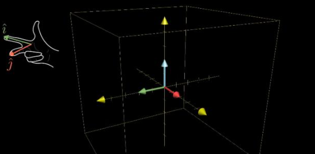
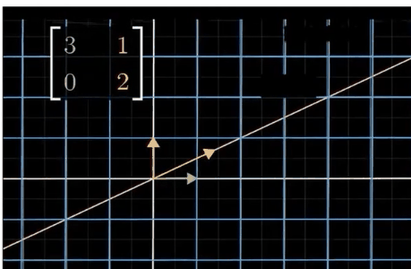
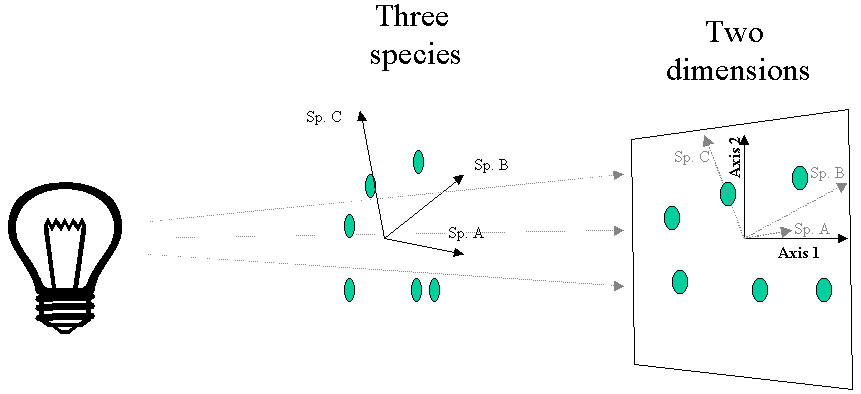
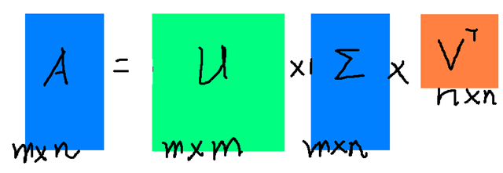
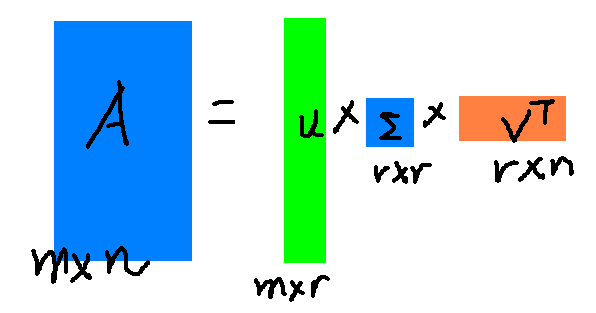
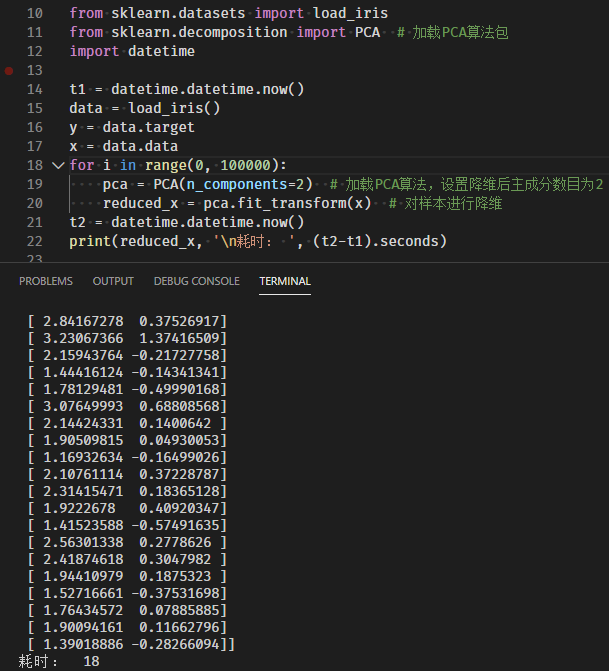
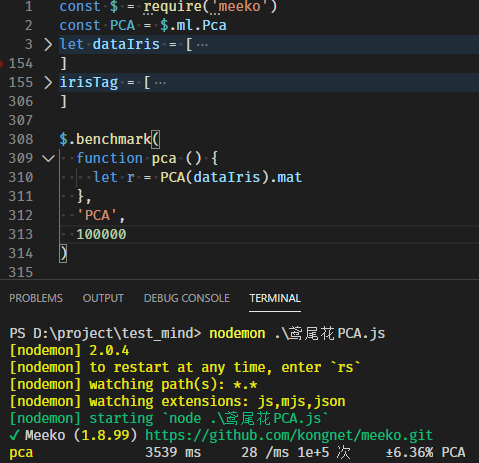
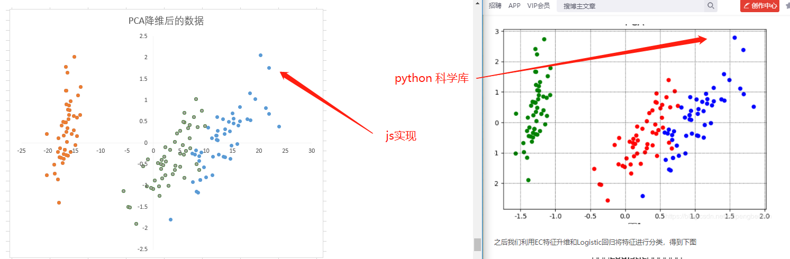
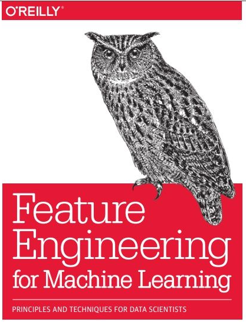

## 加推数据特征工程实战

> 在机器学习或使用之前对数据进行清洗、标准化、降维等，是技术人员必不可少的技能 💥

### 从需求说起

- 系统用户有大量的频度指标，我们希望对用户画像进行分类和打标。（分类与聚类）😶
- 产品运营有大量的指标需要分析，产生有价值的报表。（聚类）
- 销售膜拜、电话、大客，还是团队作战，哪项行为更符合我们的产品？（分类）😶

### 数据科学的第一步：特征工程

- 特征工程，说白了就是对待分析的数据进行预处理、特征选择、降维等操作。💥

### 基础知识（主要是矩阵操作）



> 首先随便用 JS 写一套 矩阵操作的函数集（编写难度很低，看着公式，中级程序猿可以轻易完成 300 行代码左右）💥
>
> 线代基础网上很多，我们用到的也就是这些基础的组合，上一篇卷积操作会相对难一些。

- 复制矩阵（浅 copy）
- 矩阵转置（下面会用到）

```javascript
matrix.transpose = function (arr) {
  let result = new Array(arr[0].length)
  for (let i = 0; i < arr[0].length; i++) {
    result[i] = new Array(arr.length)
    for (let j = 0; j < arr.length; j++) {
      result[i][j] = arr[j][i]
    }
  }
  return result
}
```

- 加法
- 减法
- 比例
- 叉乘
- 点乘
- 矩阵行列式（det）
- 全 0 矩阵（zero）
- 单位矩阵（I）
- 高斯约旦消元法
- 求逆矩阵（inv）

> 封装到 Sky 核心库的 **\$.math.mat** 下
>
> 有了这几个基础函数我们就可以完（wei）成（suo）功（yu）能（wei）🔥
>
> 矩阵操作就是线性转换，大部分的线性变化都会改变向量的方向



### 到底有哪些有用的预处理（干货）

#### 无量纲化

> 无量纲化使不同规格的数据转换到同一规格。比如把数据缩放到[0,1]区间等

##### 1、标准化（z-score）

### $$X^{\prime}=\frac{x-\text { mean }}{\sigma}$$

每个数据减去此维度（列）的平均值（mean）除以此维度的标准差或样本标准差（注意标准差和样本标准差的区别）😶

##### 2、区间缩放（归一化）

### $$x^{\prime}=\frac{x-M i n}{\operatorname{Max}-M i n}$$

每个数据减去此维度（列）的最小值（min）除以他们的极差（range:max-min）好像很简单，常用的处理方式:smile:

就这 2 个常用的，其他方法不多说，上 JS 代码 💥

```JavaScript
let oriArr = [[1,3],[2,4],[3,5]] //3行数据2个维度 这个很重要！！ 对应矩阵的行列
let arr = $.math.mat.transpose(oriArr) // 使用矩阵转置后 [[1,2,3],[3,4,5]]
function zScoreNorm (a) {
  return a.map(x => {
    let mean = $M.mean(x)
    let std = $M.stddev(x)
    x = x.map(it => (it - mean) / std)
    return x
  })
}
function minMaxNorm (a) {
  return a.map(x => {
    let max = $M.max(x)
    let min = $M.min(x)
    x = x.map(it => (it - min) / (max - min))
    return x
  })
}
```

#### 缺失值计算

- 一般出现 null 或 NaN 的值，用此维度（列）的 mean 值填充，当然还可以按最近的填充，直接删除，拟合填入或者人工填入特定值
- 数据量大的时候，可以直接删除:smile:

#### 降维

> 主成分分析法（PCA）我们详细说一下这个，是最常用的降维方式
>
> 举个例子就是你在 3 维世界，但你的影子是在平面上的，影子表征了你的特征，但它不是你 😶

- 

##### PCA 算法的执行步骤

- 将数据每个维度，中心化（零化均值），注意这里不是缩放，只是 减去 mean

  > - 每个数据减去他所在列的平均值，上代码
  >
  > - ```javascript
  >   function meanStandard (a) {
  >     let meanArr = []
  >     // 均值中心化
  >     let arr = $M.mat.transpose(a).map(x => {
  >       // 注意这里是原数据矩阵的话，需要转置
  >       let mean = $M.mean(x)
  >       meanArr.push(mean)
  >       x = x.map(it => it - mean) // 每列减去本列的mean值
  >       return x
  >     })
  >     return { meanMat: $M.mat.transpose(arr), meanArr: meanArr }
  >   }
  >   ```

- 将原始数据转置后，求出协方差，并形成矩阵

  > - 方差计算应该人人都会了 😶
  >
  > - $$\operatorname{cov}(X, Y)=\frac{\sum_{i=1}^{n}\left(X_{i}-\bar{X}\right)\left(Y_{i}-\bar{Y}\right)}{n-1}$$ **样本**协方差计算公式，方差是特殊的协方差 X=Y
  >
  > - 如果数据有 3 个维度{x,y,z}
  >
  > - 协方差矩阵就是$$C=\left(\begin{array}{ccc}
  > \operatorname{cov}(x, x) & \operatorname{cov}(x, y) & \operatorname{cov}(x, z) \\
  > \operatorname{cov}(y, x) & \operatorname{cov}(y, y) & \operatorname{cov}(y, z) \\
  > \operatorname{cov}(z, x) & \operatorname{cov}(z, y) & \operatorname{cov}(z, z)
  > \end{array}\right)$$
  >
  > - 对于 n 维
  >
  > - $$C_{n \times n}=\left(c_{i, j}, c_{i, j}=\operatorname{cov}\left(\operatorname{Dim}_{i}, D i m_{j}\right)\right)$$
  >
  > - 把公式写成代码 🔥
  >
  > - ```javascript
  >   const cov = function (mat) {
  >     let len = mat.length
  >     let a = []
  >     for (let i = 0; i < len; i++) {
  >       a[i] = []
  >       for (let j = 0; j < len; j++) {
  >         a[i][j] = $M.covarianceCorrect(mat[i], mat[j]) / len //可以不除len,最后的数据只是影响缩放
  >       }
  >     }
  >     return a
  >   }
  >   ```
  >
  > -

- 将协方差矩阵进行 SVD 奇异值分解（方阵 M\*M 可以特征值分解，非方阵一般使用奇异值分解

- SVD 是一个 O(N^3)的算法，Google 有并行解决方案，最近都喜欢用 GPU 算，自行扩展阅读

  > - $$A=U \Sigma V^{T}$$ 注意这里西格玛 不是累加算子 😶
  >
  > - 含义如下：
  > - 
  > - 图 1
  >
  > 
  >
  > 图 2
  >
  > - 上面第 1 个图，代表矩阵 A，先旋转再拉伸，最后投影到 V 基
  > - 上第 2 图 R<=N，如果 R 被缩小，最后的数据就从 MxN => MxR，也就是被降维了
  >
  > - U 代表一个 正交矩阵，也就是 每个维度都是垂直的 😶，理解一下 4 个维度互相垂直的情景:cry:

- 用 findMainFactor 函数，找到最佳阀值点

  > - R 是一个对角矩阵，对角线上的值成为奇异值（方阵的话叫特征值）
  >
  > - 也就是一串数值，没啥神奇
  >
  > - 如果我们的阀值 threshold=0.95，就是需要取多少个 R，让 R/总奇异值和>=threshold
  >
  > - 在下面鸢尾花的例子中，取 2 列就可以达到 97%，意味着 2 维新数值维度，可以很好解释原 4 维
  >
  > - 上代码
  >
  > - ```javascript
  >   function findMainFactor (a, percent = 0.95) {
  >     let sum = $M.sum(a)
  >     let cumulat = 0
  >     for (let i = 0; i < a.length; i++) {
  >       cumulat += a[i]
  >       if (cumulat / sum >= percent) {
  >         return i + 1
  >       }
  >     }
  >     return a.length
  >   }
  >   ```
  >
  > - 非常简单:smile:

- 按阀值的维度取左奇异矩阵的，相应降维后维度

  > 降维 R 后，相同降维左奇异矩阵 U，别急下面有代码:smile:

- 将中心化后的数据和上面的降维后的维度，矩阵相乘

  > 拿出上面的矩阵乘操作

- 得出相应压缩过的新矩阵（降维矩阵）

> 于是整个过程就是一个无监督学习过程 💥

##### 说了这么多公（fei）式（hua）具体怎么做（干货）？

- 全网搜索后，发现 PCA 算法**几乎**都是 Python 的实现，全栈小伙伴表示不服
- 用上面基础矩阵函数随便撸一个 JS 实现，4 行代码搞定：

```javascript
function PCA (data, threshold = 0.95, normfunc = util.none) {
  let arr = util.cov($M.mat.transpose(data)) // 求协方差矩阵
  let qMatrx = SVD(arr) // 奇异值分解
  let mainFactorLen = findMainFactor(qMatrx.q, threshold) // 自动发现最佳主因素，默认损失率<=5%对应默认95%
  let transData = $M.mat.mul(
    // 矩阵乘法，计算映射降维后的数据
    util.meanStandard(normfunc(data)).meanMat, // 数据中心化
    qMatrx.u.map(x => x.slice(0, mainFactorLen)) // 奇异值分解中的左奇异矩阵
  )
  return {
    mat: transData,
    mainFactorLen
  }
}
```

##### 特征值（奇异值）

```javascript
let r = PCA(dataIris).q //计算鸢尾花数据集的奇异值
/*
[
  1.0562101920800278,
  0.06056089290687881,
  0.019630977023538623,
  0.005920756781500258
]
*/
```

- 可以看出来 前 2 项 占到总体的 97.7%
- 所以可以通过用 2 维，代替原来的 4 维

##### 实例比对

- 使用鸢尾花数据集：
- 
- 鸢尾花数据集最初由 Edgar Anderson 测量得到，而后在著名的统计学家和生物学家 R.A Fisher 于 1936 年发表的文章「The use of multiple measurements in taxonomic problems」中被使用
- 鸢尾花数据集共收集了三类鸢尾花，即 Setosa 鸢尾花、Versicolour 鸢尾花和 Virginica 鸢尾花，每一类鸢尾花收集了 50 条样本记录，共计 150 条:smile:，组成 150\*4 的矩阵
- 每条记录都有 **4 项特征**：花萼长度、花萼宽度、花瓣长度、花瓣宽度
- 在统计学习和机器学习领域都经常被用作示例

> 简单的说我们要对鸢尾花的 4 维特征数据进行降维

- 先上 Python，科学库已经内置鸢尾花数据集，运行 10 万次

  

- JS 代码运行结果

  

  > 非常意外，JS 实现比 Python 科学库**快 5 倍**，反复确认，操作过程相同，先 PCA 降维，再映射原数据集 🔥

  ##### 可视化

  - 网上随便找了一个 python 鸢尾花降维后的图像，比对本次 JS 实现图像：
  - 

  ##### 疑难点说明

  - python 库使用 n_components=2，这里是强制将 4 维降维 2 维，但一般并不知道应该降到几维
  - JS 实现使用 threshold 概念，即默认情况下降维压缩后的数据要保留 95%的数据解释能力 🔥

#### 降维的广泛应用

- 图片降维，我们熟知的 jpeg 格式，当然算法更复杂
- 人脸识别，朋友建议先 CNN 选取特征值后，再用一下 PCA
- 推荐系统（找相关性），当然这个不是降维，而是用到其中的 SVD 奇异值分解，思路类似
- 销售指标，用户行为指标，运营指标的降维，这也是我们的重要应用场景
- 特征工程之后，就可以愉快的开始机器学习的征途了 🔥

#### 书籍的推荐



#### 总结

通过对特征工程的简单介绍，用 JS 实现矩阵操作，进一步实现协方差矩阵，最终实现 PCA 降维分析全部算法，对数据科学中的数据预处理阶段有了初步了解。

祝大家 2020 提升技术，开心，发财 :smile:
