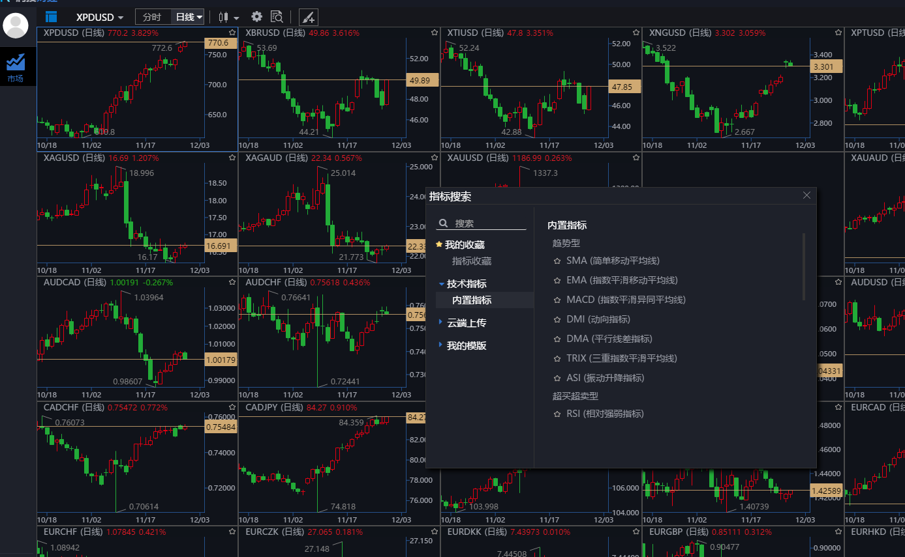

# 加推时序系统RTS实现原理及应用简介

## 什么是时序数据及分析目的？

时序数据是指时间序列数据。时间序列数据是同一统一指标按时间顺序记录的数据列。在同一数据列中的各个数据必须是同口径的，要求具有可比性。时序数据可以是`时期数`，也可以`时点数`。时间序列分析的目的是通过找出样本内时间序列的`统计特性`和`发展规律性`，构建时间序列模型，进行样本外`预测`。[百度]

Sky认为：

更广义来说时序分析是一种数据挖掘：通过：`趋势、相关性、特征`，进行，`整合、归纳、评估`。提升用户感知，优化用户体验，支持产品改进，加强业务管理水平。

## 涉及人群

本文主要针对研发人员理解时序分析和实现的一种方案，但也同时适合以下人群：

*决策层*：通过了解时序分析的场景，推进分析指标的确定。制定解决问题的总体策略与方针。

*业务部门主管*：给出专业的分析指标

*数据分析师*：解决业务问题，数据产生后，进行沟通，并对其发现进行深刻的分析

`通过时序分析作为切入点，以此来全面思考数据驱动未来企业的方案`

## 基本原理

企业对于各端，都有埋点操作，而埋点获得的是一种时序行为数据，有用户行为，也有系统行为。大量的时序数据构成了我们的互联网时代，采用化整为零的思路实现之。

实现步骤如下：

* 1.定义时间盒子（时期数）常用的有，5min 1h 1d 1w 1m 1y。
* 2.定义行为标签，每个行为标签包含<1>定义的时间盒子。
* 3.时序数据到来，根据其时间戳，先放入相应的行为标签，再分别放入多个时间盒子。每个时间盒子都会进行计数+1操作 

* 4.定义聚合操作盒子，每个时间盒子下有多个聚合操作盒子，常用有，sum，count，max，min，avg平均，med中位数，std标准方差

* 5.最终我们将原始的时序数据，按不同行为标签，存入不同时间盒子中并行放入其下的多个聚合操作盒子中。

获取数据时，我们采用 `行为数据标签+时间段+某个时间盒子+某种聚类盒子` 或者 `行为数据标签+某时间盒子的数量+某种聚合盒子`

例如：

* 本周，用户登录，每天`登陆次数`（一个折线图），实际取数<=7个，速度极快

* 以现在向前24小时内的，App首页`访问量`，实际取数24个，速度极快

原理示意图如下：

## 方案选型及系统架构

#### 本架构选择了Redis作为存储，有如下考虑

* 低成本：Redis项目本身接近100%代码覆盖率，故障率较低，运维成本低。但不支持分片和事务是其主要问题。

* 实时与高效:按经验来看，作为KV数据库使用，Redis的读写，4倍于传统数据库的读写性能。

* 稳定与可靠:内部队列，v2.6.5之后的管道PIPELINE，将多条命令一次性执行，单进程有可靠的原子操作保证，数据不串门。

* 丰富的基础算法：支持五种基本数据结构，对于需要唯一化人次的概念，实现便捷。并拥有*HyperLogLog*，海量数据基数计算解决方案，百度一下很多。

* 扩展性:集群使用，MasterSlave容易扩展。

#### 聚合函数语言选择：LUA语言

* Lua由标准C编写而成，几乎在所有操作系统和平台上都可以编译，运行。
* 整个Lua解析器，有2万行C代码完成，可以编译进182K的可执性文件，加载与运行兼得。

* Redis原生支持对lua语言的解析，弥补了Redis不是很强大的计算能力，并具备原子性，此特性有助于Redis对并发数据一致性的支持。

#### 系统架构图

整个RTS系统由14K的脚本实现，包括LUA语言部分。

Sky认为：`一切数据都有时效性`

有传统的大数据分析架构作为主要数据分析手段，因此本系统设计伊始，定位是一个强力辅助，依据新鲜数据更快的出统计更快的分析各行为指标。

有些场景的数据，可能不进入后台大数据服务，但也想快速出分析结果。按RTS的原理，可以完成一套物联网时序统计serveless系统，跑在类似*树莓*派*嵌入式操作系统*上！

#### 实际性能指标：

最高峰值，每秒2万次API请求，不加队列中间件的情况下，稳定统计持续时间1小时。

下图某系统在日活10万+时候统计数据，紫色为中位数：

## 模块的操作使用

整个RTS系统使用Nodejs完成和redis的交互，使用require即可轻松使用

具体使用如下：

##### 初始化实例

以上为返回一个静态类，8个时间盒子，项目前缀为statsCenter，用以在Redis创建多实例统计系统

##### 写入方法

注意 上面是一个异步函数，在可以选择同步函数来写入数据。

除了常用的聚合函数，本方法还提供，dy：每年按每天在周中的统计，hm：每月按小时在天中的统计，等高级环比聚合统计值

另有`recordUnique` 函数配合做唯一化统计，主要使用Redis的集合数据结构完成

##### 读取方法

注意 上面是一个同步函数，在高并发下可以选择异步函数来获取图表。

下图为按小时取数据画图表

###### 整个RTS系统，只有2个对外API，一读一写，学习成本低，中级研发人员10分钟就可以完成初级时序统计前后台。

## 应用场景

### 金融证券

在证券图表中，会使用5m ,10m ,15m ,30m ,1h ,4h ,1d ,1w ,1m 等来构造K线图。在时间周期的基础上，延伸使用MACD、KDJ、CCI、Boll 、MDI等分析工具进行短期和长期的趋势分析。

`特别指出：各个指标均建立在时序基础上`。

金融数据以一个ticket作为一个时序包，大厂每200ms推送一次，数据量大，使用RTS后，将数据降维，实现了人们经常看到的K线图。

下图是Sky在2015年完成的自研K线图表（全原生实现）界面：

### 运营统计

比起繁杂的创业过程，互联网运营有许多确定的指标，是一个专业型较强的岗位。运营负责人通过对指标的鉴别制定出相应运营计划。

对于用户的行为，进行长期与短期分析，运营也需要深入到整个产品的生命周期，我们俗称拿数据说话，做相应的对策。

日活跃用户、周活跃用户、月活跃用户，仅各类活跃指标，结合RTS与产品功能矩阵进行比对，迅速迭代与修正。

加推在用户行为分析指标上，有独特的见解：

下一步就是聚类和客户细分环节了。

### 监控服务

监控的目的是为了，推断，预警，决策。

使用时序统计，将每小时，每天，API接口访问的，最大值、最小值、平均值进行统计，快速发现网络波动和接口异常。

使用RTS快速创建一个埋点大看板。

当有接口有超过1000ms的响应时，我们就要开始预警了

### 多维度统计

数据挖掘是一门交叉科学，涉及统计学、机器学习、数据库、云计算、人工智能等。

通过数据挖掘分析架构，从明细级变为汇总级和分析级。形成数据立方体，辅助机器学习。

将多个时间盒子的数据进行，再分析。给出用户的时序行为特征，完成更深入的数据挖掘，解决企业核心数据分析，愉快的拥抱DT时代。

## 数据解决方案

最后给出一个，数据解决方案的方法论3步

* 研究、谈话理解业务活动（理解我们如何盈利，我的关键业务活动是什么）
* 头脑风暴（确定数据在业务上的作用，需要哪些数据）
* 设计与实施（评估模型，并试错）落地很重要！

我们的DT之路是星辰大海。

@_@  2019-5

