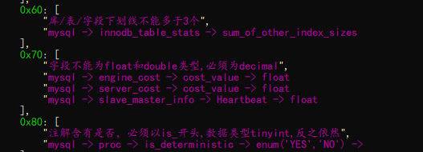
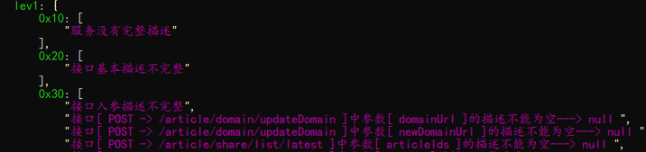
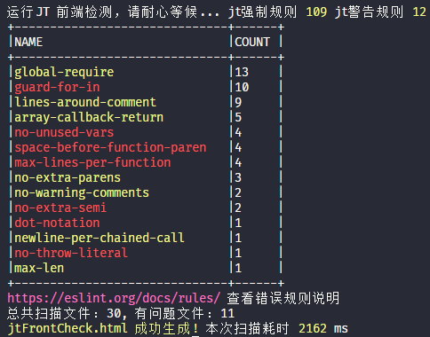
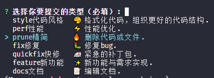
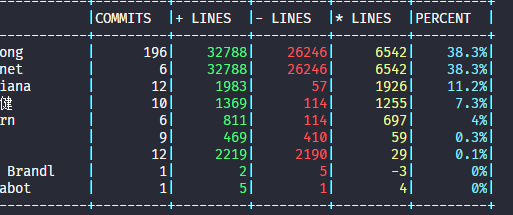

# 加推研发质量与规范实战

[TOC]

## 前言

产品详细需求评审会过后，项目经理或组长将会拆分需求到每个人身上，随后程序员们将进入风起云涌的设计与编码阶段。💥

### 技术负债

> 编码不是结果，而是过程。😶

> 技术负载 (Technical debt)，主要指看似编码完毕甚至已上线，但实际代码内部有众多隐患，好似欠下的一笔笔债务，总要还的。😔

**公式如下**：

```javascript
技术债务(人*天) =	修复重复冗余代码的时间成本
                + 修复质量违规的时间成本
                + 注解重要代码的时间成本
                + 修复未测试覆盖代码的时间成本
                + 降低代码复杂度的时间成本
                + ...

```

> SKY 认为，技术负债的本质，是一种对代码可维护性和可持续性发展的度量。
>
> 我们通过制定编码规范和扫描工具这一手段来降低技术负债。🔥

## 数据库设计质量工具

> 拿到一份无注解的数据库表，你的心情是？😔
>
> 拿到一份拼音和英文混排的表，你的心情是？😔

参考 **阿里巴巴 Java 开发手册中的 MYSQL 数据库规范** 整理如下加推数据库设计规范：😶

### 技术架构：

代码框架中会使用的特殊字段，例如 time_c, time_m, is_del 等

### 通用：

1. 每个表和字段都需要有说明 comment
2. 所有数据库名，表名、字段名必须小写或数字组合
3. 严禁数字开头，数据库名，表名，字段名
4. 禁止下划线后直接跟数字
5. 不使用官方保留字，作为数据库名、表名或者字段名
6. 表名和列名有下划线，不超过 3 个
7. 除了 id 和 datetime，text 型， 都需要有默认值

### 表：

1. 表名不使用复数名词，注意结尾是 s 的不一定是复数单词，会有一个复数单词检测表

### 字段：

1. 注解为是否 xxx 的，必须以 is_xxx 形式，数据类型 tinyint,反之亦然
2. 多状态的。注解包含[1: xxx 2:xxx],为枚举状态 stat_xxxx 开头 数据类型 tinyint or varchar，反之依然
3. 禁止出现 float 和 double 小数类型为 decimal
4. 同类型的前缀\_具体说明 po_xx1 po_xx2,缩写时不要少于 2 个字母比如 po=project co=company dtl=detail

### 索引：

1. 主键索引 pk* 唯一索引 uk* 普通索引 idx\_
2. 除主键，不要建立簇索引，必须为非簇索引
3. 建立组合索引的技巧：xxxx

> 但谁来监督检测，测试？研发？项目经理？上万个字段怎么查？每次的增量谁来查？😔

```javascript
npm i -g skyjt // 安装加推质量工具
jt db -c 数据库配置.json // 扫描指定配置的数据库加推规范
```



加入到自动化构建中，妥妥的:smile:

## API 接口设计质量工具

> 当后端代码发生改变，自动构建一份最新的 API 接口文档。相信 99%的 IT 公司都已经做到了 😶
>
> 这个 API 参数什么含义？有几种可能的字符串？有特殊值的特殊处理嘛？😔

自动生成 API 文档后，还需要有质量要求，skyjt 针对 swagger2.0 API 文档进行质量扫描

```javascript
npm i -g skyjt // 安装加推质量工具
jt swagger -c [远程|本地]swagger文档
```



加入到自动化构建中，妥妥的:smile:

## 重构及工具实战

### 老生常谈**SOLID**

以下知识点，不展开请自行 google🔥
| 英文 | 中文 |
| :------------ |:---------------|
| Single Responsibility Principle | 单一职责原则 |
|Open Closed Principle|开闭原则，允许用户添加功能而不必修改现有的代码|
| Liskov Substitution Principle|里氏替换原则|
| Law of Demeter|迪米特法则，最少知道原则|
| Interface Segregation Principle|接口隔离原则|
| Dependence Inversion Principle|依赖倒置原则|

### JS 变量

我们的规则是这样的

1. 开头大写。例如类名
2. 全大写+下划线（常量）
3. 全小写或+数字
4. 下划线或者\$开头+全小写或全大写
5. 如果是小驼峰满足下列组合规则，不允许大驼峰
   例如：oUser，aUserList

- s/str: 表示字符串 String
- d/date:表示日期
- n: 表示整型 Int(它是 Number 中的整数类型)
- f: 表示浮点 Float(它是 Number 中的小数类型)
- b/is: 表示布尔 Boolean
- a/arr: 表示数组 Array
- o/obj: 表示对象 Object
- fn: 不示函数 Function
- r/re: 表示正则 Regular Expression
- g:代表全局变量
- 。。。

```javascript
let r=/(^(s|str|d|date|n|f|b|is|a|arr|o|obj|fn|r|re|g){1}[A-Z]+[a-zA-Z\d]*((?!_).)*$)/gm
// 对于上面5的正则诠释，之后通过AST解析进行变量名检测
jt cv  //对项目变量命名进行扫描
```

### 代码圈复杂度

> 有很多的计算方式，其中最简单的是，代码流程图中，代码圈复杂度=图形的边-图形的节点+2
> 这是一个图论问题 V(G)=E-N+2:dizzy_face: 适用任何高级语言
>
> 核心的结论是：**代码复杂度低，代码不一定好，但代码复杂度高，代码一定不好**🔥

---

一个项目，几千个函数，人为来计算耗时耗力，于是我们将圈复杂度扫描加入加推质量工具套件中

```javascript
jt cc // 可以增加参数 -a 展开所有函数，未来可以对函数进行更精准的检测
```


对于复杂度较高的函数，优先重构:smile:
扩展知识：**认知复杂度**

### JS 代码质量规范

对更多的质量检查，统一加入到加推质量工具套件中

```javascript
jt ccc // 可以增加参数 -s 将错误类型聚合
```



### 其他辅助命令

| 命令       | 解释                                                             |
| :--------- | :--------------------------------------------------------------- |
| jt ecc     | 快速了解项目规模，文件最大行数是否超过阀值，函数体函数是否过大等 |
| jt todo    | 快速扫描项目中 含有 todo fixed notice xxx 等代码标记的文件及位置 |
| jt comment | 快速扫描项目中 那些函数没有编写注解                              |

:smile:

### Git 提交规范

> 修改了就提交，改了啥，懒得写注解，和项目管理系统的无法关联？😶
>
> **提交规范为此而提出**：:smiley:

```javascript
jt czjt //安装加推提交标准化模式
git cz  //准备提交
```



其他 Git 辅助工具

```javascript
jt gitstat //统计git author
```



在**Precommit**之前做质量阀值，在提测之前做质量复查:smile:

## 小结

规范标准的提出，到规范的落地，并不是一条顺畅的大道，使用规范工具进行辅助是一个很好的思路。

我们的代码质量之路是星辰大海。🔥
